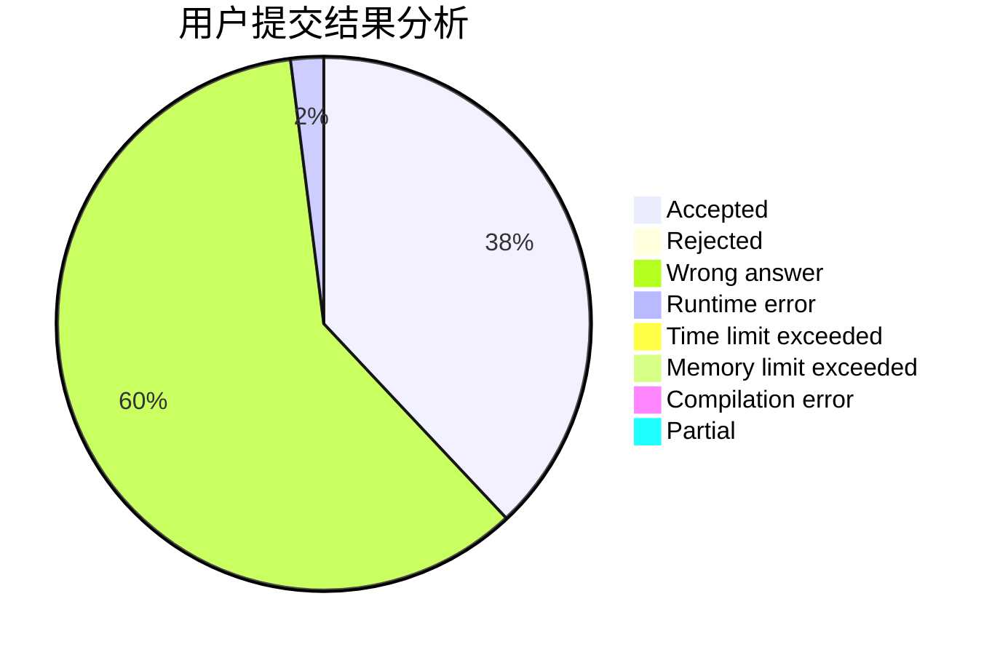
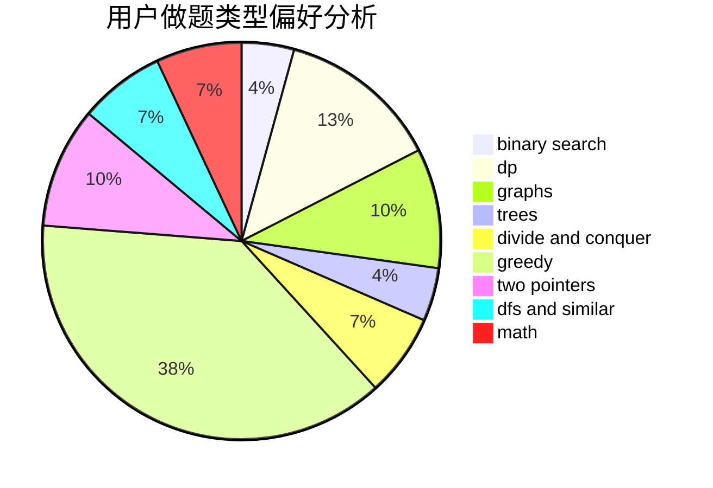

# CaCl2_6H2O

<!-- tabs:start -->

#### **用户提交结果分析**

#### **用户做题类型偏好分析**

<!-- tabs:end -->
# 推荐题目
[555C](https://codeforces.com/contest/555/problem/C)
[652E](https://codeforces.com/contest/652/problem/E)
[651D](https://codeforces.com/contest/651/problem/D)
[624A](https://codeforces.com/contest/624/problem/A)
[652D](https://codeforces.com/contest/652/problem/D)
[592D](https://codeforces.com/contest/592/problem/D)
[652B](https://codeforces.com/contest/652/problem/B)
[1012B](https://codeforces.com/contest/1012/problem/B)
[402E](https://codeforces.com/contest/402/problem/E)
[651C](https://codeforces.com/contest/651/problem/C)
