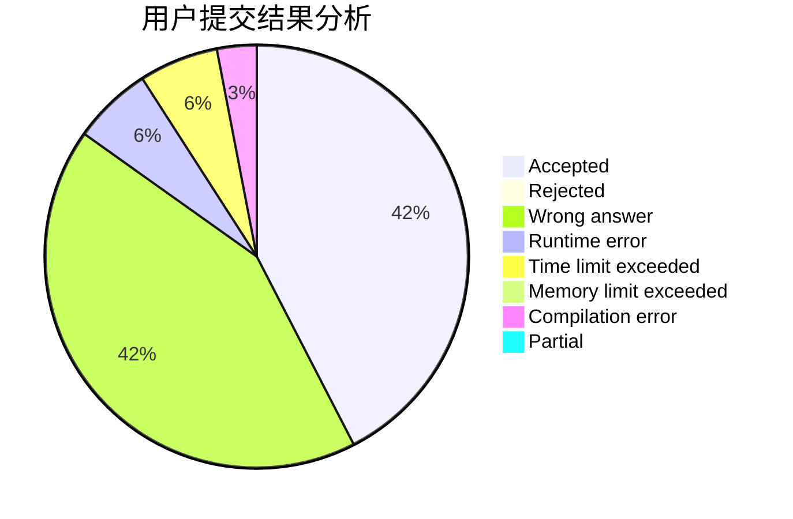
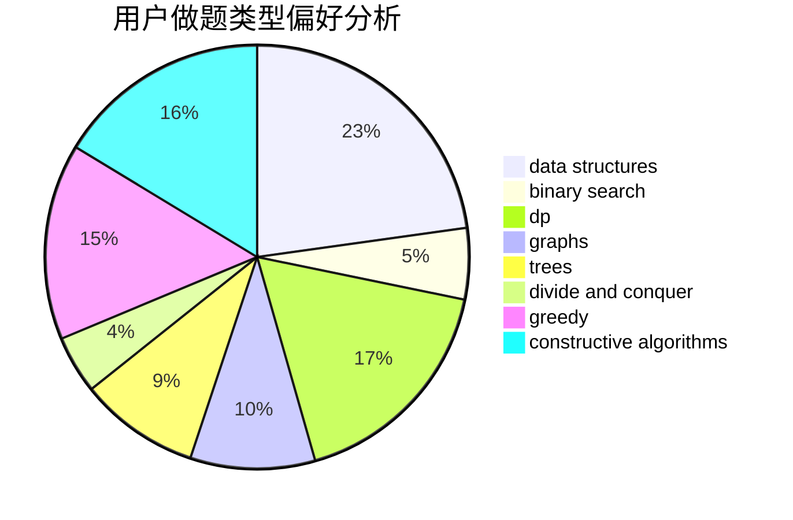
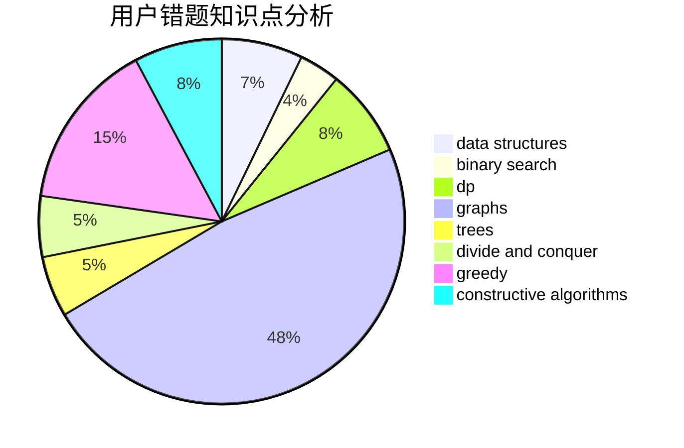

# w33z8kqrqk8zzzx34

<!-- tabs:start -->

#### **用户提交结果分析**

#### **用户做题类型偏好分析**

#### **用户错题知识点分析**

<!-- tabs:end -->
# 推荐题目
[903A](https://codeforces.com/contest/903/problem/A)		greedy,
                        implementation		  
[95B](https://codeforces.com/contest/95/problem/B)		dp,
                        greedy		  
[1016F](https://codeforces.com/contest/1016/problem/F)		dfs and similar,
                        dp,
                        trees		  
[109A](https://codeforces.com/contest/109/problem/A)		brute force,
                        implementation		  
[1198F](https://codeforces.com/contest/1198/problem/F)		greedy,
                        number theory,
                        probabilities		  
[12962](https://codeforces.com/contest/1296/problem/2)		dsu,graphs,sortings,trees		  
[11292](https://codeforces.com/contest/1129/problem/2)		dsu,graphs,sortings,trees		  
[856C](https://codeforces.com/contest/856/problem/C)		combinatorics,
                        dp,
                        math		  
[1165D](https://codeforces.com/contest/1165/problem/D)		math,
                        number theory		  
[861B](https://codeforces.com/contest/861/problem/B)		dsu,graphs,sortings,trees		  
