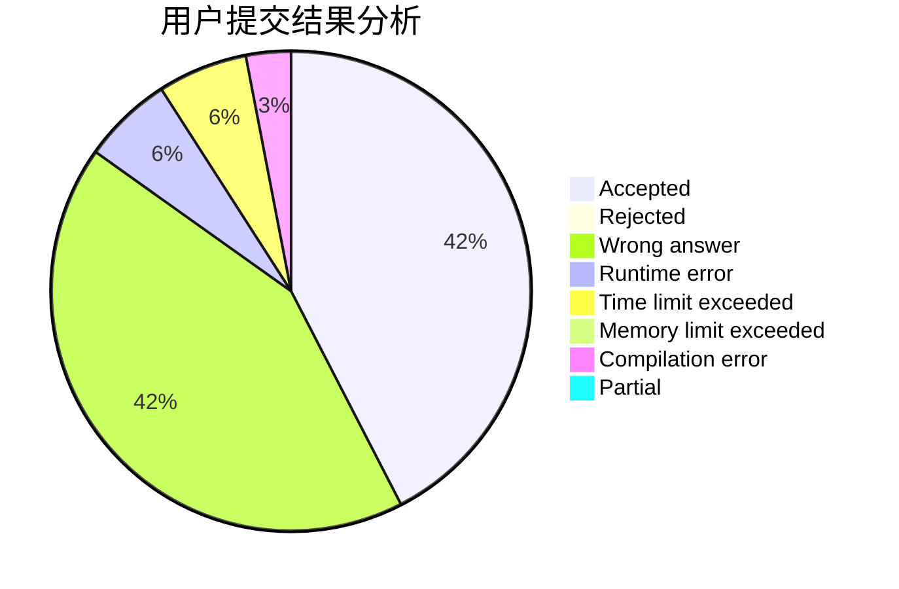
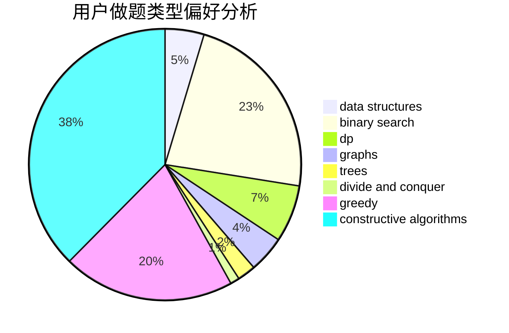
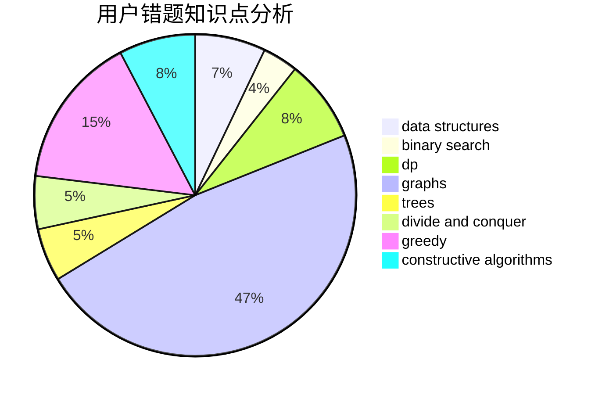

# w33z8kqrqk8zzzx34

<!-- tabs:start -->

#### **用户提交结果分析**

#### **用户做题类型偏好分析**

#### **用户错题知识点分析**

<!-- tabs:end -->
# 推荐题目
[884D](https://codeforces.com/contest/884/problem/D)		data structures,
                        greedy		  
[938C](https://codeforces.com/contest/938/problem/C)		binary search,
                        brute force,
                        constructive algorithms		  
[1016C](https://codeforces.com/contest/1016/problem/C)		dp,
                        implementation		  
[1099D](https://codeforces.com/contest/1099/problem/D)		dsu,graphs,sortings,trees		  
[1194D](https://codeforces.com/contest/1194/problem/D)		games,
                        math		  
[1288F](https://codeforces.com/contest/1288/problem/F)		constructive algorithms,
                        flows		  
[1119E](https://codeforces.com/contest/1119/problem/E)		brute force,
                        dp,
                        fft,
                        greedy,
                        ternary search		  
[838C](https://codeforces.com/contest/838/problem/C)		dp,
                        games		  
[1164G](https://codeforces.com/contest/1164/problem/G)		dsu,graphs,sortings,trees		  
[842C](https://codeforces.com/contest/842/problem/C)		dfs and similar,
                        graphs,
                        math,
                        number theory,
                        trees		  
