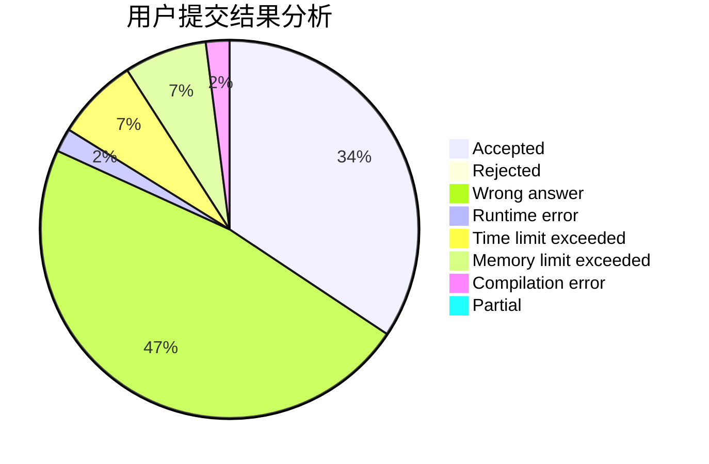
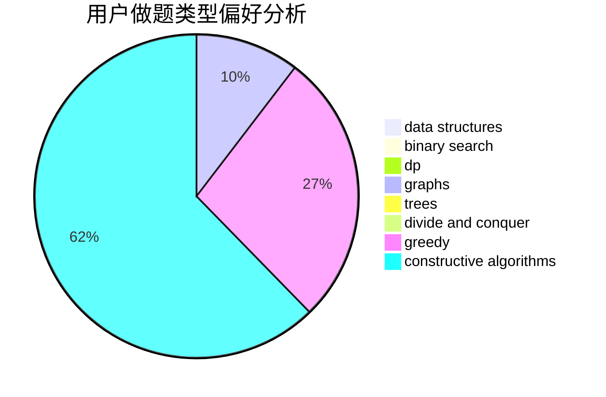
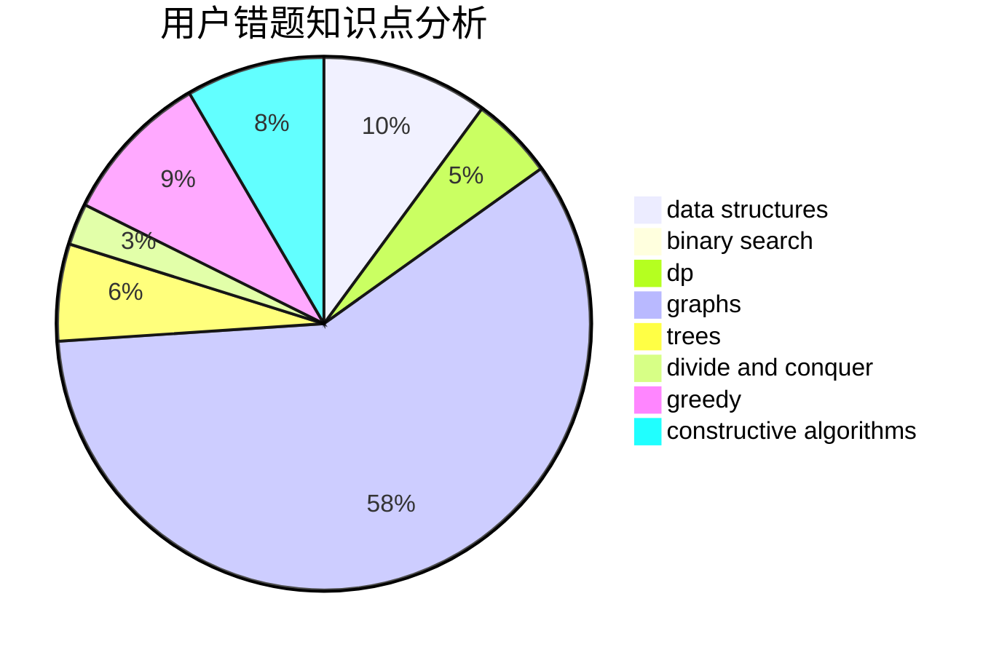

# w4p3r

<!-- tabs:start -->

#### **用户提交结果分析**

#### **用户做题类型偏好分析**

#### **用户错题知识点分析**

<!-- tabs:end -->
# 推荐题目
[1186D](https://codeforces.com/contest/1186/problem/D)		constructive algorithms,
                        greedy,
                        math		  
[672A](https://codeforces.com/contest/672/problem/A)		implementation		  
[716A](https://codeforces.com/contest/716/problem/A)		implementation		  
[25D](https://codeforces.com/contest/25/problem/D)		dsu,
                        graphs,
                        trees		  
[1062A](https://codeforces.com/contest/1062/problem/A)		greedy,
                        implementation		  
[659B](https://codeforces.com/contest/659/problem/B)		constructive algorithms,
                        sortings		  
[114B](https://codeforces.com/contest/114/problem/B)		bitmasks,
                        brute force,
                        graphs		  
[1091H](https://codeforces.com/contest/1091/problem/H)		games		  
[932B](https://codeforces.com/contest/932/problem/B)		binary search,
                        data structures,
                        dfs and similar		  
[364B](https://codeforces.com/contest/364/problem/B)		dp,
                        greedy		  
