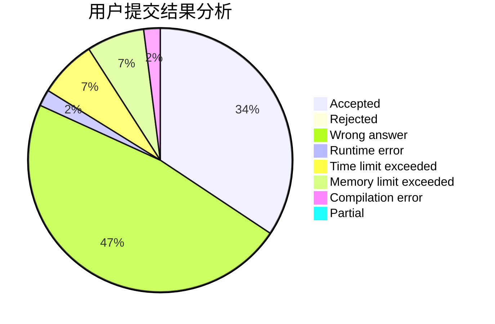
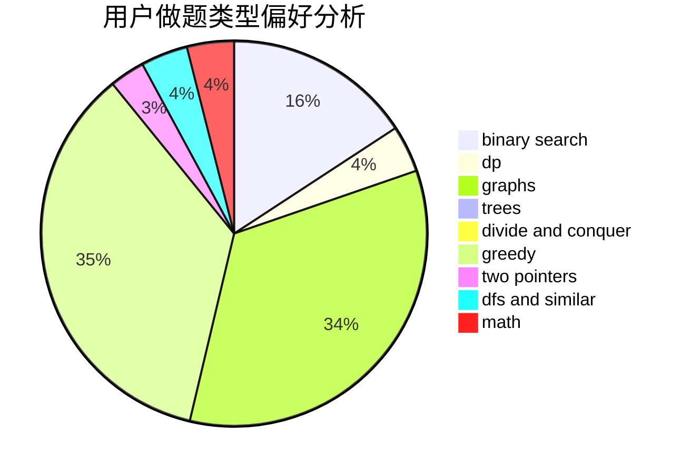

# w4p3r

<!-- tabs:start -->

#### **用户提交结果分析**

#### **用户做题类型偏好分析**

<!-- tabs:end -->
# 推荐题目
[1186D](https://codeforces.com/contest/1186/problem/D)
[672A](https://codeforces.com/contest/672/problem/A)
[716A](https://codeforces.com/contest/716/problem/A)
[25D](https://codeforces.com/contest/25/problem/D)
[1062A](https://codeforces.com/contest/1062/problem/A)
[659B](https://codeforces.com/contest/659/problem/B)
[114B](https://codeforces.com/contest/114/problem/B)
[1091H](https://codeforces.com/contest/1091/problem/H)
[932B](https://codeforces.com/contest/932/problem/B)
[364B](https://codeforces.com/contest/364/problem/B)
