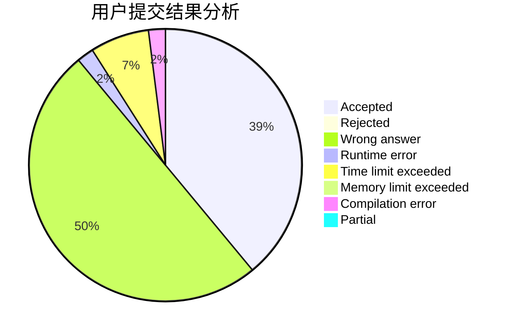
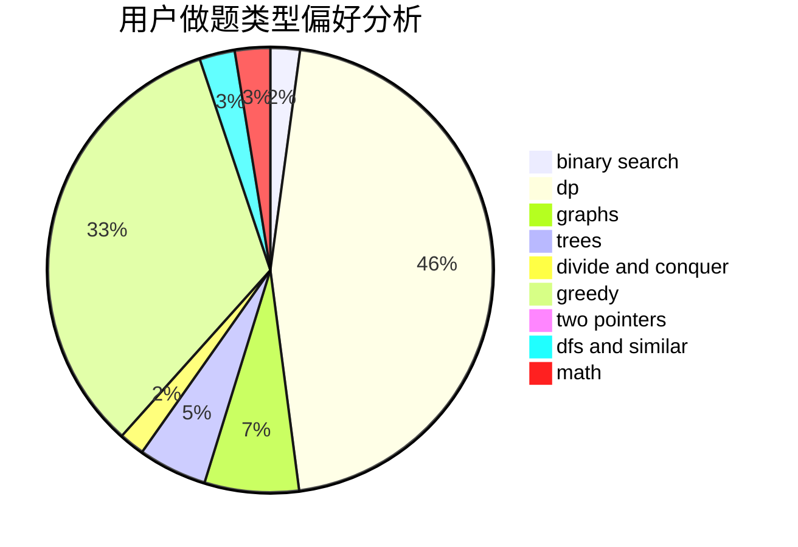

# w_y_s

<!-- tabs:start -->

#### **用户提交结果分析**

#### **用户做题类型偏好分析**

<!-- tabs:end -->
# 推荐题目
[174B](https://codeforces.com/contest/174/problem/B)
[669C](https://codeforces.com/contest/669/problem/C)
[405B](https://codeforces.com/contest/405/problem/B)
[1083A](https://codeforces.com/contest/1083/problem/A)
[523A](https://codeforces.com/contest/523/problem/A)
[966C](https://codeforces.com/contest/966/problem/C)
[739A](https://codeforces.com/contest/739/problem/A)
[216D](https://codeforces.com/contest/216/problem/D)
[367D](https://codeforces.com/contest/367/problem/D)
[819B](https://codeforces.com/contest/819/problem/B)
