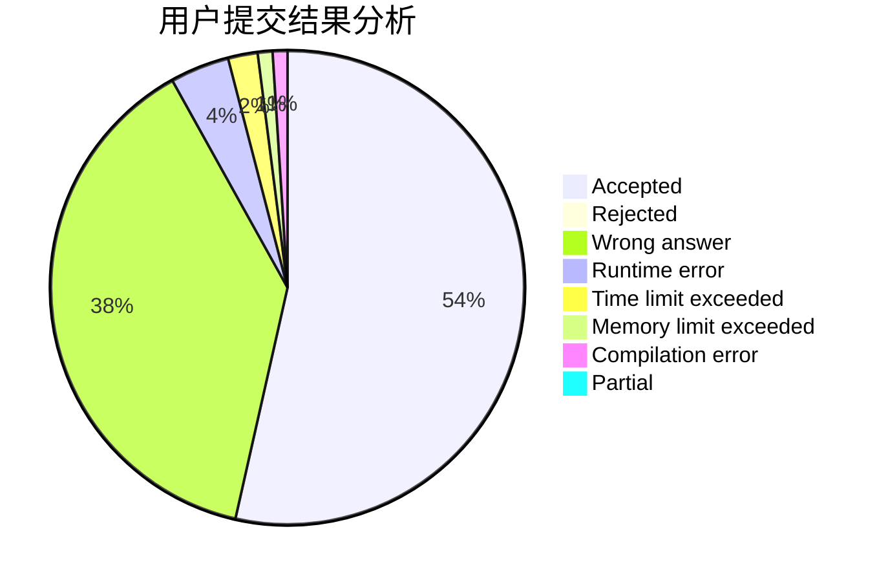
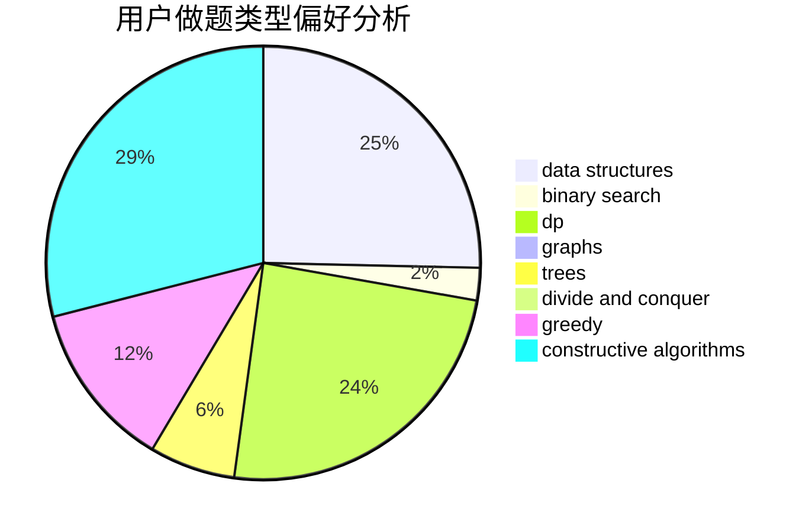
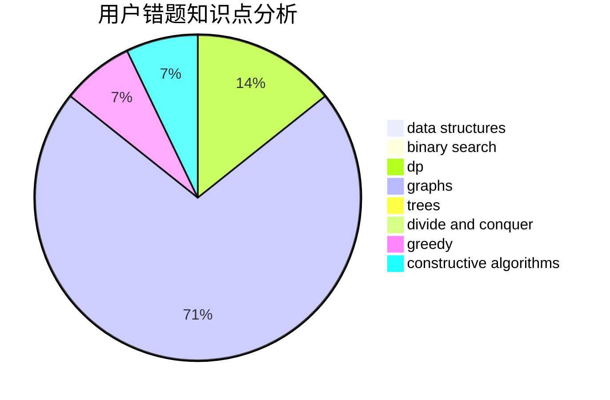

# waaitg

<!-- tabs:start -->

#### **用户提交结果分析**

#### **用户做题类型偏好分析**

#### **用户错题知识点分析**

<!-- tabs:end -->
# 推荐题目
[1082A](https://codeforces.com/contest/1082/problem/A)		implementation,
                        math		  
[559E](https://codeforces.com/contest/559/problem/E)		dp,
                        sortings		  
[289D](https://codeforces.com/contest/289/problem/D)		dsu,graphs,sortings,trees		  
[618B](https://codeforces.com/contest/618/problem/B)		constructive algorithms		  
[1101A](https://codeforces.com/contest/1101/problem/A)		math		  
[730J](https://codeforces.com/contest/730/problem/J)		dp		  
[11892](https://codeforces.com/contest/1189/problem/2)		dsu,graphs,sortings,trees		  
[11291](https://codeforces.com/contest/1129/problem/1)		dsu,graphs,sortings,trees		  
[781C](https://codeforces.com/contest/781/problem/C)		dsu,graphs,sortings,trees		  
[815D](https://codeforces.com/contest/815/problem/D)		binary search,
                        combinatorics,
                        data structures,
                        geometry		  
