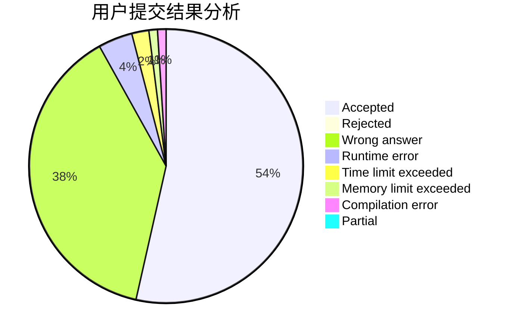
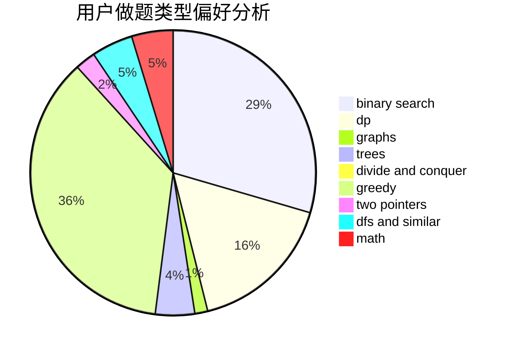

# waaitg

<!-- tabs:start -->

#### **用户提交结果分析**

#### **用户做题类型偏好分析**

<!-- tabs:end -->
# 推荐题目
[1082A](https://codeforces.com/contest/1082/problem/A)
[559E](https://codeforces.com/contest/559/problem/E)
[289D](https://codeforces.com/contest/289/problem/D)
[618B](https://codeforces.com/contest/618/problem/B)
[1101A](https://codeforces.com/contest/1101/problem/A)
[730J](https://codeforces.com/contest/730/problem/J)
[11892](https://codeforces.com/contest/1189/problem/2)
[11291](https://codeforces.com/contest/1129/problem/1)
[781C](https://codeforces.com/contest/781/problem/C)
[815D](https://codeforces.com/contest/815/problem/D)
