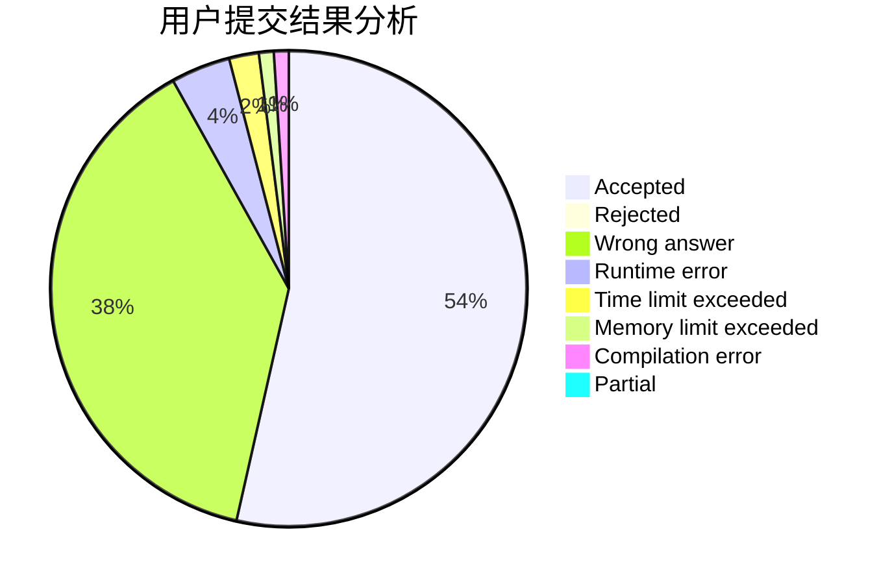
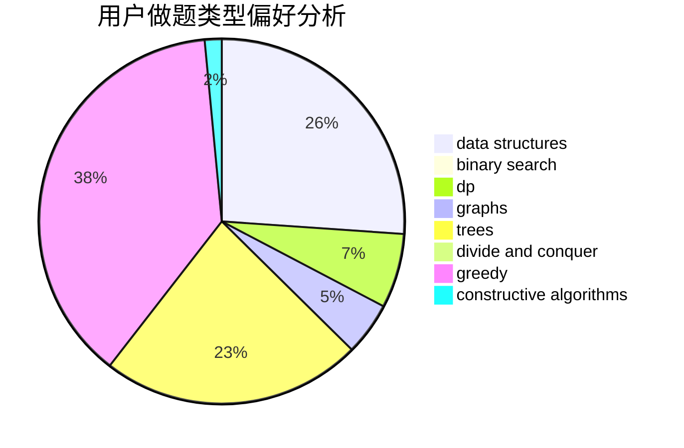
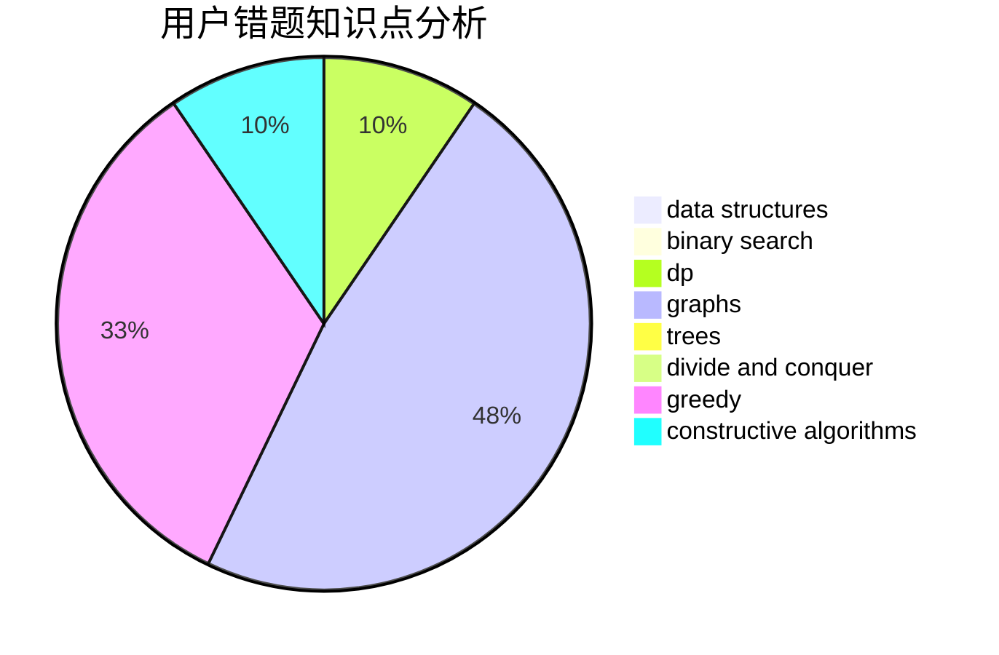

# waaitg

<!-- tabs:start -->

#### **用户提交结果分析**

#### **用户做题类型偏好分析**

#### **用户错题知识点分析**

<!-- tabs:end -->
# 推荐题目
[1081E](https://codeforces.com/contest/1081/problem/E)		binary search,
                        constructive algorithms,
                        greedy,
                        math,
                        number theory		  
[538F](https://codeforces.com/contest/538/problem/F)		brute force,
                        data structures,
                        math,
                        sortings		  
[273E](https://codeforces.com/contest/273/problem/E)		dp,
                        games		  
[59A](https://codeforces.com/contest/59/problem/A)		implementation,
                        strings		  
[1100D](https://codeforces.com/contest/1100/problem/D)		constructive algorithms,
                        games,
                        interactive		  
[710F](https://codeforces.com/contest/710/problem/F)		brute force,
                        data structures,
                        hashing,
                        interactive,
                        string suffix structures,
                        strings		  
[1185B](https://codeforces.com/contest/1185/problem/B)		implementation,
                        strings		  
[1119D](https://codeforces.com/contest/1119/problem/D)		binary search,
                        sortings		  
[762E](https://codeforces.com/contest/762/problem/E)		binary search,
                        data structures		  
[800C](https://codeforces.com/contest/800/problem/C)		dsu,graphs,sortings,trees		  
