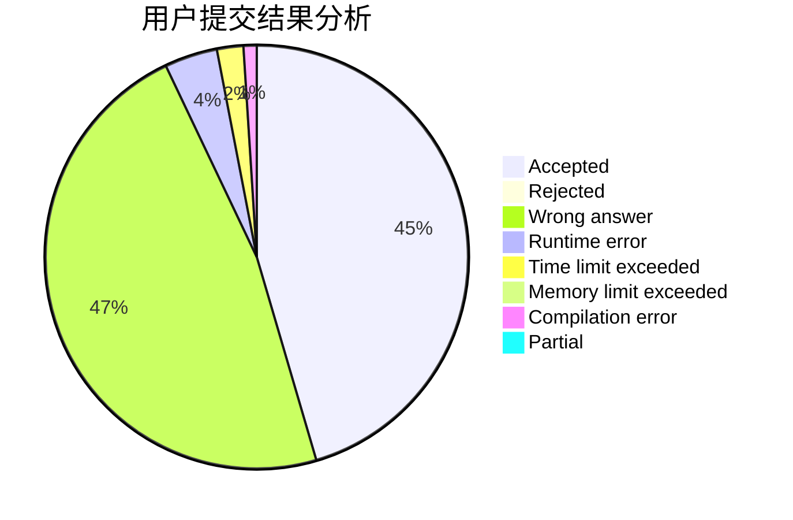
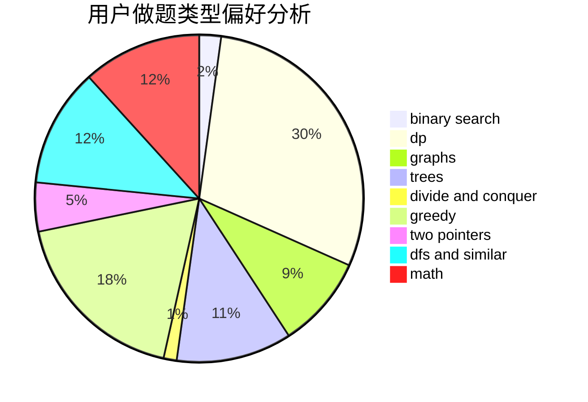

# walk_alone

<!-- tabs:start -->

#### **用户提交结果分析**

#### **用户做题类型偏好分析**

<!-- tabs:end -->
# 推荐题目
[720C](https://codeforces.com/contest/720/problem/C)
[516C](https://codeforces.com/contest/516/problem/C)
[632C](https://codeforces.com/contest/632/problem/C)
[607E](https://codeforces.com/contest/607/problem/E)
[59A](https://codeforces.com/contest/59/problem/A)
[15C](https://codeforces.com/contest/15/problem/C)
[452B](https://codeforces.com/contest/452/problem/B)
[13B](https://codeforces.com/contest/13/problem/B)
[735C](https://codeforces.com/contest/735/problem/C)
[725B](https://codeforces.com/contest/725/problem/B)
