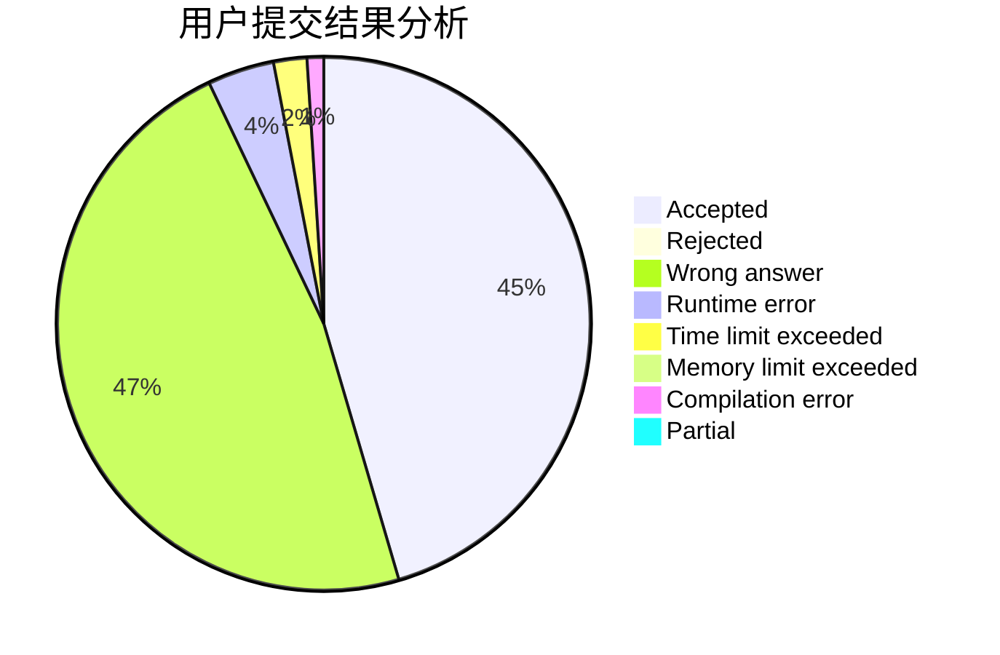
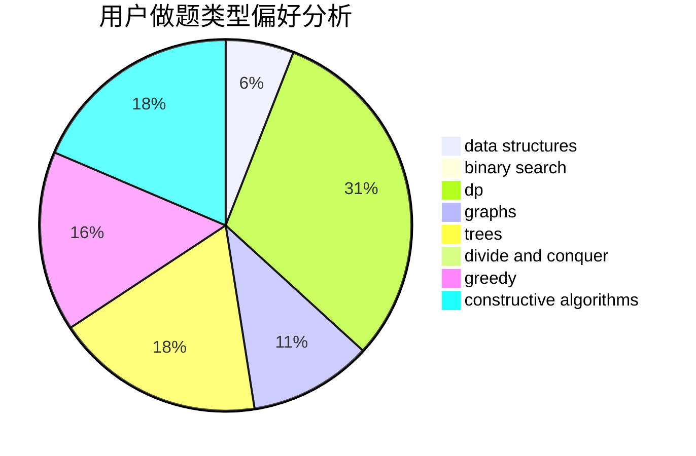
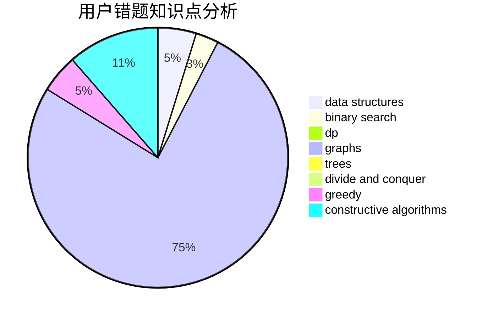

# walk_alone

<!-- tabs:start -->

#### **用户提交结果分析**

#### **用户做题类型偏好分析**

#### **用户错题知识点分析**

<!-- tabs:end -->
# 推荐题目
[720C](https://codeforces.com/contest/720/problem/C)		constructive algorithms		  
[516C](https://codeforces.com/contest/516/problem/C)		dsu,graphs,sortings,trees		  
[632C](https://codeforces.com/contest/632/problem/C)		sortings,
                        strings		  
[607E](https://codeforces.com/contest/607/problem/E)		binary search,
                        geometry		  
[59A](https://codeforces.com/contest/59/problem/A)		implementation,
                        strings		  
[15C](https://codeforces.com/contest/15/problem/C)		games		  
[452B](https://codeforces.com/contest/452/problem/B)		brute force,
                        constructive algorithms,
                        geometry,
                        trees		  
[13B](https://codeforces.com/contest/13/problem/B)		geometry,
                        implementation		  
[735C](https://codeforces.com/contest/735/problem/C)		combinatorics,
                        constructive algorithms,
                        greedy,
                        math		  
[725B](https://codeforces.com/contest/725/problem/B)		implementation,
                        math		  
