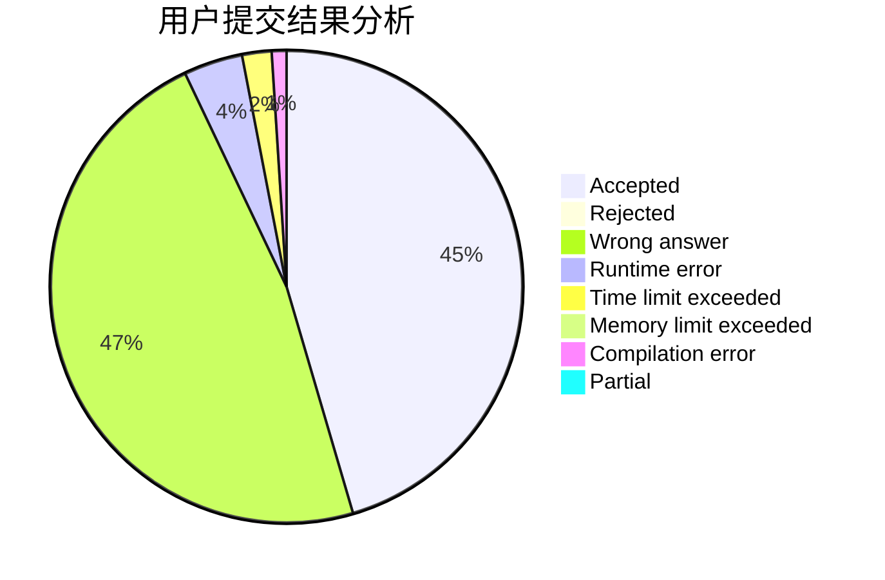
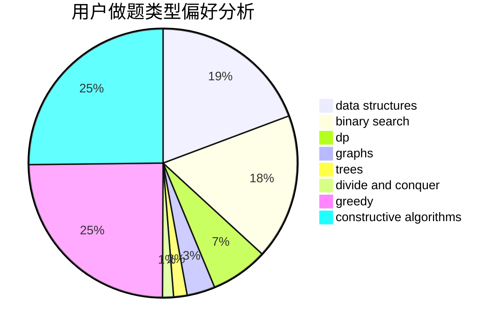
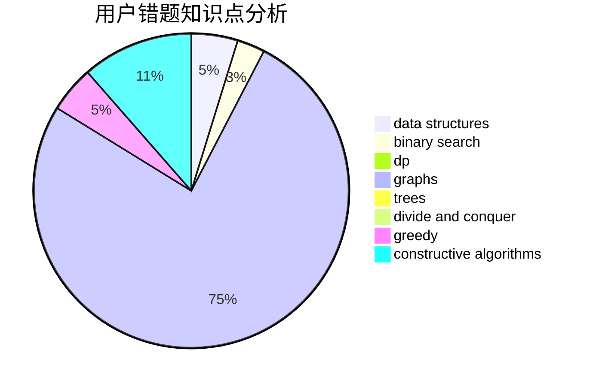

# walk_alone

<!-- tabs:start -->

#### **用户提交结果分析**

#### **用户做题类型偏好分析**

#### **用户错题知识点分析**

<!-- tabs:end -->
# 推荐题目
[701F](https://codeforces.com/contest/701/problem/F)		dsu,graphs,sortings,trees		  
[497B](https://codeforces.com/contest/497/problem/B)		dsu,graphs,sortings,trees		  
[612F](https://codeforces.com/contest/612/problem/F)		dp		  
[587D](https://codeforces.com/contest/587/problem/D)		2-sat,
                        binary search		  
[578D](https://codeforces.com/contest/578/problem/D)		dp,
                        greedy		  
[1509A](https://codeforces.com/contest/1509/problem/A)		constructive algorithms		  
[430A](https://codeforces.com/contest/430/problem/A)		constructive algorithms,
                        sortings		  
[1391E](https://codeforces.com/contest/1391/problem/E)		constructive algorithms,
                        dfs and similar,
                        graphs,
                        greedy,
                        trees		  
[717I](https://codeforces.com/contest/717/problem/I)		geometry		  
[706E](https://codeforces.com/contest/706/problem/E)		data structures,
                        implementation		  
