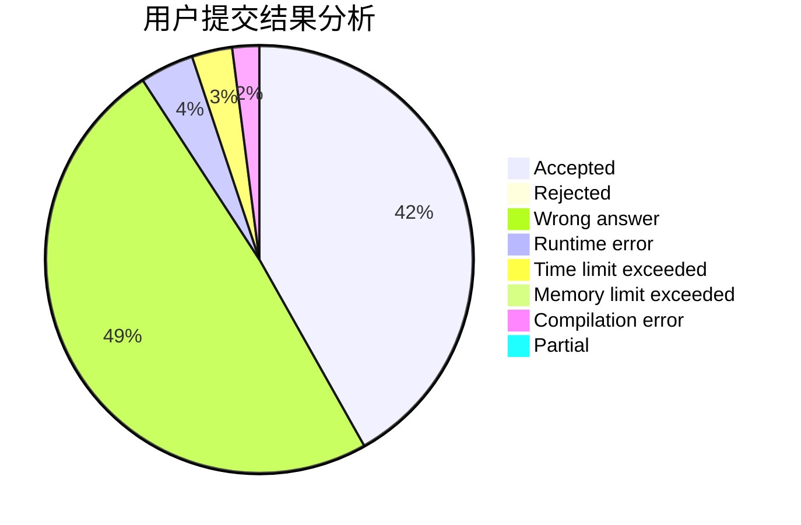
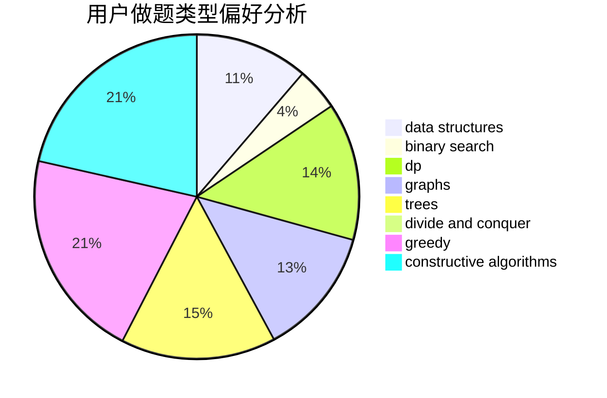

# wangchenkai
<!-- tabs:start -->
#### **用户提交结果分析**

#### **用户做题类型偏好分析**

#### **用户错题知识点分析**

<!-- tabs:end -->
# 推荐题目
[Fuzzy Search](http://codeforces.com/problemset/problem/528/D)		bitmasks,
                        brute force,
                        fft		  
[Passwords](http://codeforces.com/problemset/problem/721/B)		implementation,
                        math,
                        sortings,
                        strings		  
[Before an Exam](http://codeforces.com/problemset/problem/4/B)		constructive algorithms,
                        greedy		  
[T-Shirts](http://codeforces.com/problemset/problem/702/F)		data structures		  
[Nauuo and Pictures (hard version)](https://codeforces.com/contest/1173/problem/E2)		dp,
                        probabilities		  
[Sagheer and Nubian Market](http://codeforces.com/problemset/problem/812/C)		binary search,
                        sortings		  
[Infinite Sequence](http://codeforces.com/problemset/problem/675/A)		math		  
[Triangle](http://codeforces.com/problemset/problem/18/A)		brute force,
                        geometry		  
[...Dary!](http://codeforces.com/problemset/problem/696/F)		binary search,
                        geometry,
                        two pointers		  
[Adding Digits](http://codeforces.com/problemset/problem/260/A)		implementation,
                        math		  
<!-- tabs:start -->
#### **data structures**
[Fuzzy Search](http://codeforces.com/problemset/problem/702/F)		data structures		  
[Passwords](http://codeforces.com/problemset/problem/198/E)		binary search,
                        data structures,
                        sortings		  
[Before an Exam](http://codeforces.com/problemset/problem/383/A)		data structures,
                        greedy		  
[T-Shirts](http://codeforces.com/problemset/problem/983/E)		binary search,
                        data structures,
                        trees		  
[Nauuo and Pictures (hard version)](http://codeforces.com/problemset/problem/1388/D)		data structures,
                        dfs and similar,
                        graphs,
                        greedy,
                        implementation,
                        trees		  
[Sagheer and Nubian Market](http://codeforces.com/problemset/problem/526/F)		data structures,
                        divide and conquer		  
[Infinite Sequence](http://codeforces.com/problemset/problem/1428/C)		brute force,
                        data structures,
                        greedy,
                        strings		  
[Triangle](http://codeforces.com/problemset/problem/1492/C)		binary search,
                        data structures,
                        dp,
                        greedy,
                        two pointers		  
[...Dary!](http://codeforces.com/problemset/problem/1490/G)		binary search,
                        data structures,
                        math		  
[Adding Digits](http://codeforces.com/problemset/problem/1479/D)		binary search,
                        bitmasks,
                        brute force,
                        data structures,
                        probabilities,
                        trees		  
#### **binary search**
[Fuzzy Search](http://codeforces.com/problemset/problem/812/C)		binary search,
                        sortings		  
[Passwords](http://codeforces.com/problemset/problem/696/F)		binary search,
                        geometry,
                        two pointers		  
[Before an Exam](http://codeforces.com/problemset/problem/325/B)		binary search,
                        math		  
[T-Shirts](http://codeforces.com/problemset/problem/198/E)		binary search,
                        data structures,
                        sortings		  
[Nauuo and Pictures (hard version)](http://codeforces.com/problemset/problem/1386/A)		*special problem,
                        binary search,
                        constructive algorithms,
                        interactive		  
[Sagheer and Nubian Market](http://codeforces.com/problemset/problem/983/E)		binary search,
                        data structures,
                        trees		  
[Infinite Sequence](http://codeforces.com/problemset/problem/468/C)		binary search,
                        constructive algorithms,
                        math		  
[Triangle](http://codeforces.com/problemset/problem/1492/C)		binary search,
                        data structures,
                        dp,
                        greedy,
                        two pointers		  
[...Dary!](http://codeforces.com/problemset/problem/1463/D)		binary search,
                        constructive algorithms,
                        greedy,
                        two pointers		  
[Adding Digits](http://codeforces.com/problemset/problem/1490/G)		binary search,
                        data structures,
                        math		  
#### **dp**
[Fuzzy Search](https://codeforces.com/contest/1173/problem/E2)		dp,
                        probabilities		  
[Passwords](https://codeforces.com/contest/701/problem/E)		dfs and similar,
                        dp,
                        graphs,
                        trees		  
[Before an Exam](http://codeforces.com/problemset/problem/256/D)		dp		  
[T-Shirts](http://codeforces.com/problemset/problem/711/C)		dp		  
[Nauuo and Pictures (hard version)](http://codeforces.com/problemset/problem/1242/C)		bitmasks,
                        dfs and similar,
                        dp,
                        graphs		  
[Sagheer and Nubian Market](http://codeforces.com/problemset/problem/1198/D)		dp		  
[Infinite Sequence](http://codeforces.com/problemset/problem/1461/C)		dp,
                        math,
                        probabilities		  
[Triangle](http://codeforces.com/problemset/problem/1492/C)		binary search,
                        data structures,
                        dp,
                        greedy,
                        two pointers		  
[...Dary!](https://codeforces.com/contest/1457/problem/C)		brute force,
                        dp,
                        implementation		  
[Adding Digits](http://codeforces.com/problemset/problem/1491/C)		brute force,
                        data structures,
                        dp,
                        greedy,
                        implementation		  
#### **graph**
[Fuzzy Search](https://codeforces.com/contest/701/problem/E)		dfs and similar,
                        dp,
                        graphs,
                        trees		  
[Passwords](http://codeforces.com/problemset/problem/97/E)		dfs and similar,
                        dsu,
                        graphs,
                        trees		  
[Before an Exam](http://codeforces.com/problemset/problem/120/H)		graph matchings		  
[T-Shirts](http://codeforces.com/problemset/problem/117/C)		dfs and similar,
                        graphs		  
[Nauuo and Pictures (hard version)](http://codeforces.com/problemset/problem/1242/C)		bitmasks,
                        dfs and similar,
                        dp,
                        graphs		  
[Sagheer and Nubian Market](http://codeforces.com/problemset/problem/1388/D)		data structures,
                        dfs and similar,
                        graphs,
                        greedy,
                        implementation,
                        trees		  
[Infinite Sequence](http://codeforces.com/problemset/problem/1487/C)		brute force,
                        constructive algorithms,
                        dfs and similar,
                        graphs,
                        greedy,
                        implementation,
                        math		  
[Triangle](http://codeforces.com/problemset/problem/1437/C)		dp,
                        flows,
                        graph matchings,
                        greedy,
                        math,
                        sortings		  
[...Dary!](http://codeforces.com/problemset/problem/1470/D)		constructive algorithms,
                        dfs and similar,
                        graph matchings,
                        graphs,
                        greedy		  
[Adding Digits](http://codeforces.com/problemset/problem/1476/C)		dp,
                        graphs,
                        greedy		  
#### **trees**
[Fuzzy Search](http://codeforces.com/problemset/problem/981/C)		implementation,
                        trees		  
[Passwords](https://codeforces.com/contest/701/problem/E)		dfs and similar,
                        dp,
                        graphs,
                        trees		  
[Before an Exam](http://codeforces.com/problemset/problem/983/E)		binary search,
                        data structures,
                        trees		  
[T-Shirts](http://codeforces.com/problemset/problem/97/E)		dfs and similar,
                        dsu,
                        graphs,
                        trees		  
[Nauuo and Pictures (hard version)](http://codeforces.com/problemset/problem/715/C)		dfs and similar,
                        divide and conquer,
                        dsu,
                        trees		  
[Sagheer and Nubian Market](http://codeforces.com/problemset/problem/1388/D)		data structures,
                        dfs and similar,
                        graphs,
                        greedy,
                        implementation,
                        trees		  
[Infinite Sequence](http://codeforces.com/problemset/problem/1479/D)		binary search,
                        bitmasks,
                        brute force,
                        data structures,
                        probabilities,
                        trees		  
[Triangle](http://codeforces.com/problemset/problem/1511/C)		brute force,
                        data structures,
                        implementation,
                        trees		  
[...Dary!](http://codeforces.com/problemset/problem/1499/F)		combinatorics,
                        dfs and similar,
                        dp,
                        trees		  
[Adding Digits](http://codeforces.com/problemset/problem/1491/E)		brute force,
                        dfs and similar,
                        divide and conquer,
                        number theory,
                        trees		  
#### **divide and conquer**
[Fuzzy Search](http://codeforces.com/problemset/problem/1250/M)		constructive algorithms,
                        divide and conquer		  
[Passwords](http://codeforces.com/problemset/problem/715/C)		dfs and similar,
                        divide and conquer,
                        dsu,
                        trees		  
[Before an Exam](http://codeforces.com/problemset/problem/526/F)		data structures,
                        divide and conquer		  
[T-Shirts](http://codeforces.com/problemset/problem/1461/D)		binary search,
                        brute force,
                        data structures,
                        divide and conquer,
                        implementation,
                        sortings		  
[Nauuo and Pictures (hard version)](http://codeforces.com/problemset/problem/1466/G)		combinatorics,
                        divide and conquer,
                        hashing,
                        math,
                        string suffix structures,
                        strings		  
[Sagheer and Nubian Market](http://codeforces.com/problemset/problem/1490/D)		dfs and similar,
                        divide and conquer,
                        implementation		  
[Infinite Sequence](https://codeforces.com/contest/1483/problem/C)		data structures,
                        divide and conquer,
                        dp		  
[Triangle](http://codeforces.com/problemset/problem/1491/E)		brute force,
                        dfs and similar,
                        divide and conquer,
                        number theory,
                        trees		  
[...Dary!](http://codeforces.com/problemset/problem/1303/G)		data structures,
                        divide and conquer,
                        geometry,
                        trees		  
[Adding Digits](http://codeforces.com/problemset/problem/1494/D)		constructive algorithms,
                        data structures,
                        dfs and similar,
                        divide and conquer,
                        dsu,
                        greedy,
                        sortings,
                        trees		  
#### **greedy**
[Fuzzy Search](http://codeforces.com/problemset/problem/4/B)		constructive algorithms,
                        greedy		  
[Passwords](https://codeforces.com/contest/477/problem/B)		constructive algorithms,
                        greedy,
                        math		  
[Before an Exam](http://codeforces.com/problemset/problem/383/A)		data structures,
                        greedy		  
[T-Shirts](http://codeforces.com/problemset/problem/142/B)		constructive algorithms,
                        greedy,
                        implementation		  
[Nauuo and Pictures (hard version)](http://codeforces.com/problemset/problem/494/A)		greedy		  
[Sagheer and Nubian Market](http://codeforces.com/problemset/problem/883/M)		greedy,
                        math		  
[Infinite Sequence](http://codeforces.com/problemset/problem/1388/D)		data structures,
                        dfs and similar,
                        graphs,
                        greedy,
                        implementation,
                        trees		  
[Triangle](http://codeforces.com/problemset/problem/1451/A)		greedy,
                        math		  
[...Dary!](http://codeforces.com/problemset/problem/919/A)		brute force,
                        greedy,
                        implementation		  
[Adding Digits](http://codeforces.com/problemset/problem/1392/A)		greedy,
                        math		  
#### **constructive algorithms**
[Fuzzy Search](http://codeforces.com/problemset/problem/4/B)		constructive algorithms,
                        greedy		  
[Passwords](http://codeforces.com/problemset/problem/1250/M)		constructive algorithms,
                        divide and conquer		  
[Before an Exam](https://codeforces.com/contest/477/problem/B)		constructive algorithms,
                        greedy,
                        math		  
[T-Shirts](http://codeforces.com/problemset/problem/1386/A)		*special problem,
                        binary search,
                        constructive algorithms,
                        interactive		  
[Nauuo and Pictures (hard version)](http://codeforces.com/problemset/problem/142/B)		constructive algorithms,
                        greedy,
                        implementation		  
[Sagheer and Nubian Market](http://codeforces.com/problemset/problem/10/E)		constructive algorithms		  
[Infinite Sequence](http://codeforces.com/problemset/problem/1513/B)		bitmasks,
                        combinatorics,
                        constructive algorithms,
                        math		  
[Triangle](http://codeforces.com/problemset/problem/878/A)		bitmasks,
                        constructive algorithms		  
[...Dary!](http://codeforces.com/problemset/problem/468/C)		binary search,
                        constructive algorithms,
                        math		  
[Adding Digits](http://codeforces.com/problemset/problem/1067/C)		constructive algorithms		  
#### **sortings**
[Fuzzy Search](http://codeforces.com/problemset/problem/721/B)		implementation,
                        math,
                        sortings,
                        strings		  
[Passwords](http://codeforces.com/problemset/problem/812/C)		binary search,
                        sortings		  
[Before an Exam](http://codeforces.com/problemset/problem/198/E)		binary search,
                        data structures,
                        sortings		  
[T-Shirts](http://codeforces.com/problemset/problem/1344/A)		math,
                        number theory,
                        sortings		  
[Nauuo and Pictures (hard version)](http://codeforces.com/problemset/problem/334/B)		sortings		  
[Sagheer and Nubian Market](http://codeforces.com/problemset/problem/291/A)		*special problem,
                        implementation,
                        sortings		  
[Infinite Sequence](https://codeforces.com/contest/1496/problem/C)		geometry,
                        greedy,
                        math,
                        sortings		  
[Triangle](http://codeforces.com/problemset/problem/1495/A)		geometry,
                        greedy,
                        math,
                        sortings		  
[...Dary!](http://codeforces.com/problemset/problem/1497/A)		brute force,
                        data structures,
                        greedy,
                        sortings		  
[Adding Digits](http://codeforces.com/problemset/problem/1427/A)		math,
                        sortings		  
<!-- tabs:end -->
