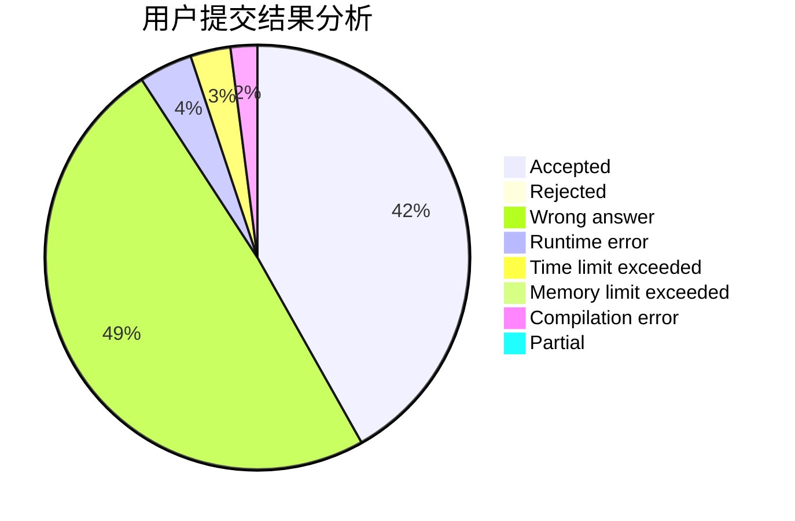
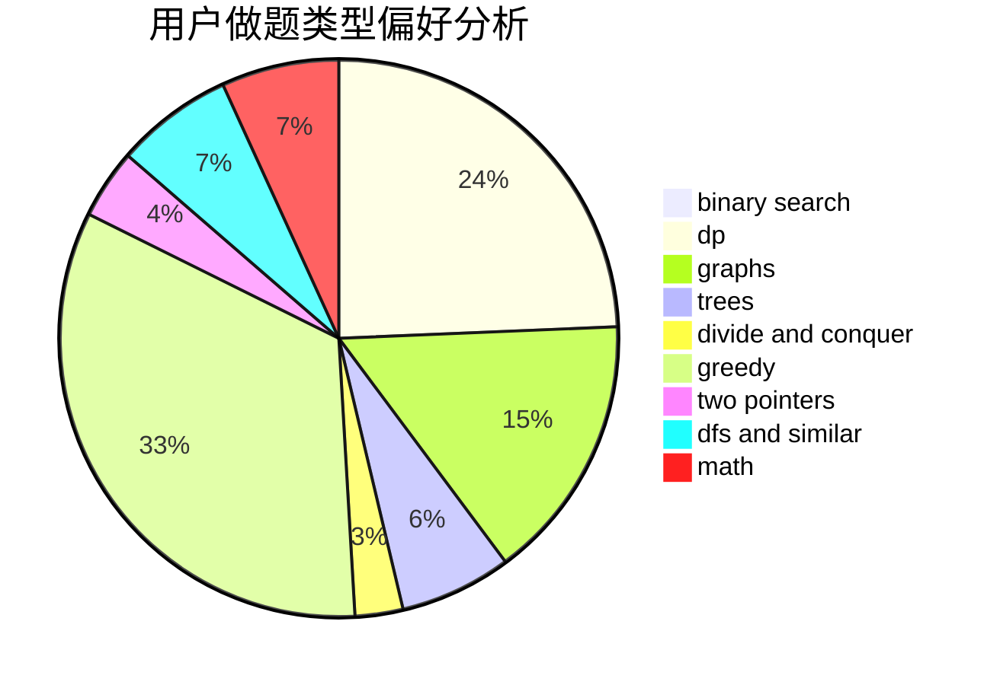

# wangchenkai

<!-- tabs:start -->

#### **用户提交结果分析**

#### **用户做题类型偏好分析**

<!-- tabs:end -->
# 推荐题目
[283C](https://codeforces.com/contest/283/problem/C)
[721D](https://codeforces.com/contest/721/problem/D)
[69A](https://codeforces.com/contest/69/problem/A)
[1350E](https://codeforces.com/contest/1350/problem/E)
[932G](https://codeforces.com/contest/932/problem/G)
[1396B](https://codeforces.com/contest/1396/problem/B)
[414B](https://codeforces.com/contest/414/problem/B)
[738D](https://codeforces.com/contest/738/problem/D)
[305D](https://codeforces.com/contest/305/problem/D)
[630C](https://codeforces.com/contest/630/problem/C)
