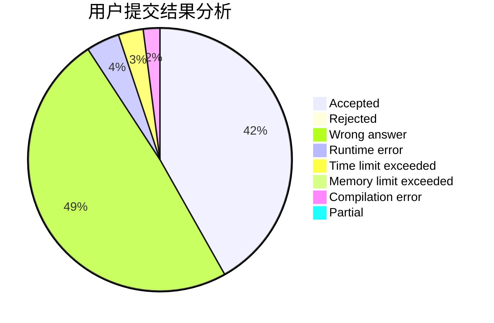
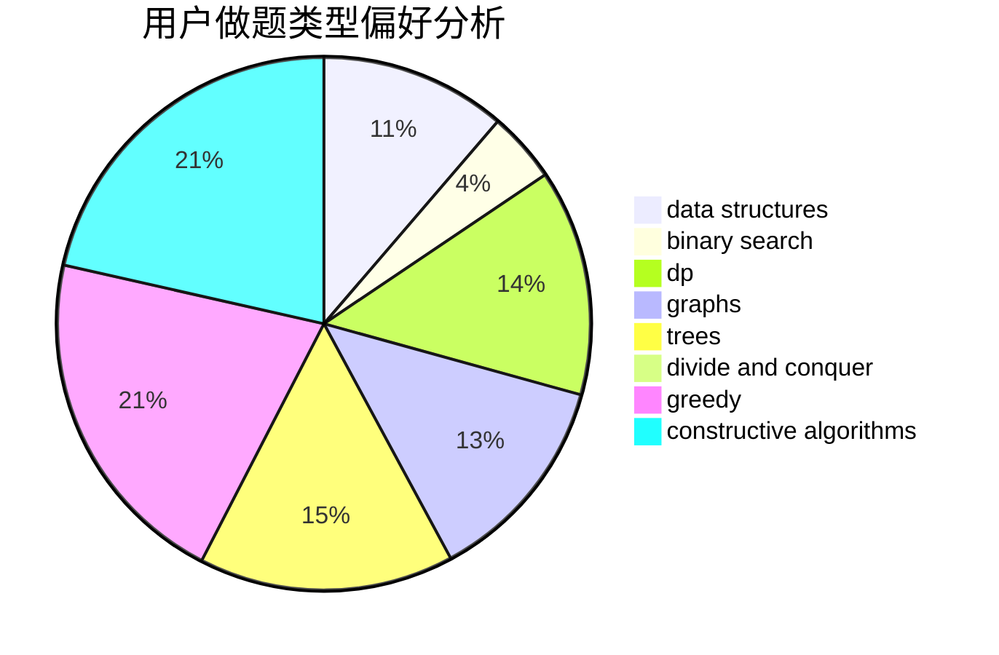

# wangchenkai

<!-- tabs:start -->

#### **用户提交结果分析**

#### **用户做题类型偏好分析**

#### **用户错题知识点分析**

<!-- tabs:end -->
# 推荐题目
[268B](https://codeforces.com/contest/268/problem/B)		implementation,
                        math		  
[702F](https://codeforces.com/contest/702/problem/F)		data structures		  
[675A](https://codeforces.com/contest/675/problem/A)		math		  
[1344A](https://codeforces.com/contest/1344/problem/A)		math,
                        number theory,
                        sortings		  
[914A](https://codeforces.com/contest/914/problem/A)		brute force,
                        implementation,
                        math		  
[1386A](https://codeforces.com/contest/1386/problem/A)		*special problem,
                        binary search,
                        constructive algorithms,
                        interactive		  
[383A](https://codeforces.com/contest/383/problem/A)		data structures,
                        greedy		  
[721B](https://codeforces.com/contest/721/problem/B)		implementation,
                        math,
                        sortings,
                        strings		  
[291A](https://codeforces.com/contest/291/problem/A)		*special problem,
                        implementation,
                        sortings		  
[611B](https://codeforces.com/contest/611/problem/B)		bitmasks,
                        brute force,
                        implementation		  
