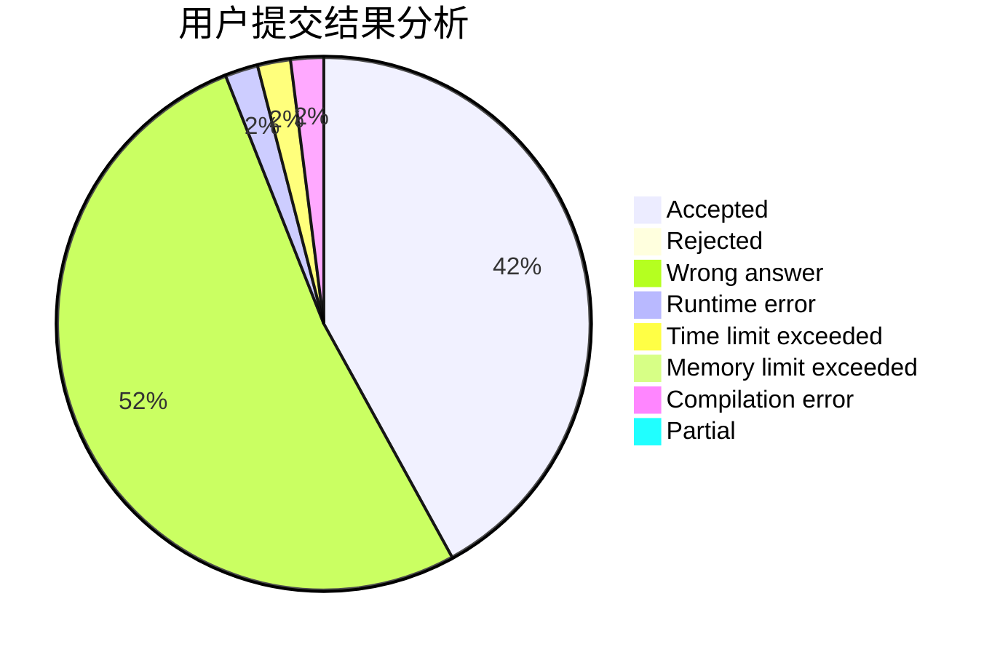
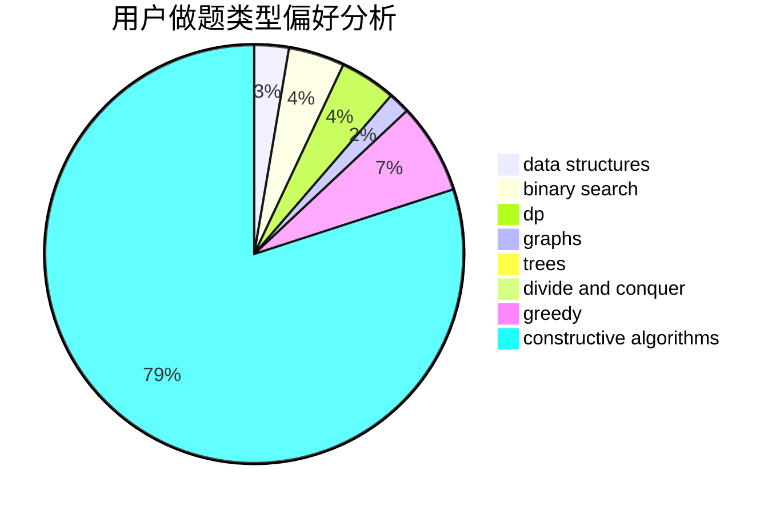
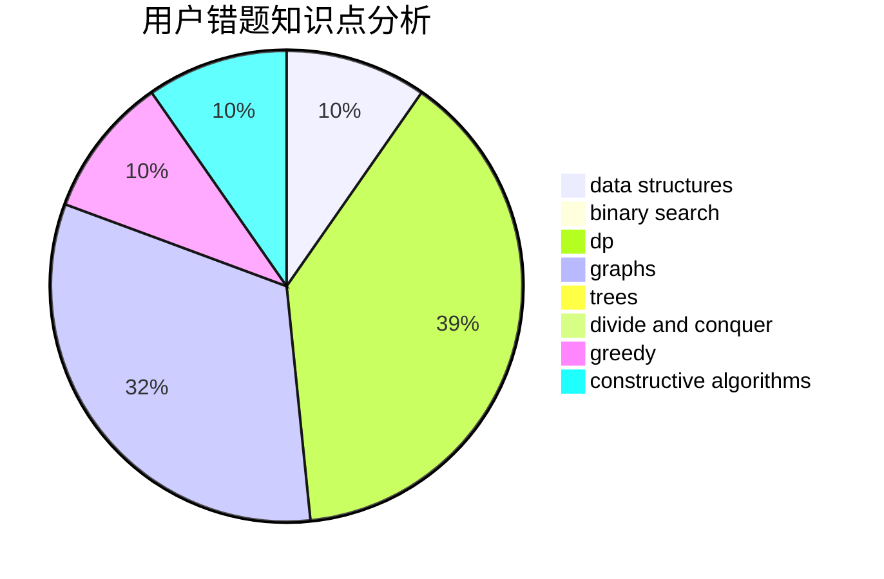

# wangdyakioi

<!-- tabs:start -->

#### **用户提交结果分析**

#### **用户做题类型偏好分析**

#### **用户错题知识点分析**

<!-- tabs:end -->
# 推荐题目
[9581](https://codeforces.com/contest/958/problem/1)		dsu,graphs,sortings,trees		  
[1423C](https://codeforces.com/contest/1423/problem/C)		divide and conquer,
                        graphs,
                        trees		  
[725F](https://codeforces.com/contest/725/problem/F)		games,
                        greedy		  
[13681](https://codeforces.com/contest/1368/problem/1)		dsu,graphs,sortings,trees		  
[1164K](https://codeforces.com/contest/1164/problem/K)		dsu,graphs,sortings,trees		  
[800A](https://codeforces.com/contest/800/problem/A)		dsu,graphs,sortings,trees		  
[212C](https://codeforces.com/contest/212/problem/C)		combinatorics,
                        dp,
                        math		  
[673B](https://codeforces.com/contest/673/problem/B)		greedy,
                        implementation		  
[761F](https://codeforces.com/contest/761/problem/F)		brute force,
                        data structures,
                        dp,
                        implementation		  
[116C](https://codeforces.com/contest/116/problem/C)		dsu,graphs,sortings,trees		  
