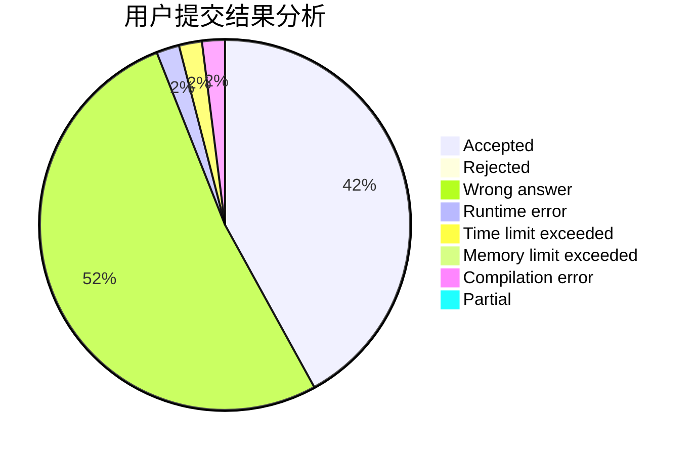
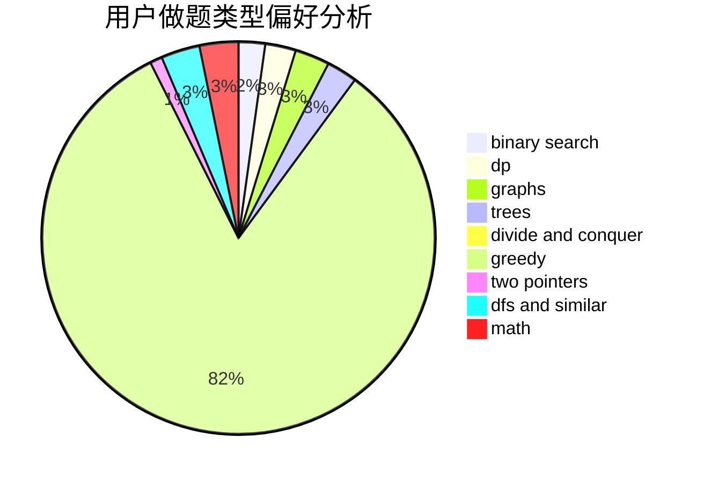

# wangdyakioi

<!-- tabs:start -->

#### **用户提交结果分析**

#### **用户做题类型偏好分析**

<!-- tabs:end -->
# 推荐题目
[9581](https://codeforces.com/contest/958/problem/1)
[1423C](https://codeforces.com/contest/1423/problem/C)
[725F](https://codeforces.com/contest/725/problem/F)
[13681](https://codeforces.com/contest/1368/problem/1)
[1164K](https://codeforces.com/contest/1164/problem/K)
[800A](https://codeforces.com/contest/800/problem/A)
[212C](https://codeforces.com/contest/212/problem/C)
[673B](https://codeforces.com/contest/673/problem/B)
[761F](https://codeforces.com/contest/761/problem/F)
[116C](https://codeforces.com/contest/116/problem/C)
