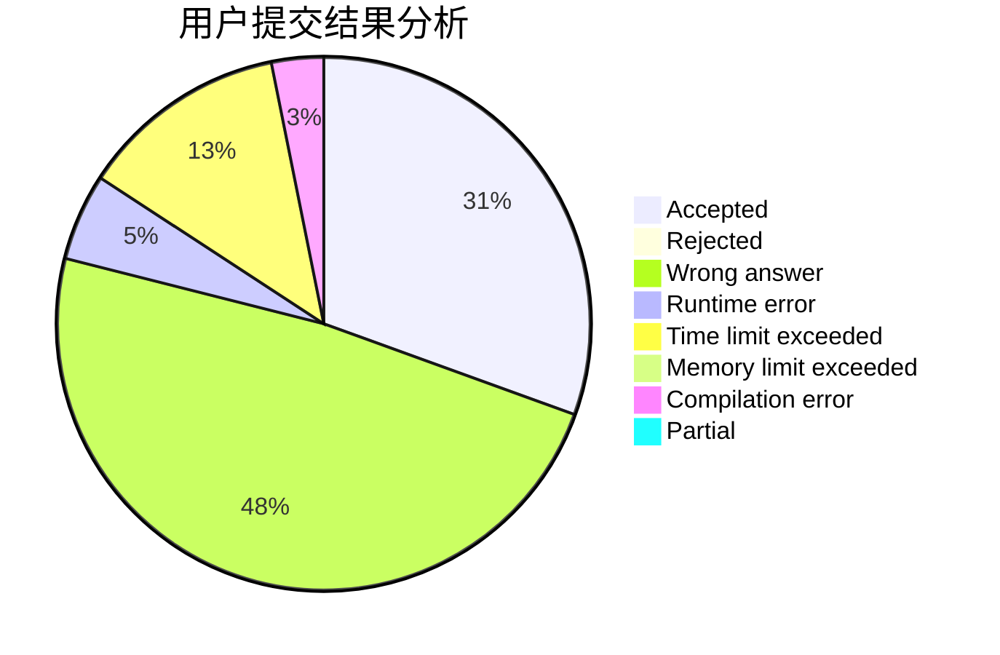
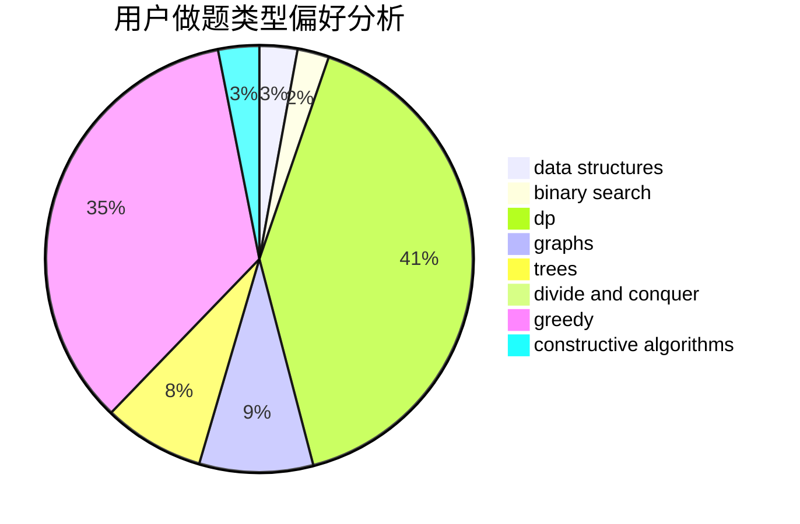
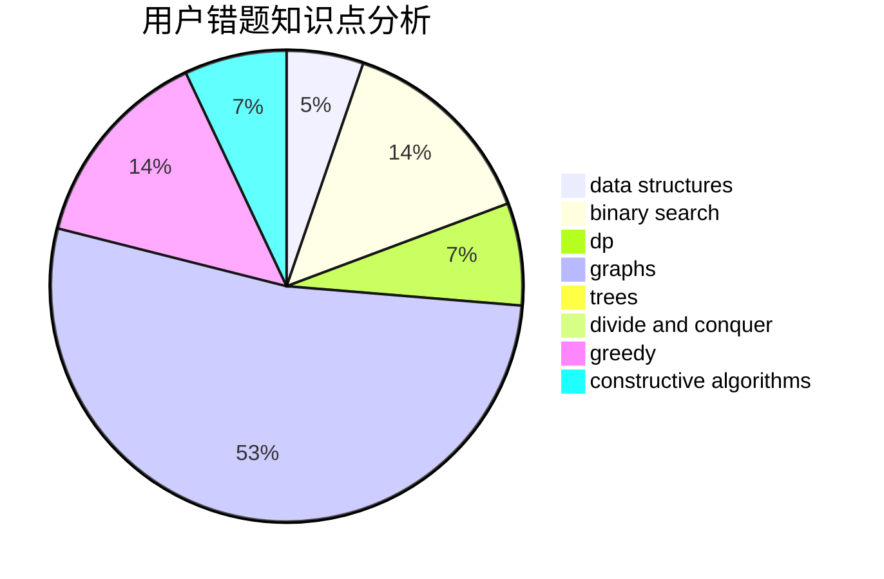

# wanghaoze

<!-- tabs:start -->

#### **用户提交结果分析**

#### **用户做题类型偏好分析**

#### **用户错题知识点分析**

<!-- tabs:end -->
# 推荐题目
[1129D](https://codeforces.com/contest/1129/problem/D)		data structures,
                        dp		  
[417C](https://codeforces.com/contest/417/problem/C)		constructive algorithms,
                        graphs,
                        implementation		  
[311D](https://codeforces.com/contest/311/problem/D)		data structures,
                        math		  
[103E](https://codeforces.com/contest/103/problem/E)		flows,
                        graph matchings		  
[1016F](https://codeforces.com/contest/1016/problem/F)		dfs and similar,
                        dp,
                        trees		  
[1370B](https://codeforces.com/contest/1370/problem/B)		constructive algorithms,
                        math,
                        number theory		  
[1149E](https://codeforces.com/contest/1149/problem/E)		games,
                        graphs		  
[102B](https://codeforces.com/contest/102/problem/B)		implementation		  
[34A](https://codeforces.com/contest/34/problem/A)		implementation		  
[1132D](https://codeforces.com/contest/1132/problem/D)		binary search,
                        greedy		  
