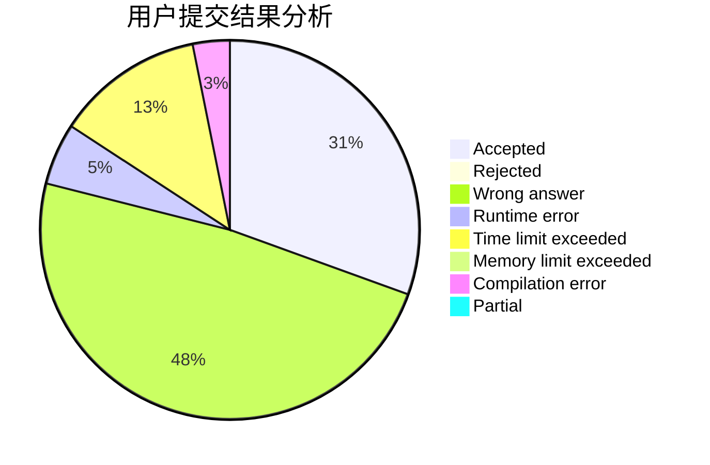
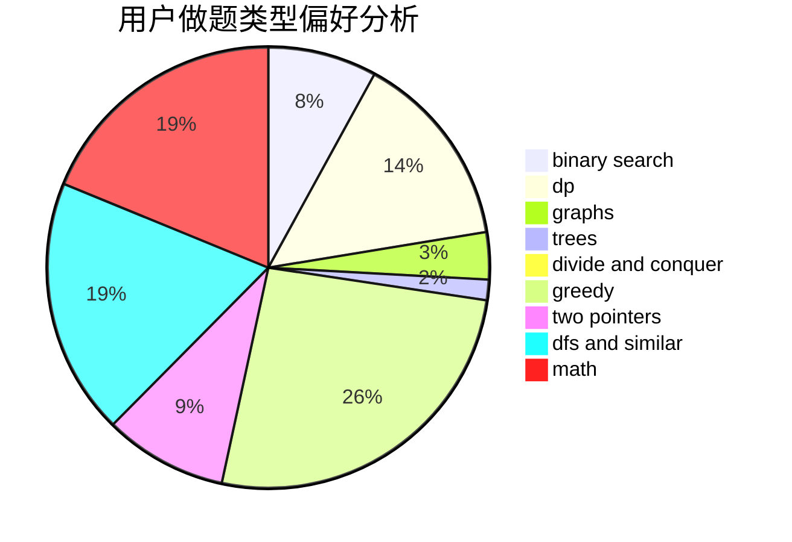

# wanghaoze

<!-- tabs:start -->

#### **用户提交结果分析**

#### **用户做题类型偏好分析**

<!-- tabs:end -->
# 推荐题目
[1131D](https://codeforces.com/contest/1131/problem/D)
[442B](https://codeforces.com/contest/442/problem/B)
[335A](https://codeforces.com/contest/335/problem/A)
[1040D](https://codeforces.com/contest/1040/problem/D)
[1017B](https://codeforces.com/contest/1017/problem/B)
[13791](https://codeforces.com/contest/1379/problem/1)
[1151C](https://codeforces.com/contest/1151/problem/C)
[1030C](https://codeforces.com/contest/1030/problem/C)
[376B](https://codeforces.com/contest/376/problem/B)
[1136C](https://codeforces.com/contest/1136/problem/C)
