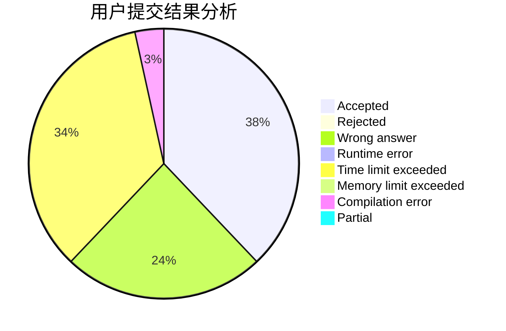
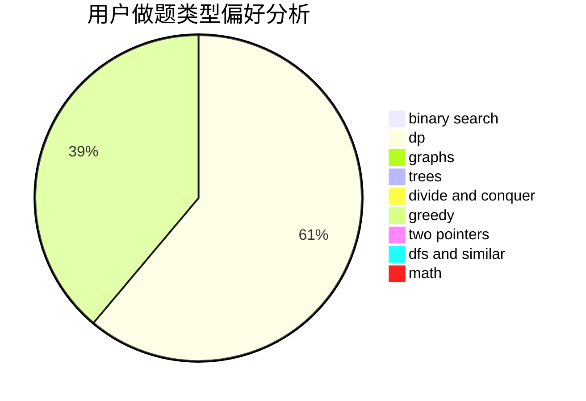

# wanghaozhou

<!-- tabs:start -->

#### **用户提交结果分析**

#### **用户做题类型偏好分析**

<!-- tabs:end -->
# 推荐题目
[735A](https://codeforces.com/contest/735/problem/A)
[536D](https://codeforces.com/contest/536/problem/D)
[859F](https://codeforces.com/contest/859/problem/F)
[232B](https://codeforces.com/contest/232/problem/B)
[1421B](https://codeforces.com/contest/1421/problem/B)
[1490C](https://codeforces.com/contest/1490/problem/C)
[1497B](https://codeforces.com/contest/1497/problem/B)
[1491C](https://codeforces.com/contest/1491/problem/C)
[1484C](https://codeforces.com/contest/1484/problem/C)
[1480A](https://codeforces.com/contest/1480/problem/A)
