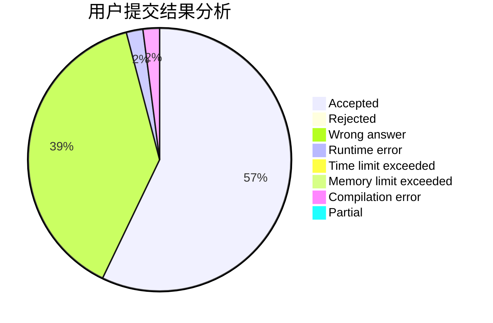
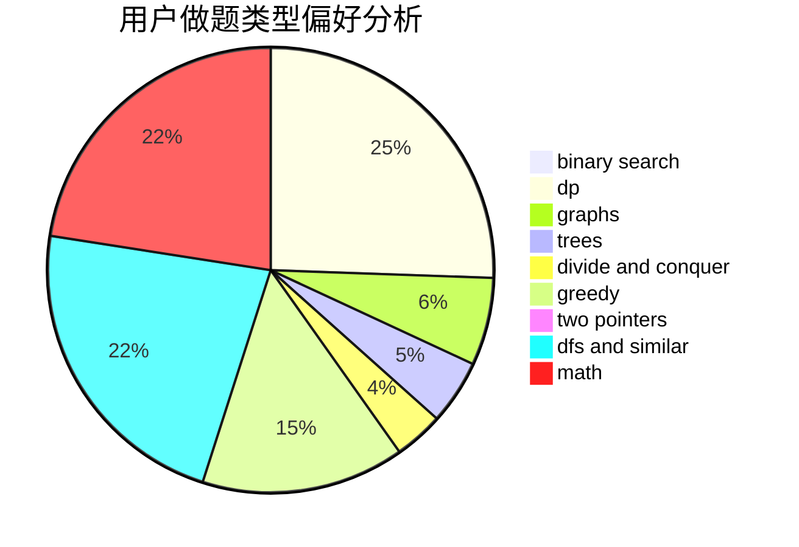

# wangluyao

<!-- tabs:start -->

#### **用户提交结果分析**

#### **用户做题类型偏好分析**

<!-- tabs:end -->
# 推荐题目
[467A](https://codeforces.com/contest/467/problem/A)
[669C](https://codeforces.com/contest/669/problem/C)
[668B](https://codeforces.com/contest/668/problem/B)
[1147A](https://codeforces.com/contest/1147/problem/A)
[1327A](https://codeforces.com/contest/1327/problem/A)
[327A](https://codeforces.com/contest/327/problem/A)
[463A](https://codeforces.com/contest/463/problem/A)
[816C](https://codeforces.com/contest/816/problem/C)
[533A](https://codeforces.com/contest/533/problem/A)
[1167A](https://codeforces.com/contest/1167/problem/A)
