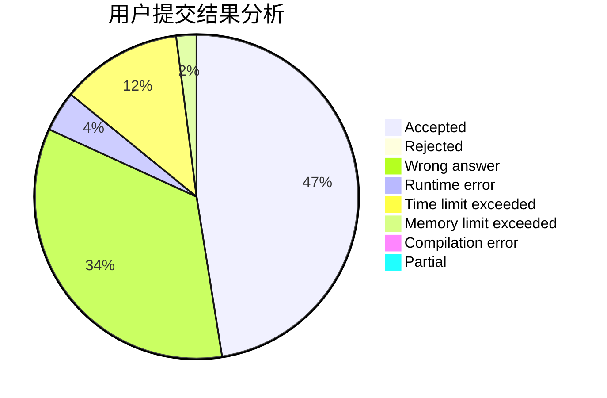
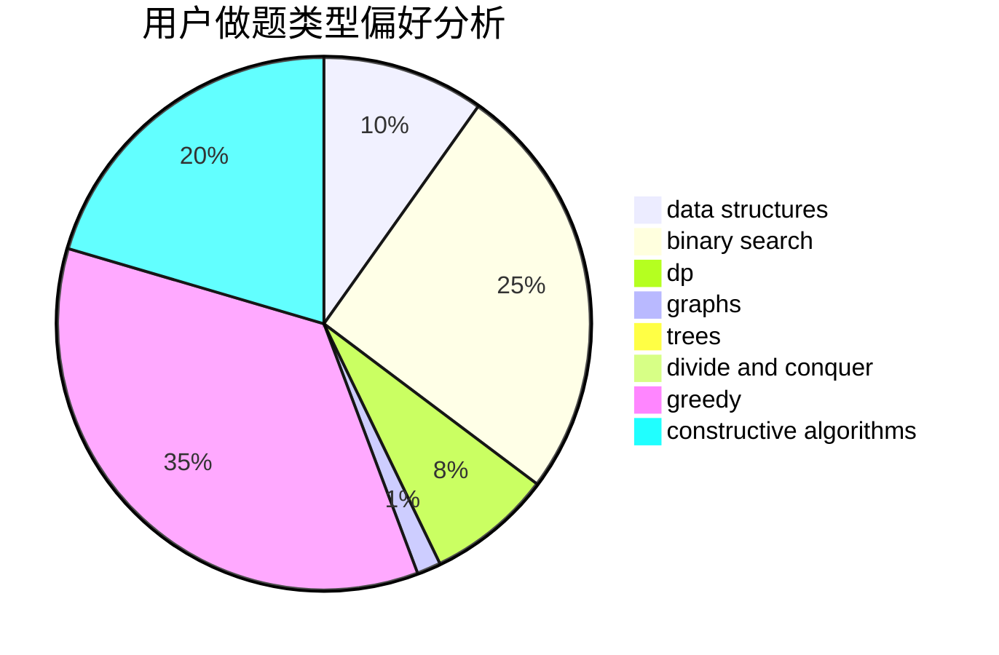
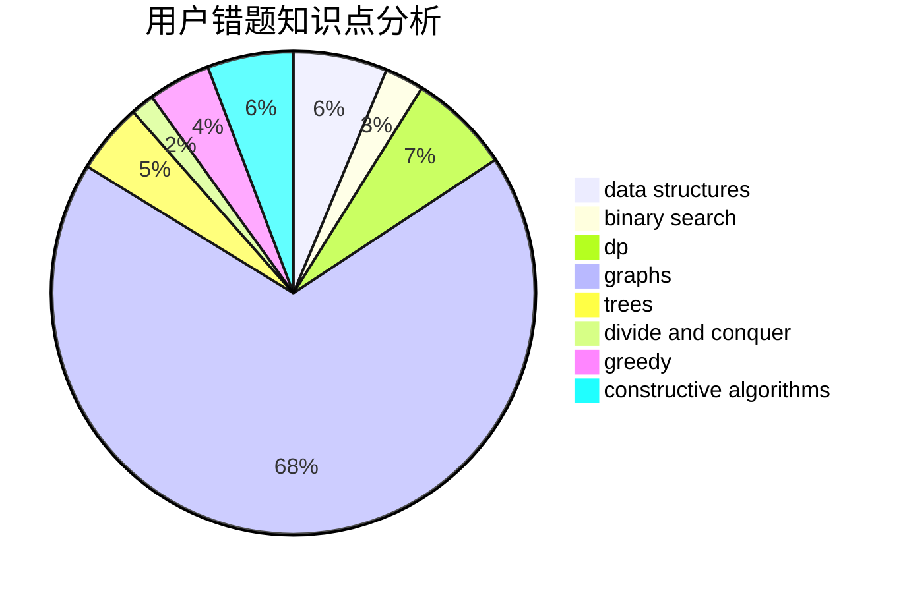

# Cain

<!-- tabs:start -->

#### **用户提交结果分析**

#### **用户做题类型偏好分析**

#### **用户错题知识点分析**

<!-- tabs:end -->
# 推荐题目
[149E](https://codeforces.com/contest/149/problem/E)		string suffix structures,
                        strings		  
[14B](https://codeforces.com/contest/14/problem/B)		implementation		  
[612C](https://codeforces.com/contest/612/problem/C)		data structures,
                        expression parsing,
                        math		  
[1081A](https://codeforces.com/contest/1081/problem/A)		constructive algorithms,
                        math		  
[626F](https://codeforces.com/contest/626/problem/F)		dp		  
[121D](https://codeforces.com/contest/121/problem/D)		binary search,
                        implementation,
                        two pointers		  
[626E](https://codeforces.com/contest/626/problem/E)		binary search,
                        math,
                        ternary search		  
[1253C](https://codeforces.com/contest/1253/problem/C)		dp,
                        greedy,
                        math,
                        sortings		  
[1349D](https://codeforces.com/contest/1349/problem/D)		math,
                        probabilities		  
[1400C](https://codeforces.com/contest/1400/problem/C)		2-sat,
                        brute force,
                        constructive algorithms,
                        greedy		  
