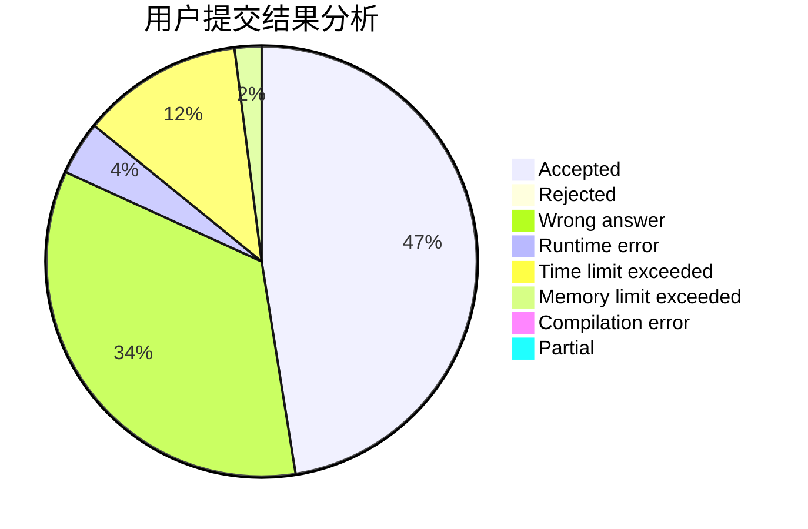
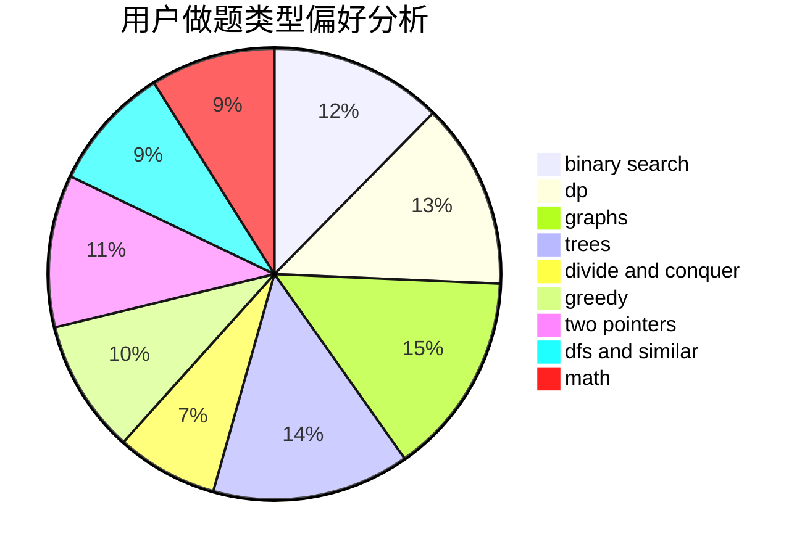

# Cain

<!-- tabs:start -->

#### **用户提交结果分析**

#### **用户做题类型偏好分析**

<!-- tabs:end -->
# 推荐题目
[1510A](https://codeforces.com/contest/1510/problem/A)
[1510C](https://codeforces.com/contest/1510/problem/C)
[631E](https://codeforces.com/contest/631/problem/E)
[1081D](https://codeforces.com/contest/1081/problem/D)
[653A](https://codeforces.com/contest/653/problem/A)
[1227B](https://codeforces.com/contest/1227/problem/B)
[652F](https://codeforces.com/contest/652/problem/F)
[1260E](https://codeforces.com/contest/1260/problem/E)
[13562](https://codeforces.com/contest/1356/problem/2)
[140B](https://codeforces.com/contest/140/problem/B)
