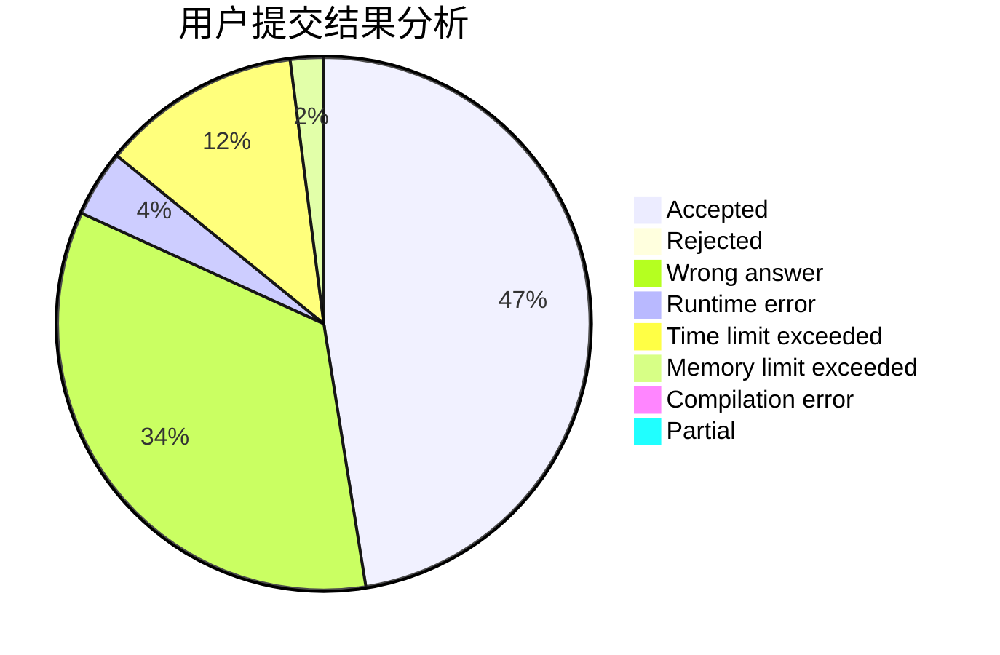
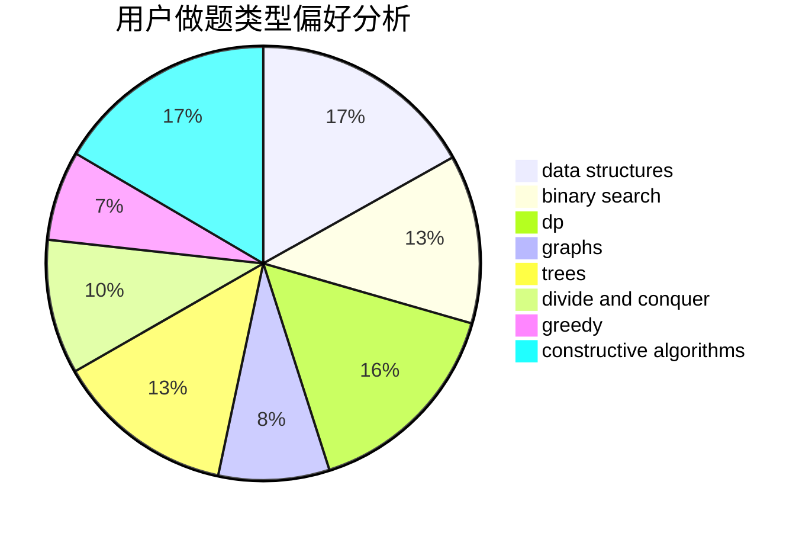
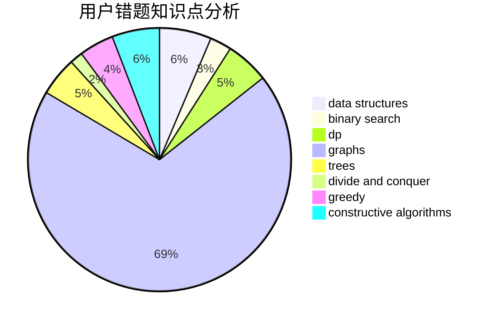

# Cain

<!-- tabs:start -->

#### **用户提交结果分析**

#### **用户做题类型偏好分析**

#### **用户错题知识点分析**

<!-- tabs:end -->
# 推荐题目
[1510A](https://codeforces.com/contest/1510/problem/A)		nan		  
[1510C](https://codeforces.com/contest/1510/problem/C)		dfs and similar,
                        graph matchings,
                        graphs		  
[631E](https://codeforces.com/contest/631/problem/E)		data structures,
                        dp,
                        geometry		  
[1081D](https://codeforces.com/contest/1081/problem/D)		dsu,
                        graphs,
                        shortest paths,
                        sortings		  
[653A](https://codeforces.com/contest/653/problem/A)		brute force,
                        implementation,
                        sortings		  
[1227B](https://codeforces.com/contest/1227/problem/B)		constructive algorithms		  
[652F](https://codeforces.com/contest/652/problem/F)		constructive algorithms,
                        math		  
[1260E](https://codeforces.com/contest/1260/problem/E)		brute force,
                        dp,
                        greedy		  
[13562](https://codeforces.com/contest/1356/problem/2)		dsu,graphs,sortings,trees		  
[140B](https://codeforces.com/contest/140/problem/B)		brute force,
                        greedy,
                        implementation		  
