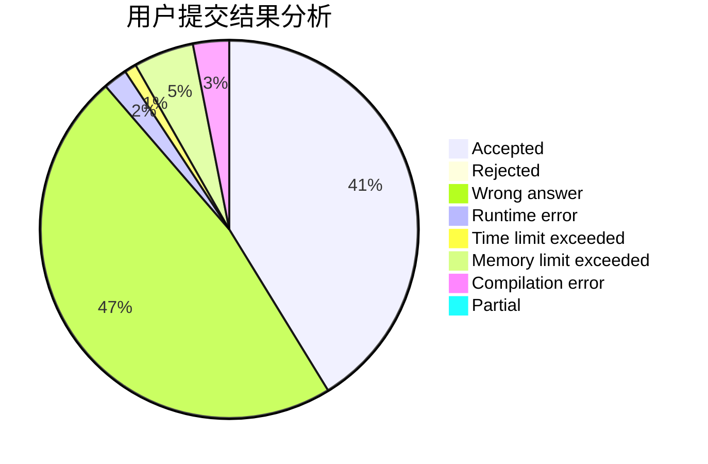
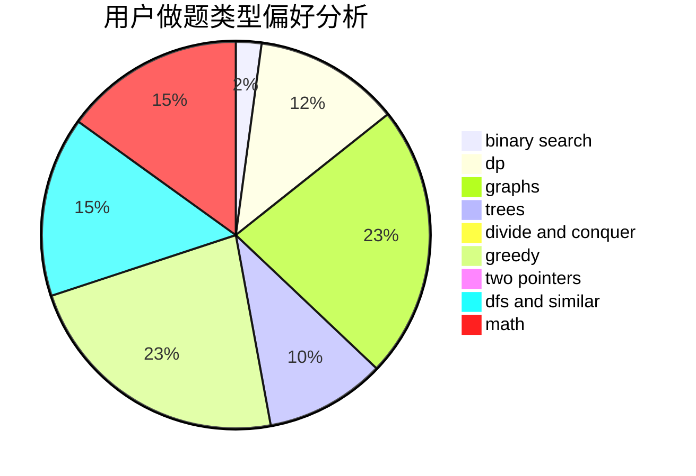

# wangshufeng

<!-- tabs:start -->

#### **用户提交结果分析**

#### **用户做题类型偏好分析**

<!-- tabs:end -->
# 推荐题目
[1416D](https://codeforces.com/contest/1416/problem/D)
[707B](https://codeforces.com/contest/707/problem/B)
[847E](https://codeforces.com/contest/847/problem/E)
[286D](https://codeforces.com/contest/286/problem/D)
[1210E](https://codeforces.com/contest/1210/problem/E)
[387C](https://codeforces.com/contest/387/problem/C)
[312C](https://codeforces.com/contest/312/problem/C)
[1023F](https://codeforces.com/contest/1023/problem/F)
[11C](https://codeforces.com/contest/11/problem/C)
[637B](https://codeforces.com/contest/637/problem/B)
