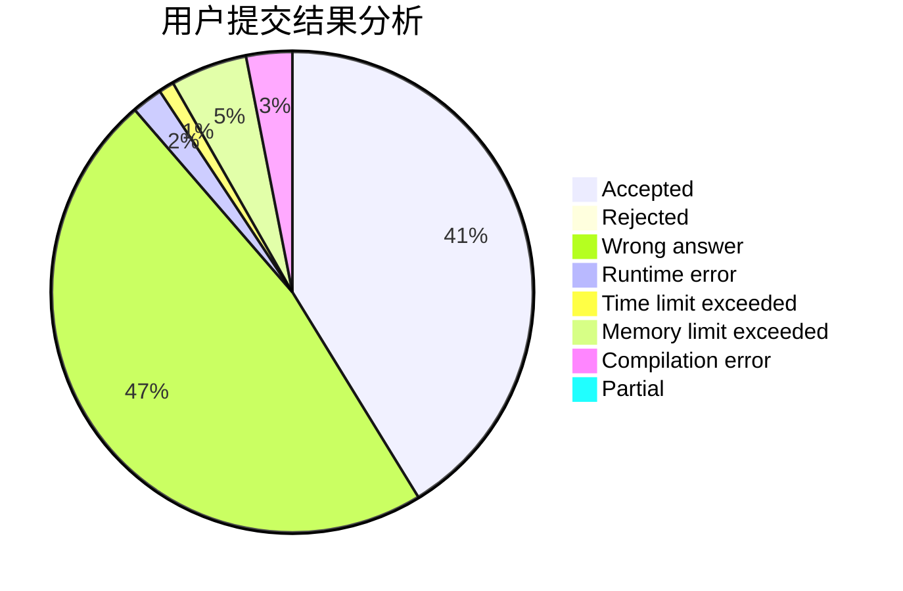
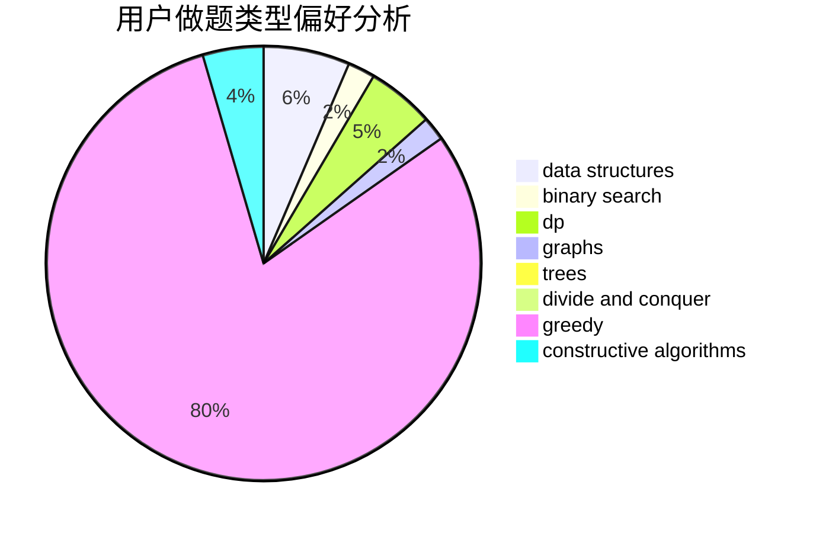
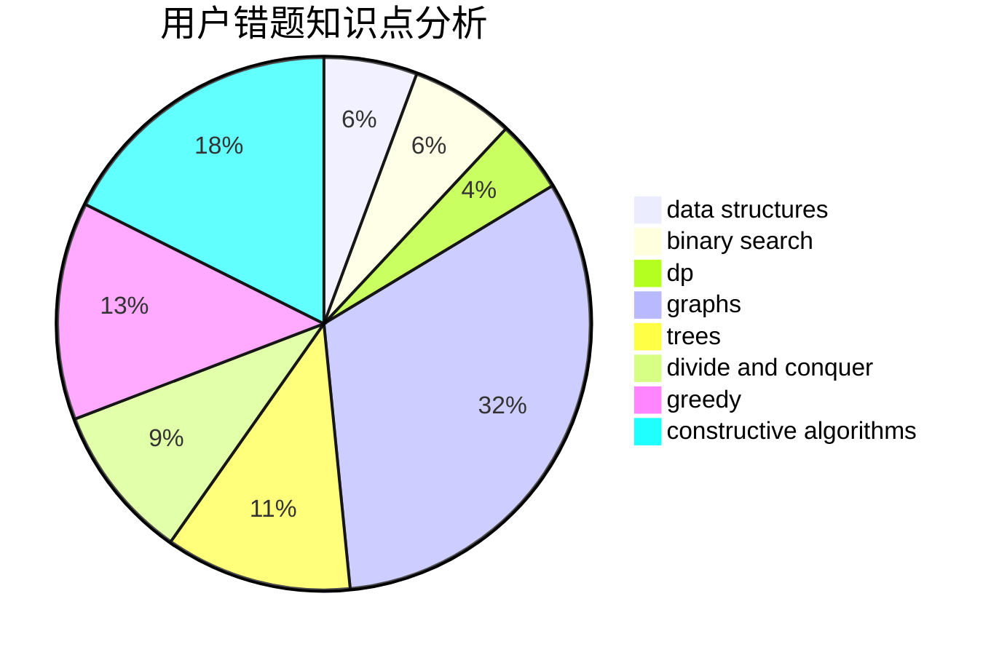

# wangshufeng

<!-- tabs:start -->

#### **用户提交结果分析**

#### **用户做题类型偏好分析**

#### **用户错题知识点分析**

<!-- tabs:end -->
# 推荐题目
[1405C](https://codeforces.com/contest/1405/problem/C)		dsu,graphs,sortings,trees		  
[683A](https://codeforces.com/contest/683/problem/A)		*special problem,
                        geometry		  
[828E](https://codeforces.com/contest/828/problem/E)		dsu,graphs,sortings,trees		  
[26D](https://codeforces.com/contest/26/problem/D)		combinatorics,
                        math,
                        probabilities		  
[1206D](https://codeforces.com/contest/1206/problem/D)		dsu,graphs,sortings,trees		  
[359D](https://codeforces.com/contest/359/problem/D)		binary search,
                        brute force,
                        data structures,
                        math,
                        two pointers		  
[295E](https://codeforces.com/contest/295/problem/E)		data structures		  
[1023C](https://codeforces.com/contest/1023/problem/C)		greedy		  
[1196B](https://codeforces.com/contest/1196/problem/B)		constructive algorithms,
                        math		  
[618A](https://codeforces.com/contest/618/problem/A)		implementation		  
