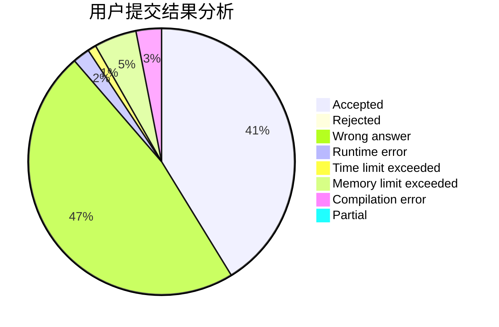
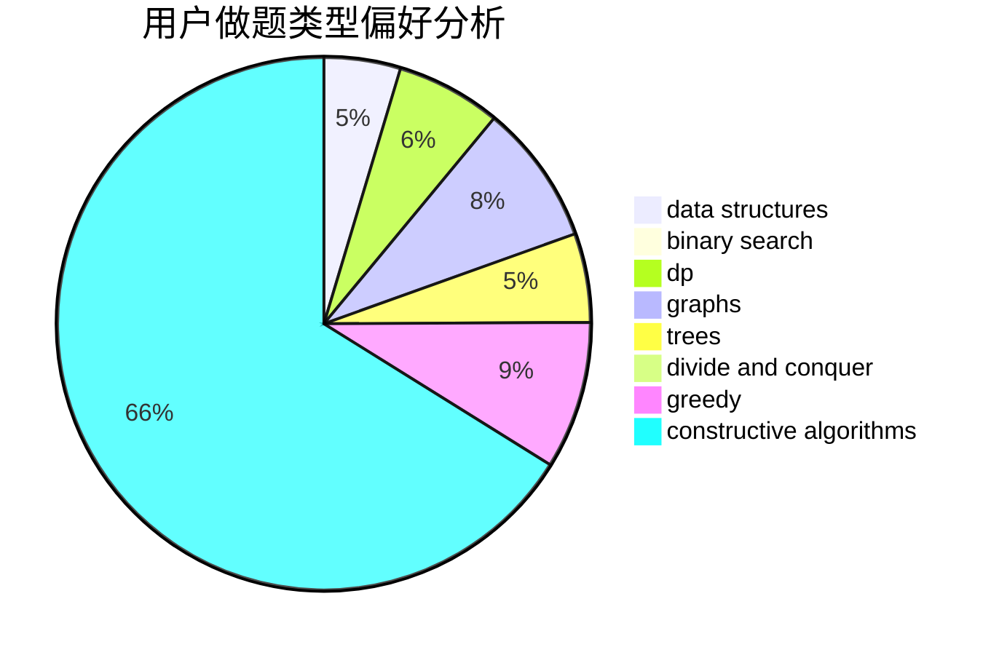
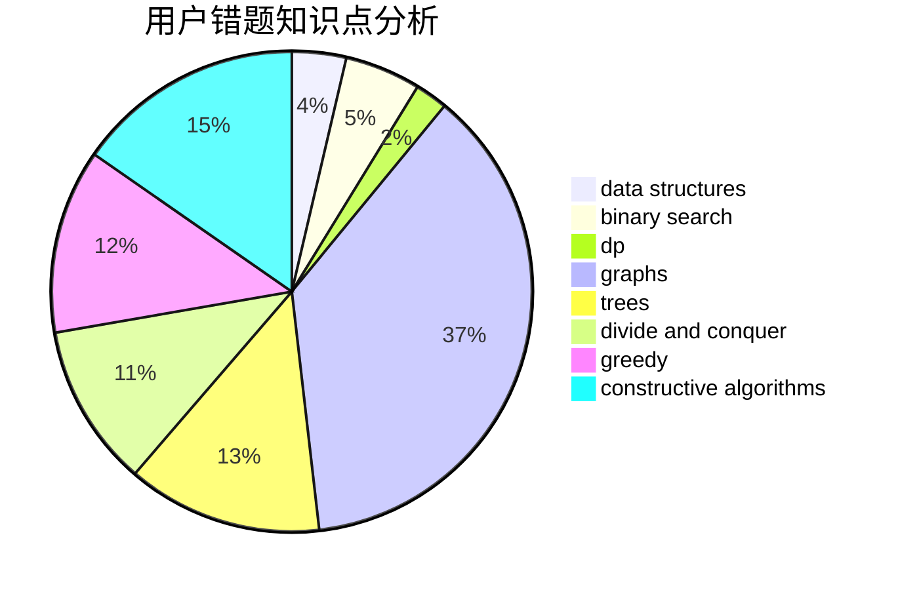

# wangshufeng

<!-- tabs:start -->

#### **用户提交结果分析**

#### **用户做题类型偏好分析**

#### **用户错题知识点分析**

<!-- tabs:end -->
# 推荐题目
[1416D](https://codeforces.com/contest/1416/problem/D)		data structures,
                        dsu,
                        graphs,
                        implementation,
                        trees		  
[707B](https://codeforces.com/contest/707/problem/B)		graphs		  
[847E](https://codeforces.com/contest/847/problem/E)		binary search,
                        dp		  
[286D](https://codeforces.com/contest/286/problem/D)		data structures,
                        sortings		  
[1210E](https://codeforces.com/contest/1210/problem/E)		math		  
[387C](https://codeforces.com/contest/387/problem/C)		greedy,
                        implementation		  
[312C](https://codeforces.com/contest/312/problem/C)		dsu,graphs,sortings,trees		  
[1023F](https://codeforces.com/contest/1023/problem/F)		dfs and similar,
                        dsu,
                        graphs,
                        trees		  
[11C](https://codeforces.com/contest/11/problem/C)		implementation		  
[637B](https://codeforces.com/contest/637/problem/B)		*special problem,
                        binary search,
                        constructive algorithms,
                        data structures,
                        sortings		  
