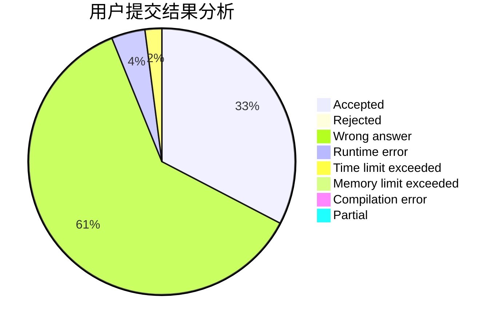
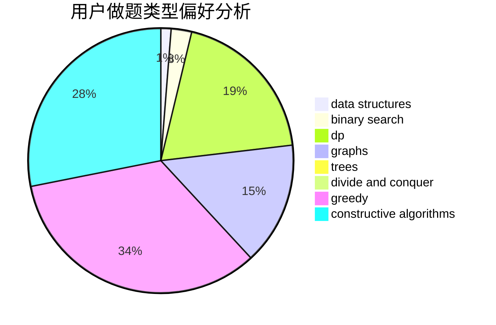
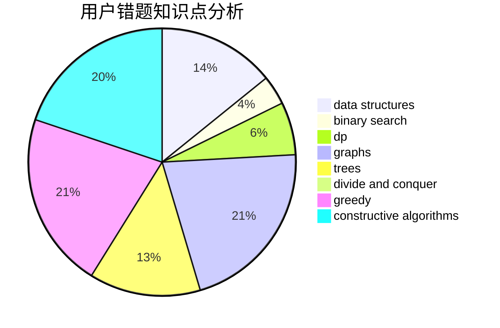

# wangxiaojingzi

<!-- tabs:start -->

#### **用户提交结果分析**

#### **用户做题类型偏好分析**

#### **用户错题知识点分析**

<!-- tabs:end -->
# 推荐题目
[499C](https://codeforces.com/contest/499/problem/C)		dsu,graphs,sortings,trees		  
[1248D2](https://codeforces.com/contest/1248D/problem/2)		dsu,graphs,sortings,trees		  
[450B](https://codeforces.com/contest/450/problem/B)		implementation,
                        math		  
[714E](https://codeforces.com/contest/714/problem/E)		dsu,graphs,sortings,trees		  
[825D](https://codeforces.com/contest/825/problem/D)		binary search,
                        greedy,
                        implementation		  
[494B](https://codeforces.com/contest/494/problem/B)		dp,
                        strings		  
[618D](https://codeforces.com/contest/618/problem/D)		dfs and similar,
                        dp,
                        graph matchings,
                        greedy,
                        trees		  
[157B](https://codeforces.com/contest/157/problem/B)		geometry,
                        sortings		  
[854A](https://codeforces.com/contest/854/problem/A)		brute force,
                        constructive algorithms,
                        math		  
[518B](https://codeforces.com/contest/518/problem/B)		greedy,
                        implementation,
                        strings		  
