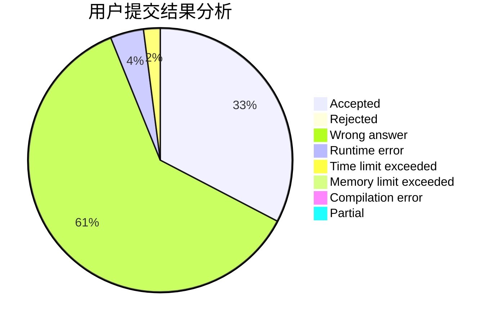
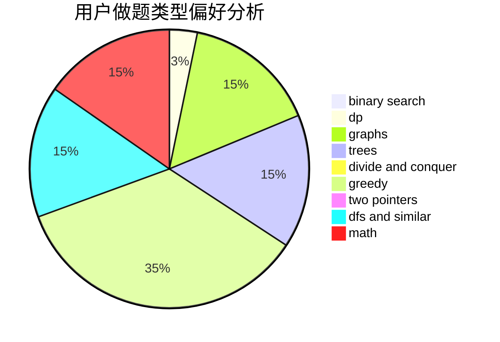

# wangxiaojingzi

<!-- tabs:start -->

#### **用户提交结果分析**

#### **用户做题类型偏好分析**

<!-- tabs:end -->
# 推荐题目
[51A](https://codeforces.com/contest/51/problem/A)
[1252F](https://codeforces.com/contest/1252/problem/F)
[472C](https://codeforces.com/contest/472/problem/C)
[733B](https://codeforces.com/contest/733/problem/B)
[844A](https://codeforces.com/contest/844/problem/A)
[514C](https://codeforces.com/contest/514/problem/C)
[639B](https://codeforces.com/contest/639/problem/B)
[1781](https://codeforces.com/contest/178/problem/1)
[872B](https://codeforces.com/contest/872/problem/B)
[544A](https://codeforces.com/contest/544/problem/A)
