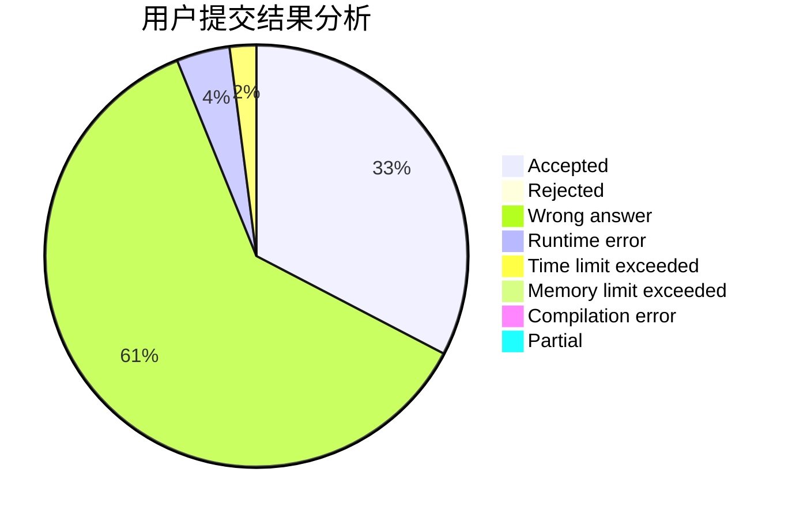
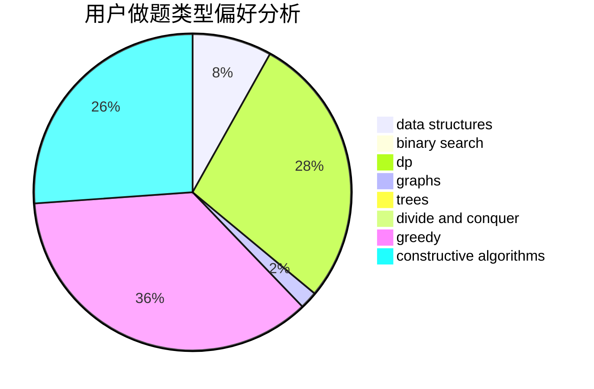
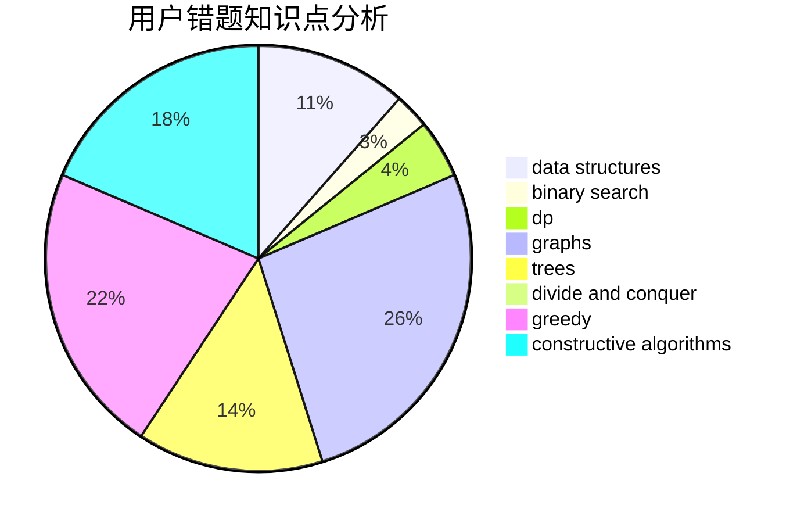

# wangxiaojingzi

<!-- tabs:start -->

#### **用户提交结果分析**

#### **用户做题类型偏好分析**

#### **用户错题知识点分析**

<!-- tabs:end -->
# 推荐题目
[51A](https://codeforces.com/contest/51/problem/A)		implementation		  
[1252F](https://codeforces.com/contest/1252/problem/F)		hashing,
                        trees		  
[472C](https://codeforces.com/contest/472/problem/C)		greedy		  
[733B](https://codeforces.com/contest/733/problem/B)		math		  
[844A](https://codeforces.com/contest/844/problem/A)		greedy,
                        implementation,
                        strings		  
[514C](https://codeforces.com/contest/514/problem/C)		binary search,
                        data structures,
                        hashing,
                        string suffix structures,
                        strings		  
[639B](https://codeforces.com/contest/639/problem/B)		constructive algorithms,
                        graphs,
                        trees		  
[1781](https://codeforces.com/contest/178/problem/1)		dsu,graphs,sortings,trees		  
[872B](https://codeforces.com/contest/872/problem/B)		dsu,graphs,sortings,trees		  
[544A](https://codeforces.com/contest/544/problem/A)		implementation,
                        strings		  
