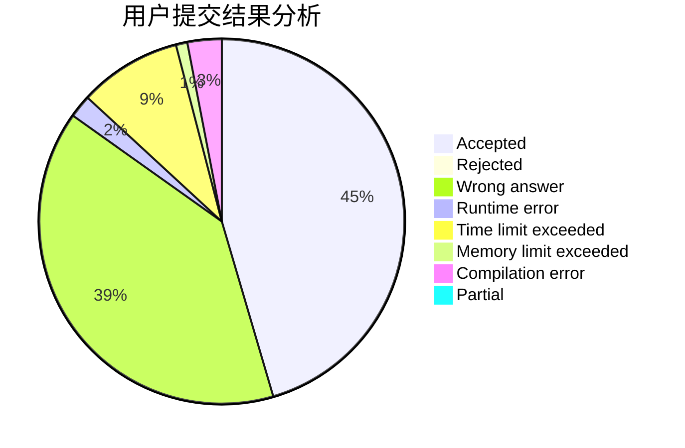
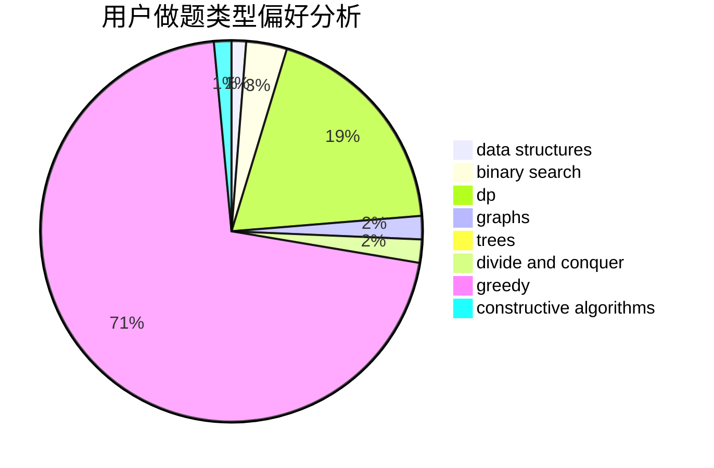
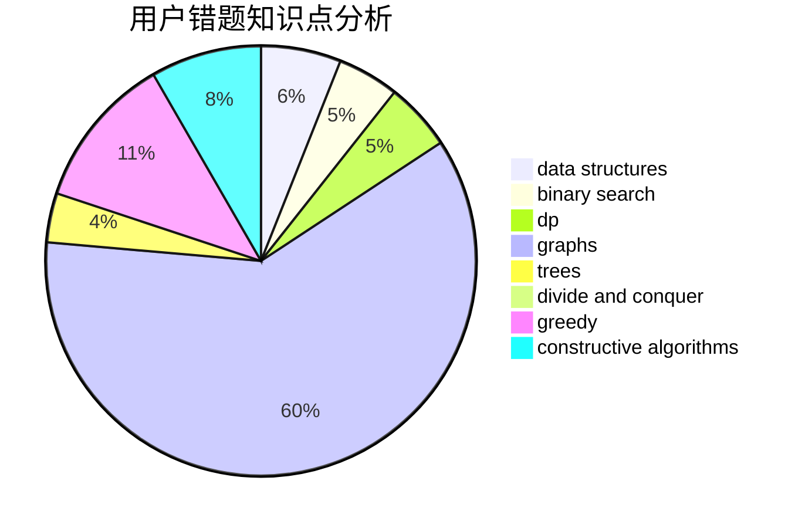

# wangziji

<!-- tabs:start -->

#### **用户提交结果分析**

#### **用户做题类型偏好分析**

#### **用户错题知识点分析**

<!-- tabs:end -->
# 推荐题目
[429B](https://codeforces.com/contest/429/problem/B)		dp		  
[838E](https://codeforces.com/contest/838/problem/E)		dp		  
[1151F](https://codeforces.com/contest/1151/problem/F)		combinatorics,
                        dp,
                        matrices,
                        probabilities		  
[124A](https://codeforces.com/contest/124/problem/A)		math		  
[1213F](https://codeforces.com/contest/1213/problem/F)		data structures,
                        dfs and similar,
                        dsu,
                        graphs,
                        greedy,
                        implementation,
                        strings		  
[12622](https://codeforces.com/contest/1262/problem/2)		dsu,graphs,sortings,trees		  
[946C](https://codeforces.com/contest/946/problem/C)		greedy,
                        strings		  
[899C](https://codeforces.com/contest/899/problem/C)		constructive algorithms,
                        graphs,
                        math		  
[114C](https://codeforces.com/contest/114/problem/C)		dsu,graphs,sortings,trees		  
[1299E](https://codeforces.com/contest/1299/problem/E)		interactive,
                        math		  
