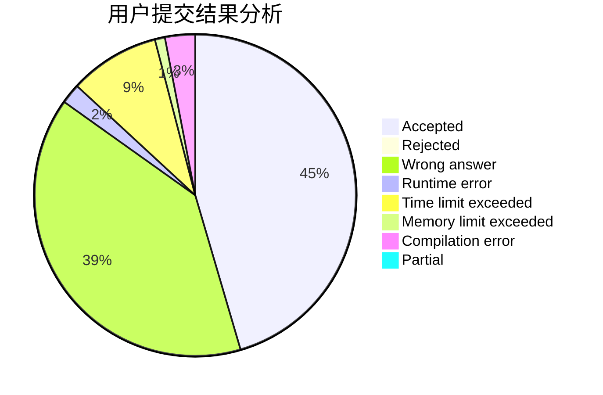
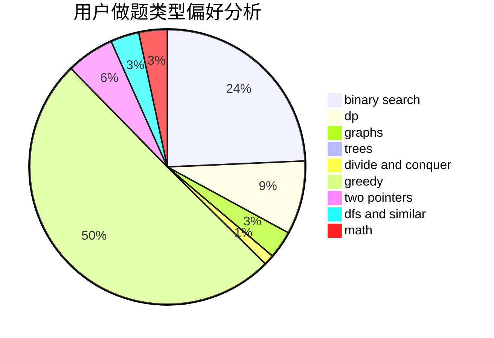

# wangziji

<!-- tabs:start -->

#### **用户提交结果分析**

#### **用户做题类型偏好分析**

<!-- tabs:end -->
# 推荐题目
[429B](https://codeforces.com/contest/429/problem/B)
[838E](https://codeforces.com/contest/838/problem/E)
[1151F](https://codeforces.com/contest/1151/problem/F)
[124A](https://codeforces.com/contest/124/problem/A)
[1213F](https://codeforces.com/contest/1213/problem/F)
[12622](https://codeforces.com/contest/1262/problem/2)
[946C](https://codeforces.com/contest/946/problem/C)
[899C](https://codeforces.com/contest/899/problem/C)
[114C](https://codeforces.com/contest/114/problem/C)
[1299E](https://codeforces.com/contest/1299/problem/E)
