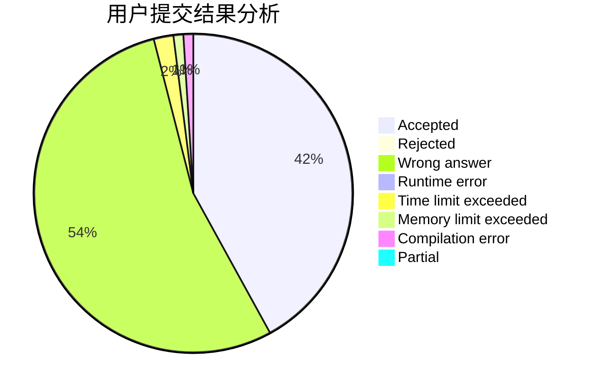
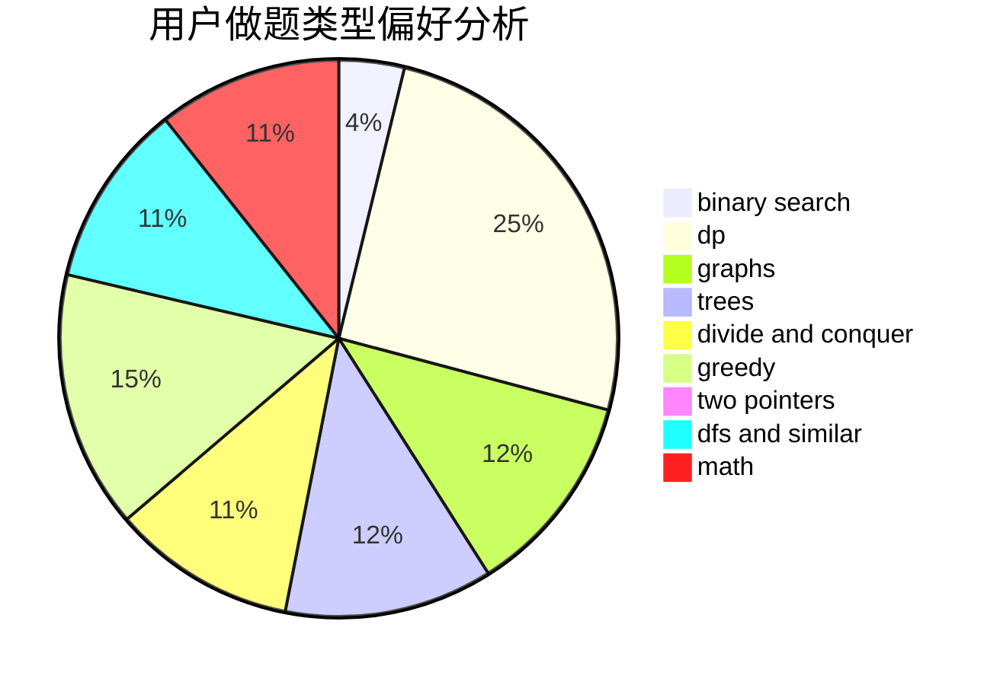

# wannaAC

<!-- tabs:start -->

#### **用户提交结果分析**

#### **用户做题类型偏好分析**

<!-- tabs:end -->
# 推荐题目
[1355A](https://codeforces.com/contest/1355/problem/A)
[1140F](https://codeforces.com/contest/1140/problem/F)
[287C](https://codeforces.com/contest/287/problem/C)
[59A](https://codeforces.com/contest/59/problem/A)
[1245F](https://codeforces.com/contest/1245/problem/F)
[952C](https://codeforces.com/contest/952/problem/C)
[672B](https://codeforces.com/contest/672/problem/B)
[938A](https://codeforces.com/contest/938/problem/A)
[1017F](https://codeforces.com/contest/1017/problem/F)
[335F](https://codeforces.com/contest/335/problem/F)
