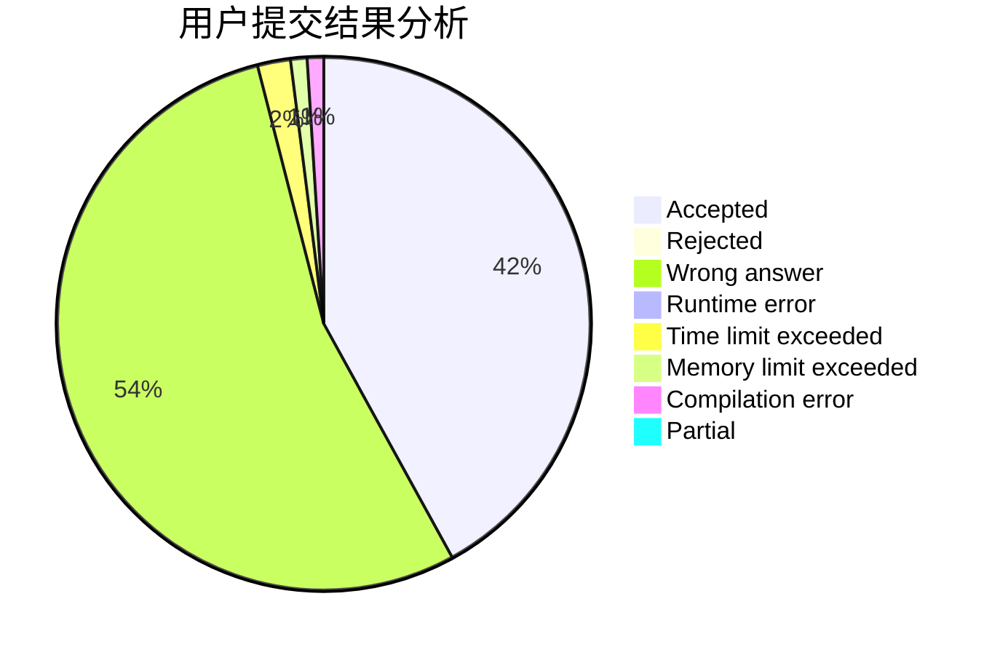
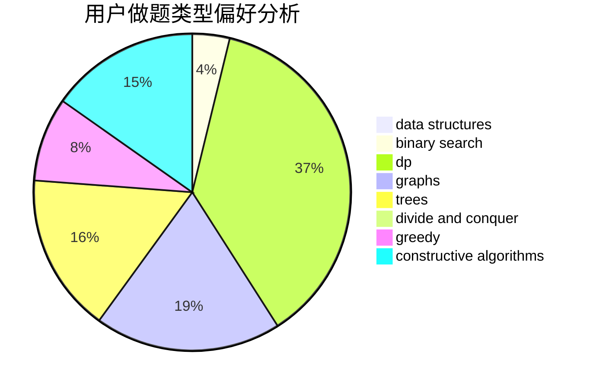

# wannaAC

<!-- tabs:start -->

#### **用户提交结果分析**

#### **用户做题类型偏好分析**

#### **用户错题知识点分析**

<!-- tabs:end -->
# 推荐题目
[1355A](https://codeforces.com/contest/1355/problem/A)		brute force,
                        implementation,
                        math		  
[1140F](https://codeforces.com/contest/1140/problem/F)		data structures,
                        divide and conquer,
                        dsu		  
[287C](https://codeforces.com/contest/287/problem/C)		dsu,graphs,sortings,trees		  
[59A](https://codeforces.com/contest/59/problem/A)		implementation,
                        strings		  
[1245F](https://codeforces.com/contest/1245/problem/F)		bitmasks,
                        brute force,
                        combinatorics,
                        dp		  
[952C](https://codeforces.com/contest/952/problem/C)		implementation		  
[672B](https://codeforces.com/contest/672/problem/B)		constructive algorithms,
                        implementation,
                        strings		  
[938A](https://codeforces.com/contest/938/problem/A)		implementation		  
[1017F](https://codeforces.com/contest/1017/problem/F)		brute force,
                        math		  
[335F](https://codeforces.com/contest/335/problem/F)		dp,
                        greedy		  
