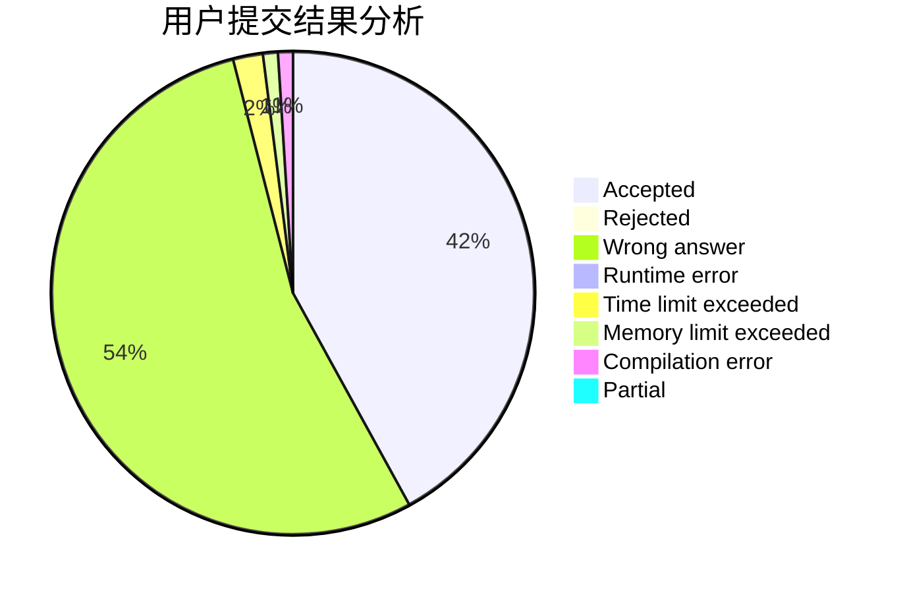
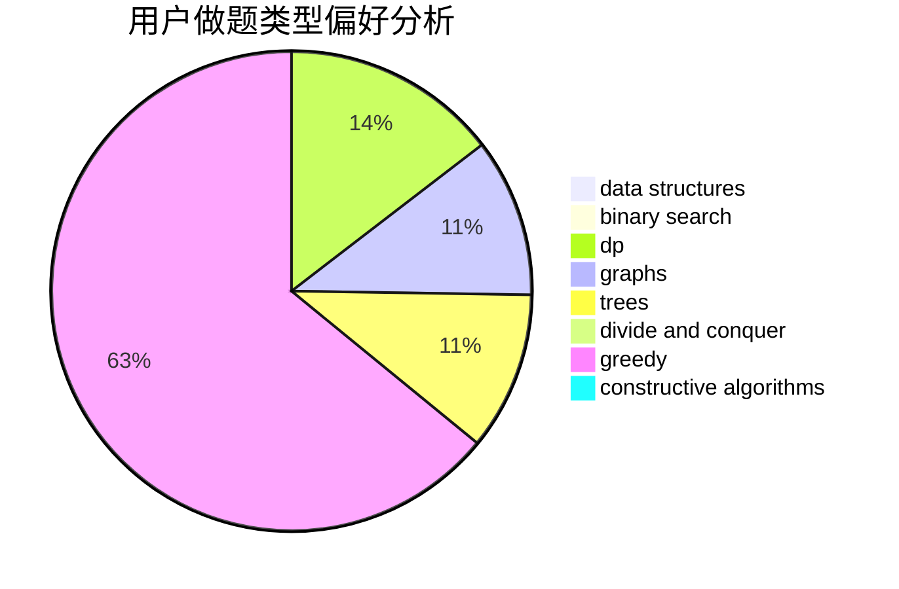

# wannaAC

<!-- tabs:start -->

#### **用户提交结果分析**

#### **用户做题类型偏好分析**

#### **用户错题知识点分析**

<!-- tabs:end -->
# 推荐题目
[1348C](https://codeforces.com/contest/1348/problem/C)		constructive algorithms,
                        greedy,
                        sortings,
                        strings		  
[1139B](https://codeforces.com/contest/1139/problem/B)		greedy,
                        implementation		  
[271A](https://codeforces.com/contest/271/problem/A)		brute force		  
[578D](https://codeforces.com/contest/578/problem/D)		dp,
                        greedy		  
[1240C](https://codeforces.com/contest/1240/problem/C)		dsu,graphs,sortings,trees		  
[931C](https://codeforces.com/contest/931/problem/C)		implementation,
                        math		  
[645F](https://codeforces.com/contest/645/problem/F)		combinatorics,
                        math,
                        number theory		  
[917C](https://codeforces.com/contest/917/problem/C)		combinatorics,
                        dp,
                        matrices		  
[1017C](https://codeforces.com/contest/1017/problem/C)		constructive algorithms,
                        greedy		  
[312A](https://codeforces.com/contest/312/problem/A)		implementation,
                        strings		  
