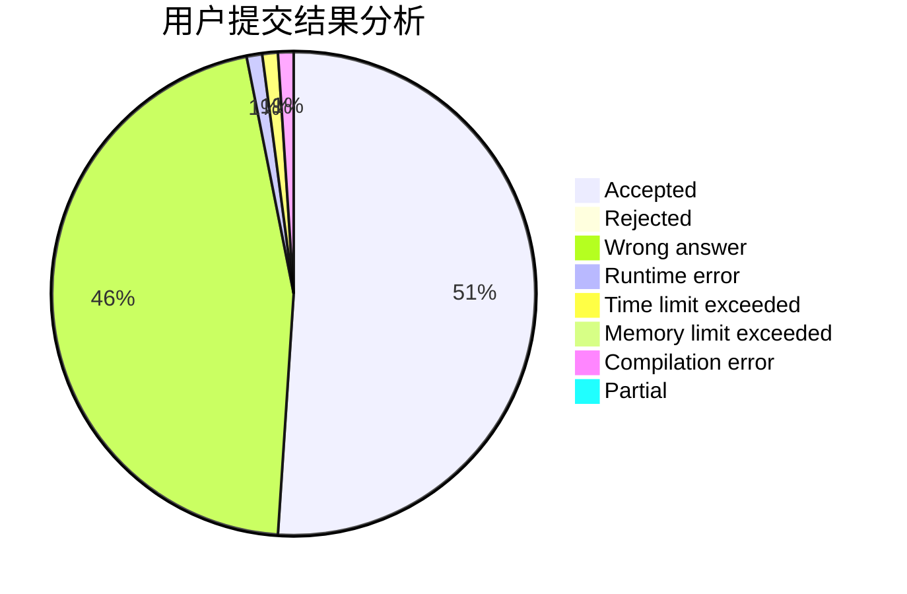
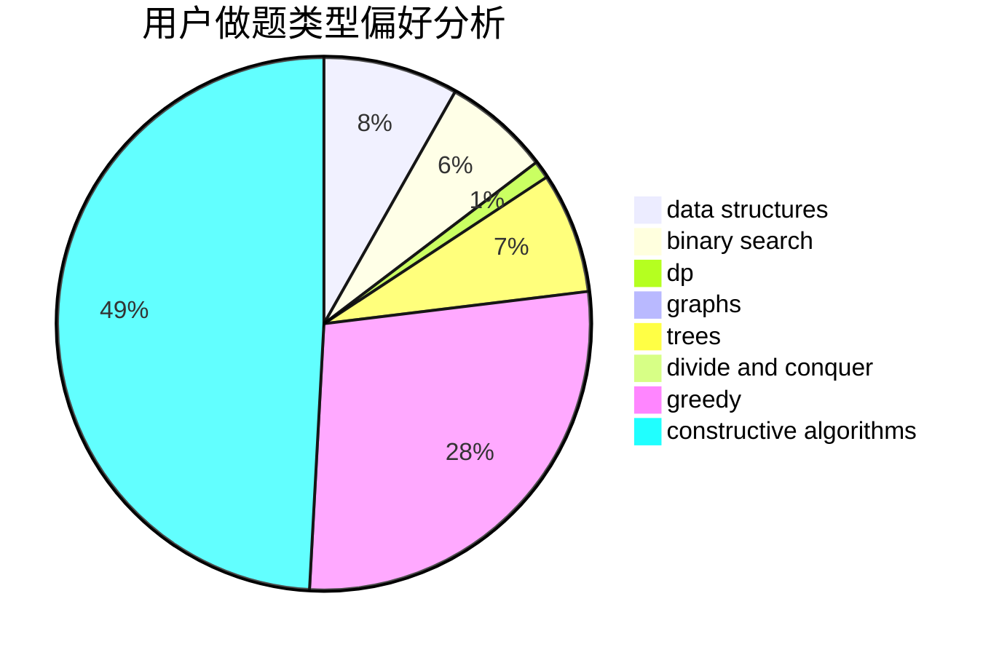
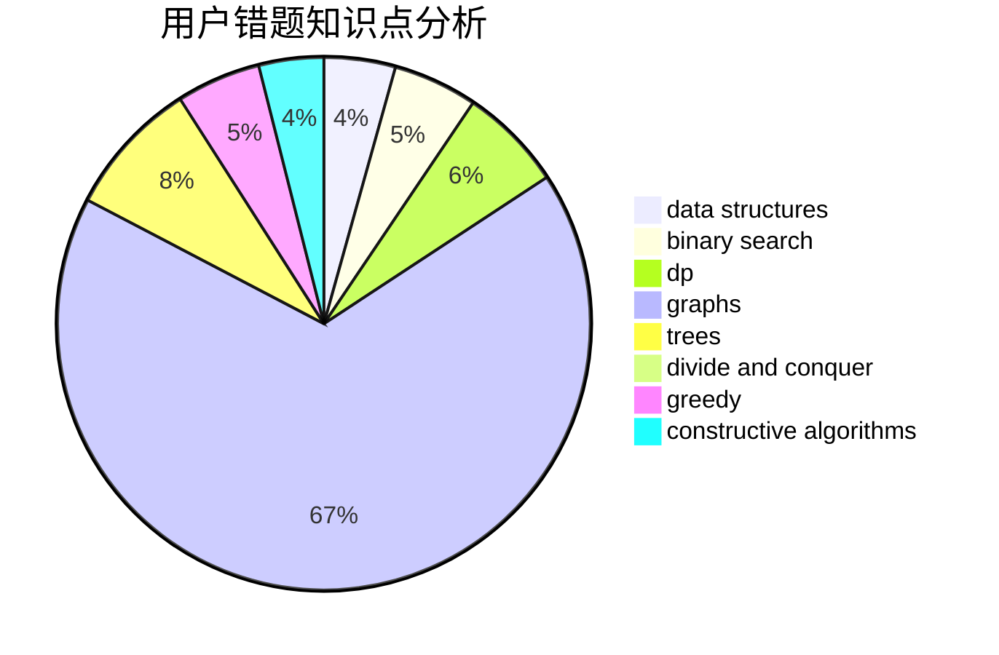

# wannaak

<!-- tabs:start -->

#### **用户提交结果分析**

#### **用户做题类型偏好分析**

#### **用户错题知识点分析**

<!-- tabs:end -->
# 推荐题目
[459B](https://codeforces.com/contest/459/problem/B)		combinatorics,
                        implementation,
                        sortings		  
[1205E](https://codeforces.com/contest/1205/problem/E)		combinatorics,
                        strings		  
[1266E](https://codeforces.com/contest/1266/problem/E)		data structures,
                        greedy,
                        implementation		  
[777D](https://codeforces.com/contest/777/problem/D)		binary search,
                        greedy,
                        implementation,
                        strings		  
[691A](https://codeforces.com/contest/691/problem/A)		implementation		  
[593E](https://codeforces.com/contest/593/problem/E)		dp,
                        matrices		  
[275B](https://codeforces.com/contest/275/problem/B)		constructive algorithms,
                        implementation		  
[354A](https://codeforces.com/contest/354/problem/A)		brute force,
                        greedy,
                        math		  
[1017B](https://codeforces.com/contest/1017/problem/B)		implementation,
                        math		  
[429E](https://codeforces.com/contest/429/problem/E)		graphs		  
