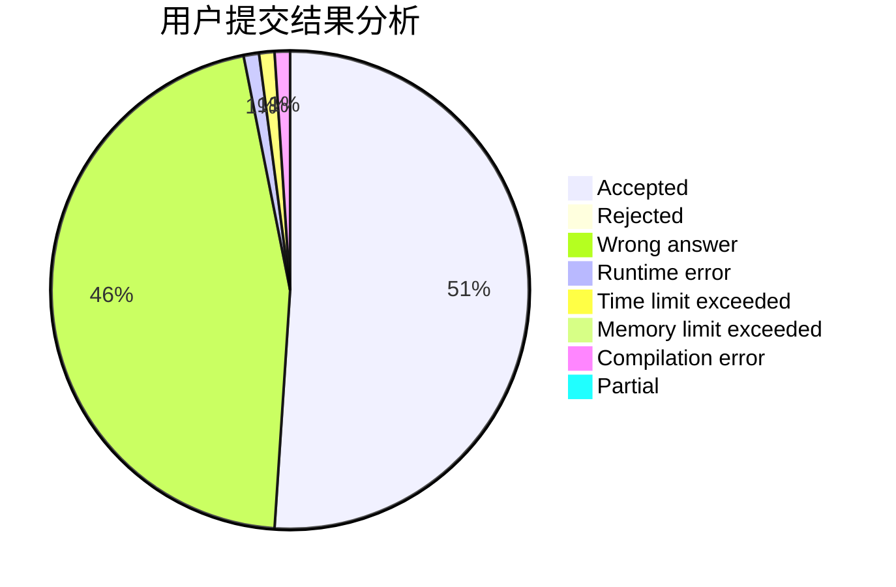
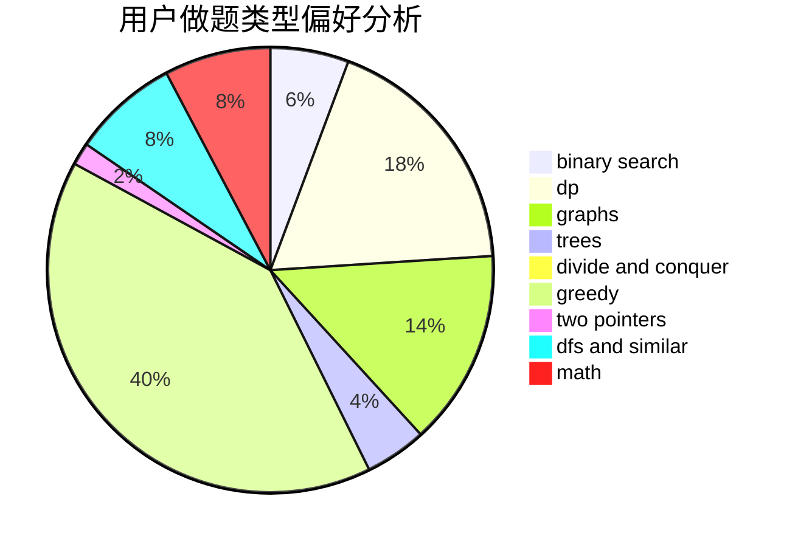

# wannaak

<!-- tabs:start -->

#### **用户提交结果分析**

#### **用户做题类型偏好分析**

<!-- tabs:end -->
# 推荐题目
[478A](https://codeforces.com/contest/478/problem/A)
[120H](https://codeforces.com/contest/120/problem/H)
[1271F](https://codeforces.com/contest/1271/problem/F)
[796A](https://codeforces.com/contest/796/problem/A)
[710E](https://codeforces.com/contest/710/problem/E)
[612B](https://codeforces.com/contest/612/problem/B)
[290B](https://codeforces.com/contest/290/problem/B)
[37D](https://codeforces.com/contest/37/problem/D)
[1017E](https://codeforces.com/contest/1017/problem/E)
[451A](https://codeforces.com/contest/451/problem/A)
