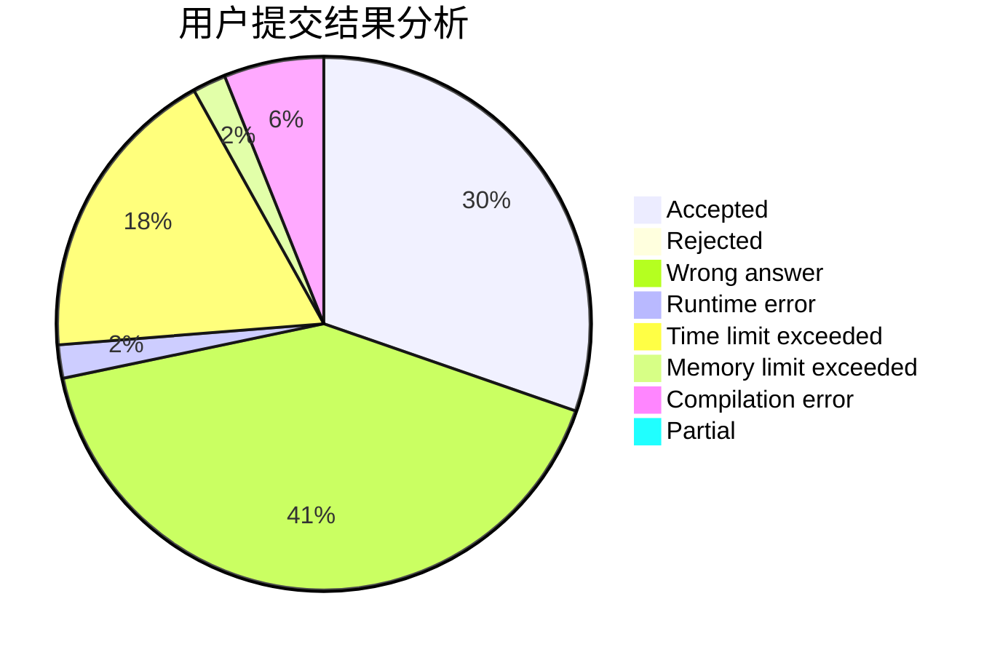
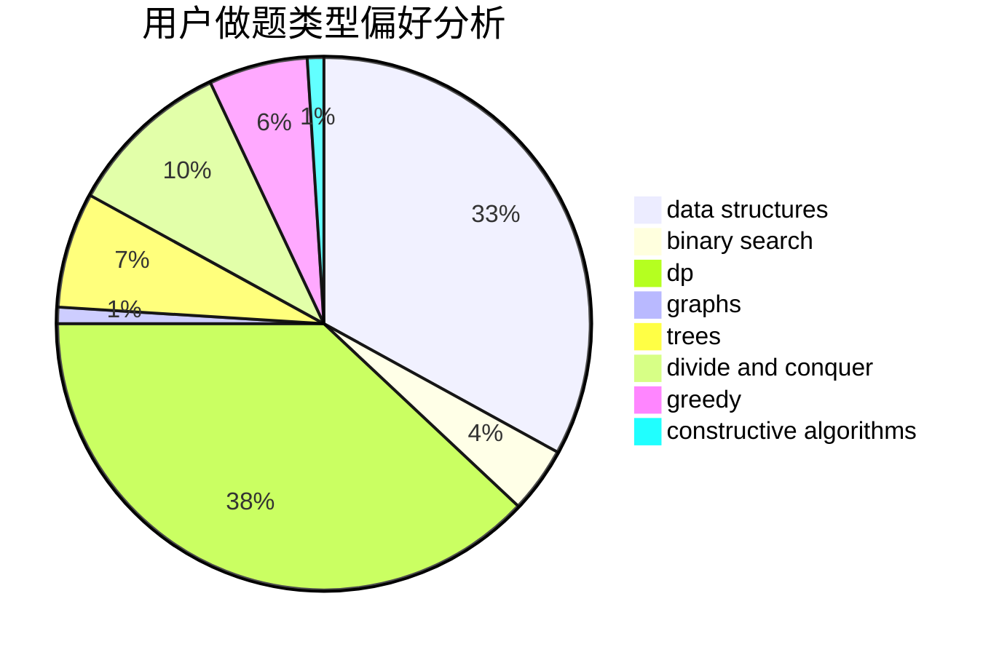

# wanshe

<!-- tabs:start -->

#### **用户提交结果分析**

#### **用户做题类型偏好分析**

#### **用户错题知识点分析**

<!-- tabs:end -->
# 推荐题目
[1107F](https://codeforces.com/contest/1107/problem/F)		dp,
                        flows,
                        graph matchings,
                        graphs,
                        sortings		  
[1045G](https://codeforces.com/contest/1045/problem/G)		data structures		  
[6C](https://codeforces.com/contest/6/problem/C)		greedy,
                        two pointers		  
[519B](https://codeforces.com/contest/519/problem/B)		data structures,
                        implementation,
                        sortings		  
[612B](https://codeforces.com/contest/612/problem/B)		implementation,
                        math		  
[463D](https://codeforces.com/contest/463/problem/D)		dfs and similar,
                        dp,
                        graphs,
                        implementation		  
[314B](https://codeforces.com/contest/314/problem/B)		binary search,
                        dfs and similar,
                        strings		  
[1334E](https://codeforces.com/contest/1334/problem/E)		combinatorics,
                        graphs,
                        greedy,
                        math,
                        number theory		  
[685B](https://codeforces.com/contest/685/problem/B)		data structures,
                        dfs and similar,
                        dp,
                        trees		  
[1114D](https://codeforces.com/contest/1114/problem/D)		dp		  
