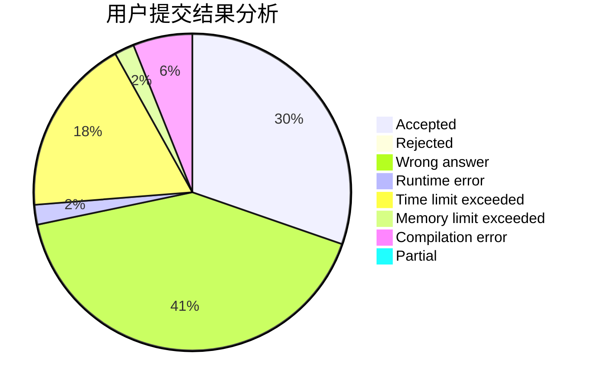
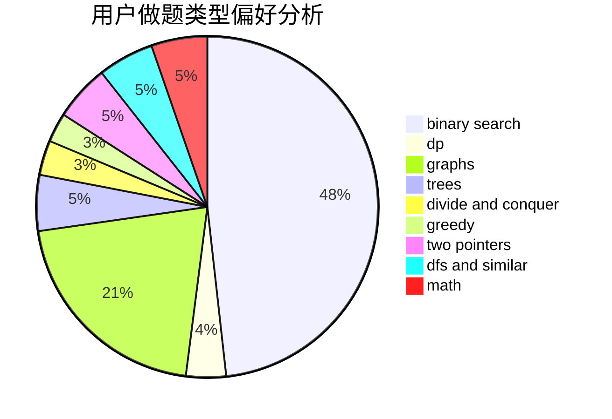

# wanshe

<!-- tabs:start -->

#### **用户提交结果分析**

#### **用户做题类型偏好分析**

<!-- tabs:end -->
# 推荐题目
[1108A](https://codeforces.com/contest/1108/problem/A)
[1045J](https://codeforces.com/contest/1045/problem/J)
[717E](https://codeforces.com/contest/717/problem/E)
[544D](https://codeforces.com/contest/544/problem/D)
[631D](https://codeforces.com/contest/631/problem/D)
[483D](https://codeforces.com/contest/483/problem/D)
[339A](https://codeforces.com/contest/339/problem/A)
[1341D](https://codeforces.com/contest/1341/problem/D)
[707D](https://codeforces.com/contest/707/problem/D)
[11151](https://codeforces.com/contest/1115/problem/1)
