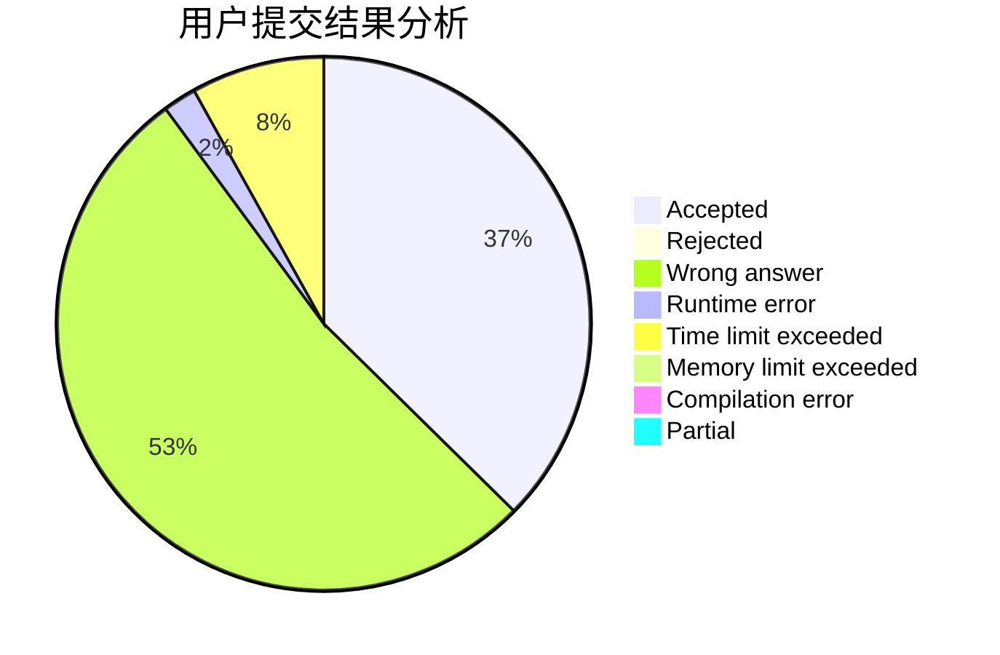
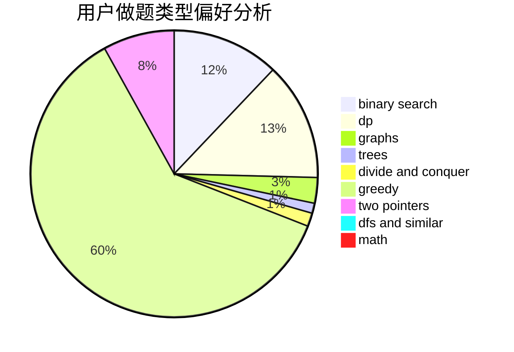

# wasa855

<!-- tabs:start -->

#### **用户提交结果分析**

#### **用户做题类型偏好分析**

<!-- tabs:end -->
# 推荐题目
[1166F](https://codeforces.com/contest/1166/problem/F)
[722D](https://codeforces.com/contest/722/problem/D)
[1465F](https://codeforces.com/contest/1465/problem/F)
[17E](https://codeforces.com/contest/17/problem/E)
[380A](https://codeforces.com/contest/380/problem/A)
[1243E](https://codeforces.com/contest/1243/problem/E)
[852D](https://codeforces.com/contest/852/problem/D)
[1293A](https://codeforces.com/contest/1293/problem/A)
[652F](https://codeforces.com/contest/652/problem/F)
[120J](https://codeforces.com/contest/120/problem/J)
