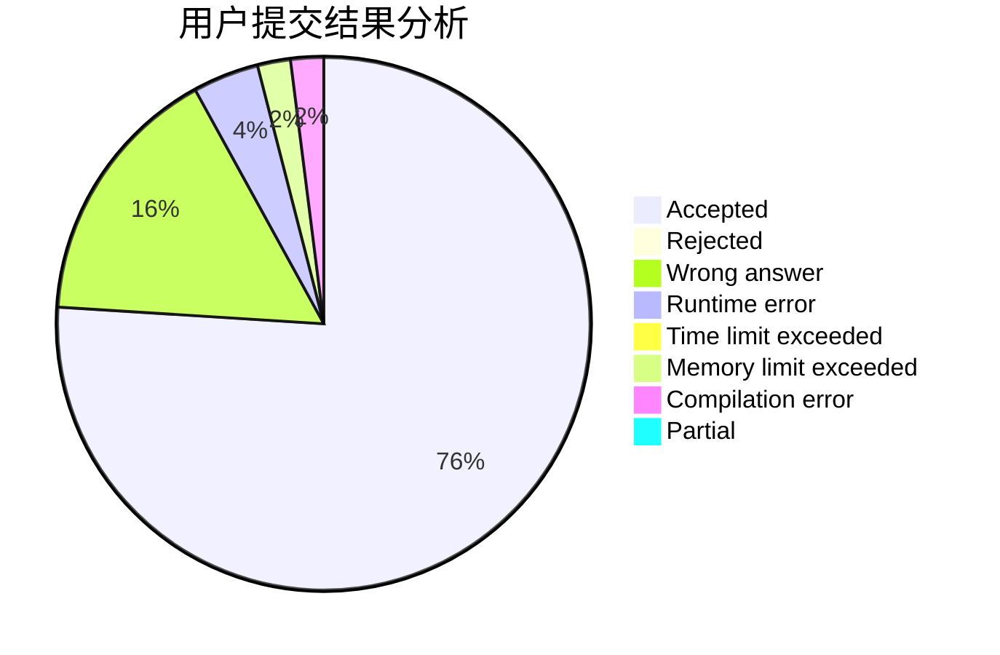
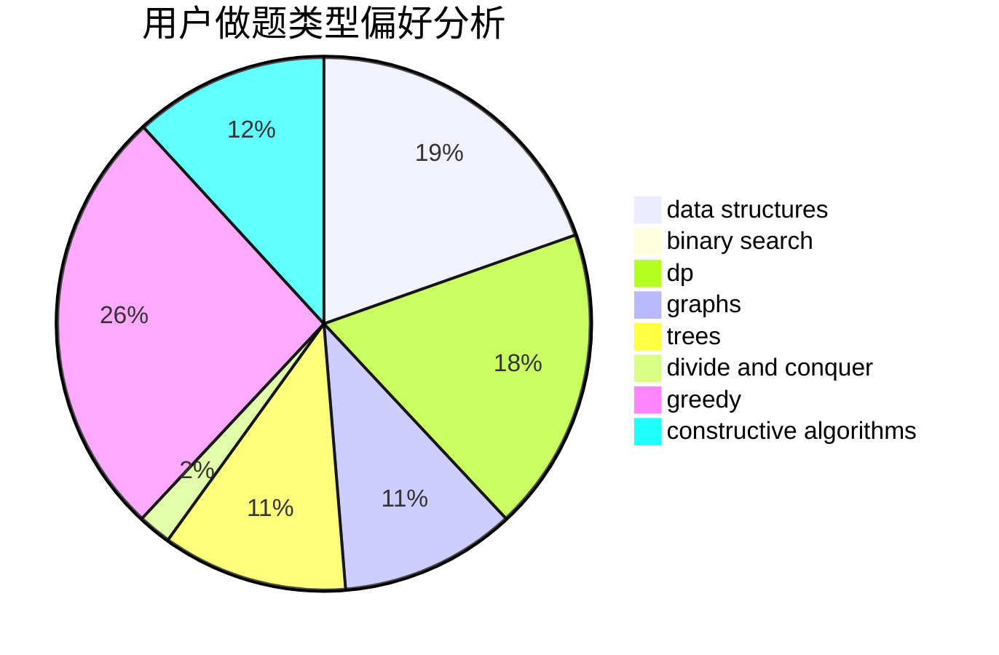
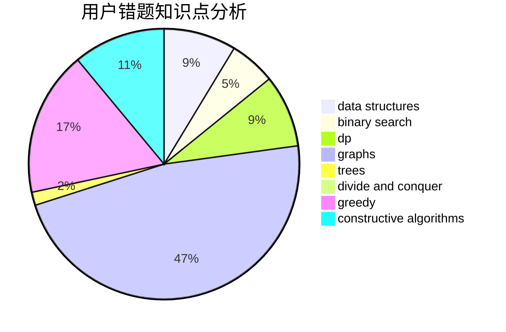

# water_tomato

<!-- tabs:start -->

#### **用户提交结果分析**

#### **用户做题类型偏好分析**

#### **用户错题知识点分析**

<!-- tabs:end -->
# 推荐题目
[13573](https://codeforces.com/contest/1357/problem/3)		dsu,graphs,sortings,trees		  
[132C](https://codeforces.com/contest/132/problem/C)		dp		  
[766D](https://codeforces.com/contest/766/problem/D)		data structures,
                        dfs and similar,
                        dp,
                        dsu,
                        graphs		  
[767C](https://codeforces.com/contest/767/problem/C)		dfs and similar,
                        graphs,
                        greedy,
                        trees		  
[1131F](https://codeforces.com/contest/1131/problem/F)		constructive algorithms,
                        dsu		  
[150A](https://codeforces.com/contest/150/problem/A)		games,
                        math,
                        number theory		  
[1447E](https://codeforces.com/contest/1447/problem/E)		dsu,graphs,sortings,trees		  
[580B](https://codeforces.com/contest/580/problem/B)		binary search,
                        sortings,
                        two pointers		  
[793F](https://codeforces.com/contest/793/problem/F)		data structures,
                        divide and conquer,
                        dp		  
[620A](https://codeforces.com/contest/620/problem/A)		implementation,
                        math		  
