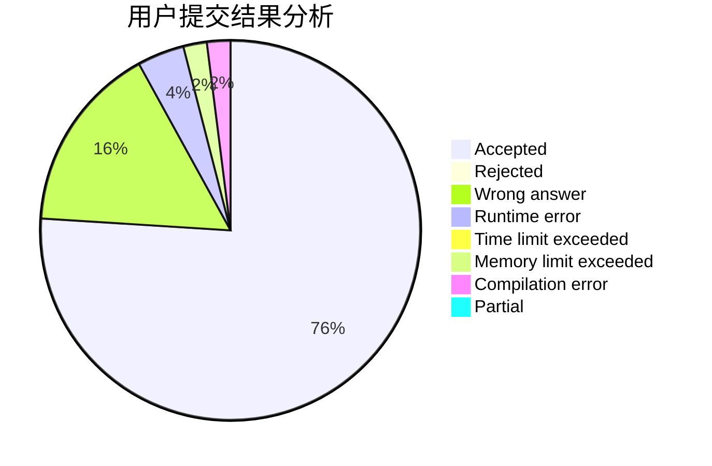
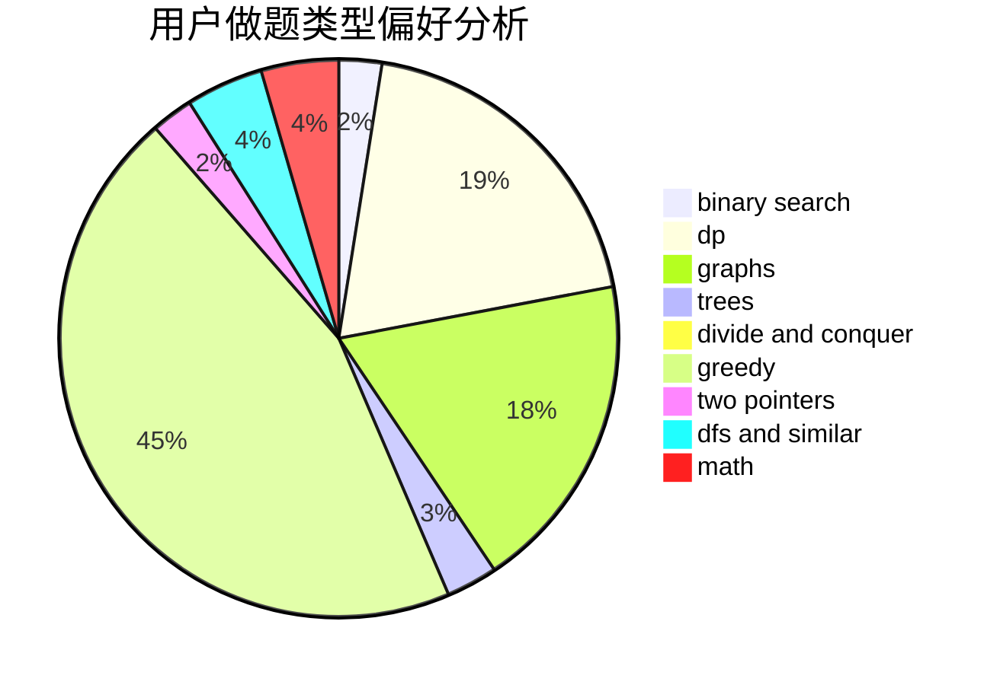

# water_tomato

<!-- tabs:start -->

#### **用户提交结果分析**

#### **用户做题类型偏好分析**

<!-- tabs:end -->
# 推荐题目
[13573](https://codeforces.com/contest/1357/problem/3)
[132C](https://codeforces.com/contest/132/problem/C)
[766D](https://codeforces.com/contest/766/problem/D)
[767C](https://codeforces.com/contest/767/problem/C)
[1131F](https://codeforces.com/contest/1131/problem/F)
[150A](https://codeforces.com/contest/150/problem/A)
[1447E](https://codeforces.com/contest/1447/problem/E)
[580B](https://codeforces.com/contest/580/problem/B)
[793F](https://codeforces.com/contest/793/problem/F)
[620A](https://codeforces.com/contest/620/problem/A)
