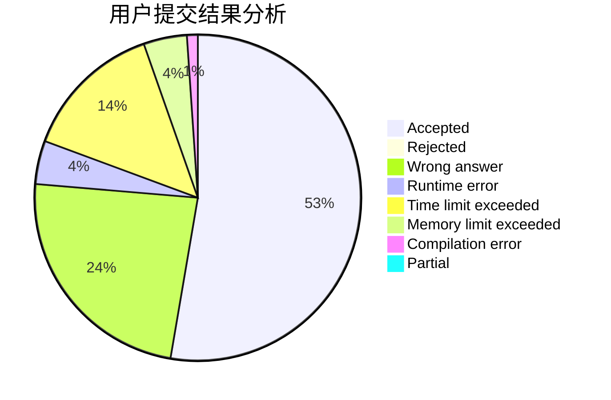
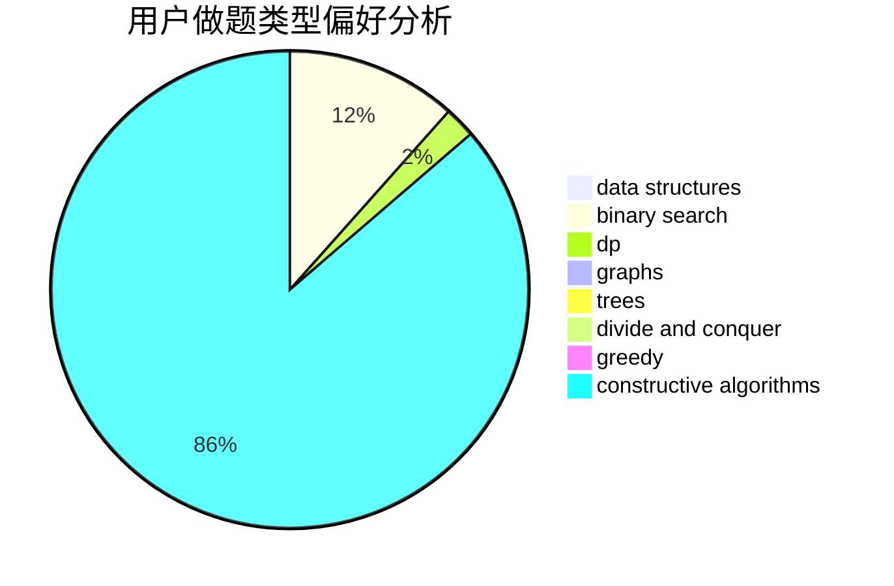
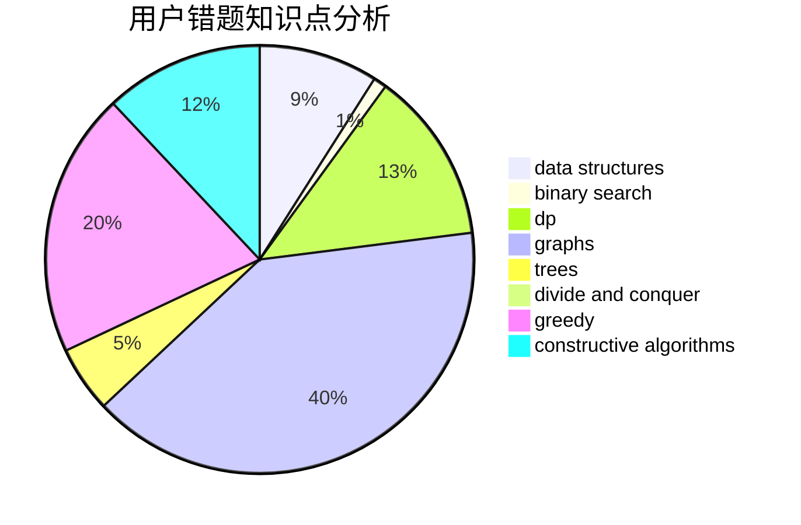

# wazxy

<!-- tabs:start -->

#### **用户提交结果分析**

#### **用户做题类型偏好分析**

#### **用户错题知识点分析**

<!-- tabs:end -->
# 推荐题目
[1364C](https://codeforces.com/contest/1364/problem/C)		brute force,
                        constructive algorithms,
                        greedy		  
[1131A](https://codeforces.com/contest/1131/problem/A)		math		  
[482E](https://codeforces.com/contest/482/problem/E)		data structures,
                        trees		  
[180C](https://codeforces.com/contest/180/problem/C)		dp		  
[472C](https://codeforces.com/contest/472/problem/C)		greedy		  
[353E](https://codeforces.com/contest/353/problem/E)		dp,
                        graph matchings,
                        greedy		  
[832C](https://codeforces.com/contest/832/problem/C)		binary search,
                        implementation,
                        math		  
[1164I](https://codeforces.com/contest/1164/problem/I)		dsu,graphs,sortings,trees		  
[1234D](https://codeforces.com/contest/1234/problem/D)		data structures		  
[1257A](https://codeforces.com/contest/1257/problem/A)		greedy,
                        math		  
