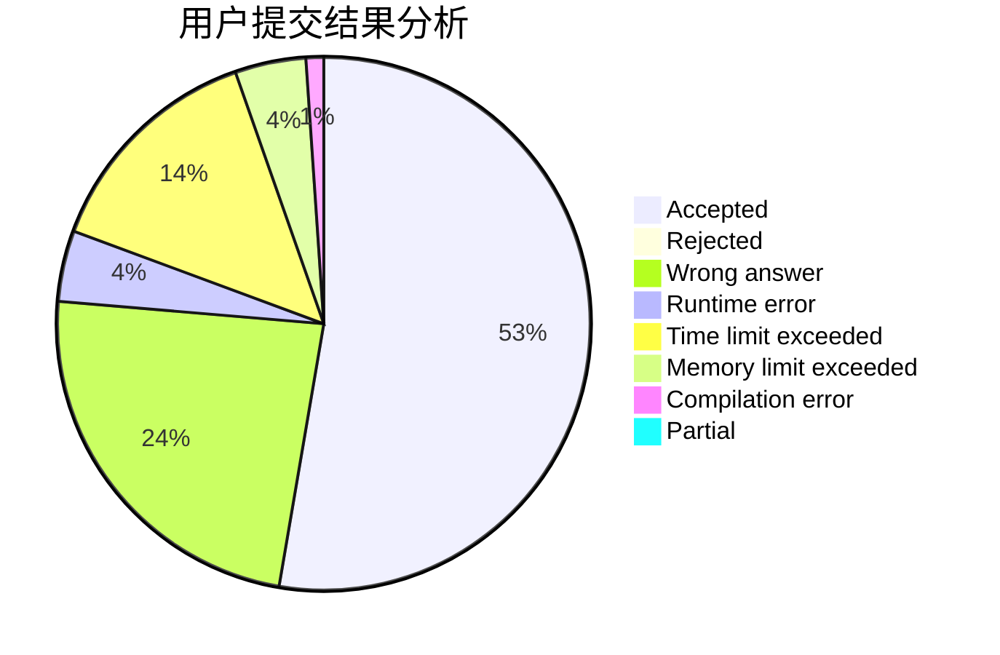
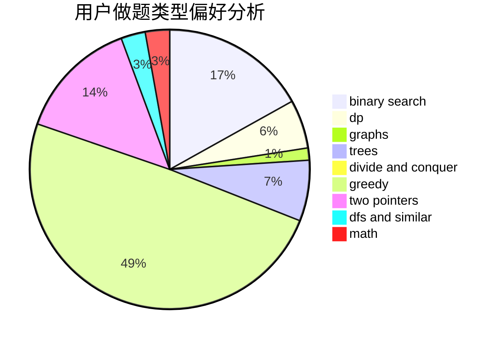

# wazxy

<!-- tabs:start -->

#### **用户提交结果分析**

#### **用户做题类型偏好分析**

<!-- tabs:end -->
# 推荐题目
[1364C](https://codeforces.com/contest/1364/problem/C)
[1131A](https://codeforces.com/contest/1131/problem/A)
[482E](https://codeforces.com/contest/482/problem/E)
[180C](https://codeforces.com/contest/180/problem/C)
[472C](https://codeforces.com/contest/472/problem/C)
[353E](https://codeforces.com/contest/353/problem/E)
[832C](https://codeforces.com/contest/832/problem/C)
[1164I](https://codeforces.com/contest/1164/problem/I)
[1234D](https://codeforces.com/contest/1234/problem/D)
[1257A](https://codeforces.com/contest/1257/problem/A)
