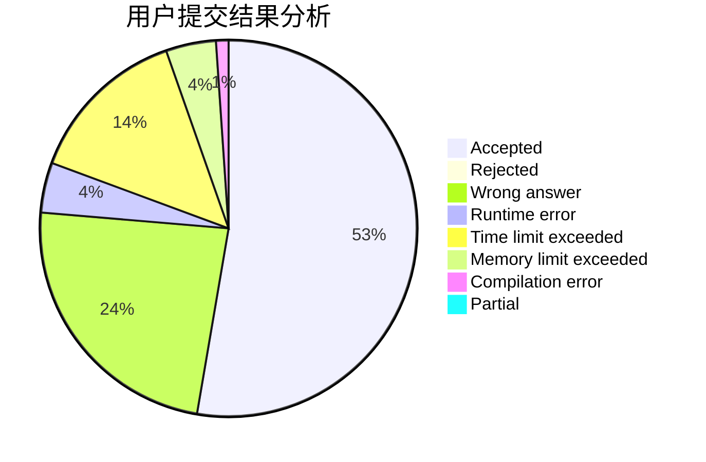
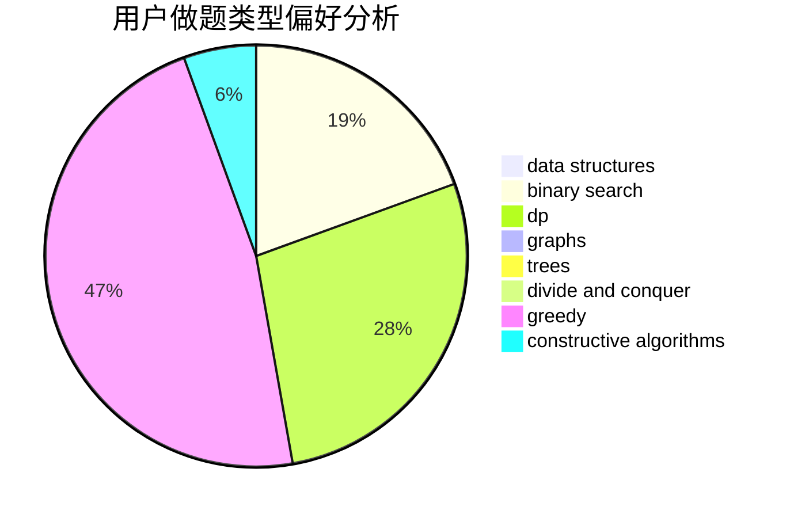
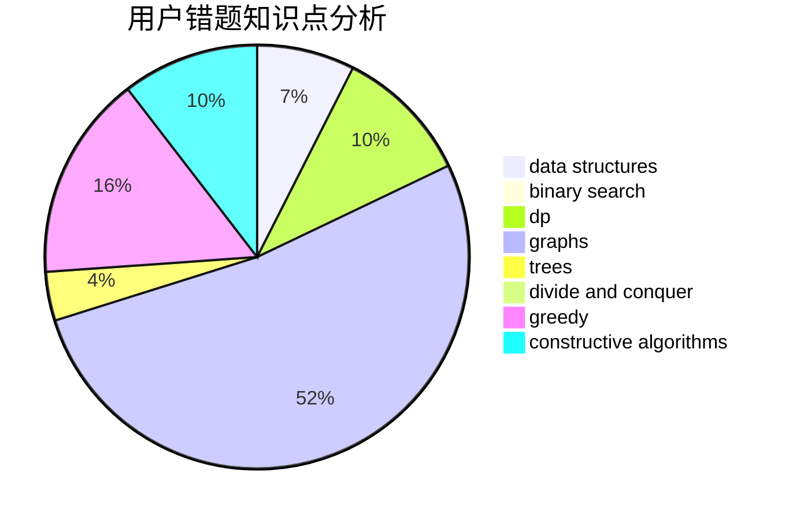

# wazxy

<!-- tabs:start -->

#### **用户提交结果分析**

#### **用户做题类型偏好分析**

#### **用户错题知识点分析**

<!-- tabs:end -->
# 推荐题目
[1357A7](https://codeforces.com/contest/1357A/problem/7)		nan		  
[1129A2](https://codeforces.com/contest/1129A/problem/2)		brute force,
                        greedy		  
[463A](https://codeforces.com/contest/463/problem/A)		brute force,
                        implementation		  
[158C](https://codeforces.com/contest/158/problem/C)		*special problem,
                        data structures,
                        implementation		  
[450B](https://codeforces.com/contest/450/problem/B)		implementation,
                        math		  
[323B](https://codeforces.com/contest/323/problem/B)		constructive algorithms,
                        graphs		  
[814A](https://codeforces.com/contest/814/problem/A)		constructive algorithms,
                        greedy,
                        implementation,
                        sortings		  
[1162B](https://codeforces.com/contest/1162/problem/B)		brute force,
                        greedy		  
[1225G](https://codeforces.com/contest/1225/problem/G)		bitmasks,
                        constructive algorithms,
                        dp,
                        greedy,
                        number theory		  
[1251E2](https://codeforces.com/contest/1251E/problem/2)		binary search,
                        data structures,
                        greedy		  
