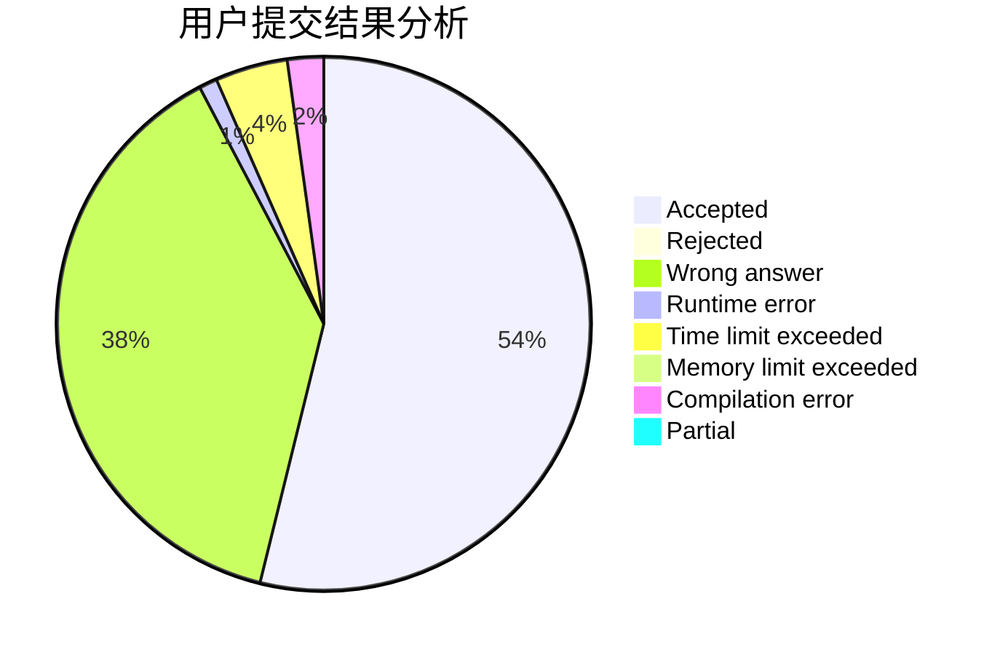
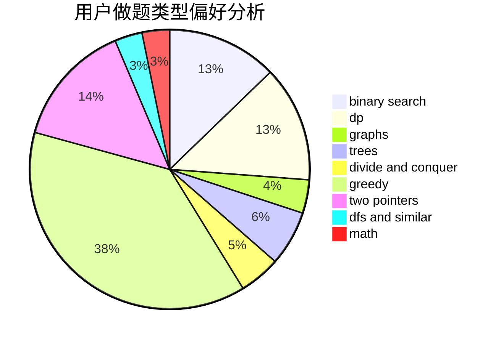

# weishenmezheyangzi

<!-- tabs:start -->

#### **用户提交结果分析**

#### **用户做题类型偏好分析**

<!-- tabs:end -->
# 推荐题目
[1099F](https://codeforces.com/contest/1099/problem/F)
[603E](https://codeforces.com/contest/603/problem/E)
[527C](https://codeforces.com/contest/527/problem/C)
[1020A](https://codeforces.com/contest/1020/problem/A)
[452B](https://codeforces.com/contest/452/problem/B)
[1174F](https://codeforces.com/contest/1174/problem/F)
[1395E](https://codeforces.com/contest/1395/problem/E)
[1183H](https://codeforces.com/contest/1183/problem/H)
[979C](https://codeforces.com/contest/979/problem/C)
[454A](https://codeforces.com/contest/454/problem/A)
