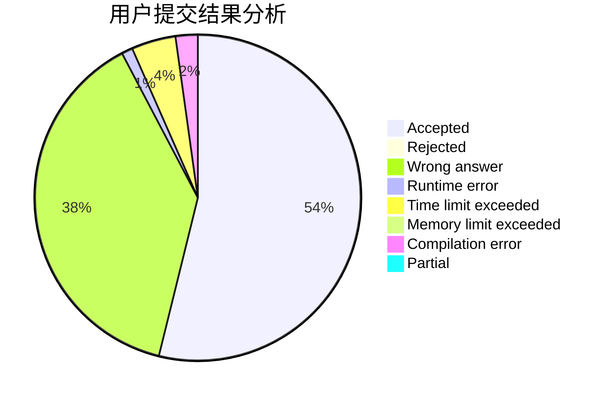
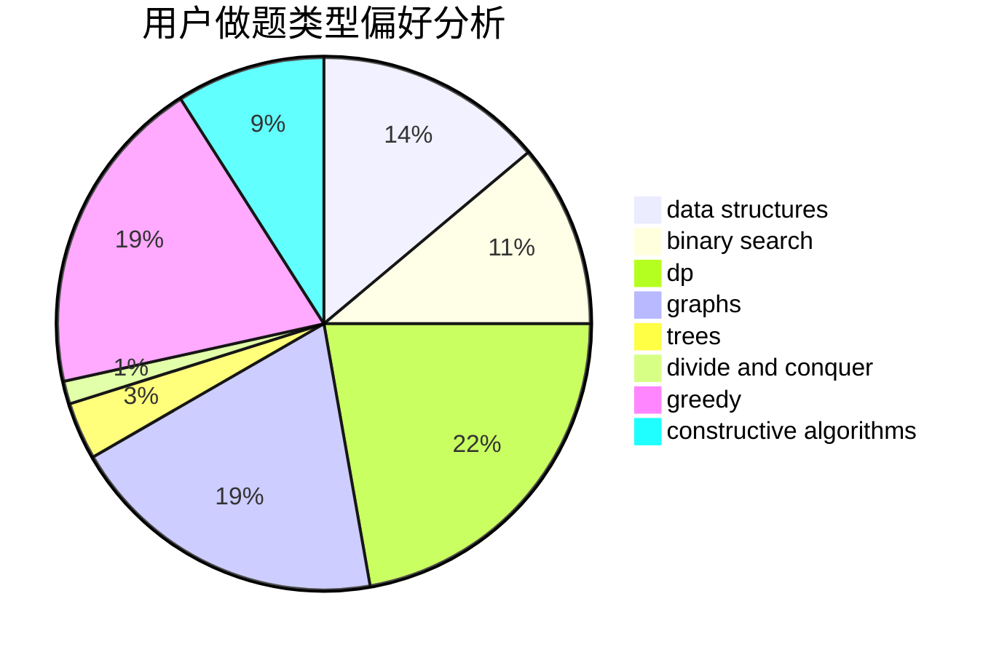
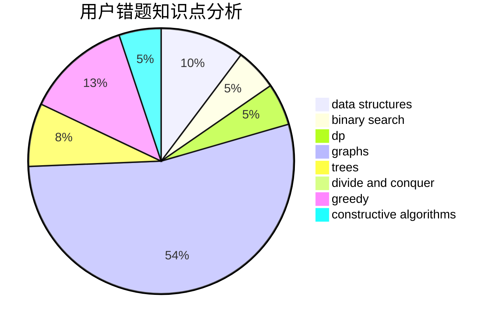

# weishenmezheyangzi

<!-- tabs:start -->

#### **用户提交结果分析**

#### **用户做题类型偏好分析**

#### **用户错题知识点分析**

<!-- tabs:end -->
# 推荐题目
[1099C](https://codeforces.com/contest/1099/problem/C)		constructive algorithms,
                        implementation		  
[582D](https://codeforces.com/contest/582/problem/D)		dp,
                        math,
                        number theory		  
[507B](https://codeforces.com/contest/507/problem/B)		geometry,
                        math		  
[1019E](https://codeforces.com/contest/1019/problem/E)		data structures,
                        divide and conquer,
                        trees		  
[430A](https://codeforces.com/contest/430/problem/A)		constructive algorithms,
                        sortings		  
[1172C2](https://codeforces.com/contest/1172C/problem/2)		dp,
                        probabilities		  
[1385E](https://codeforces.com/contest/1385/problem/E)		constructive algorithms,
                        dfs and similar,
                        graphs		  
[1181C](https://codeforces.com/contest/1181/problem/C)		brute force,
                        combinatorics,
                        dp,
                        implementation		  
[958A2](https://codeforces.com/contest/958A/problem/2)		hashing,
                        strings		  
[434A](https://codeforces.com/contest/434/problem/A)		dsu,graphs,sortings,trees		  
