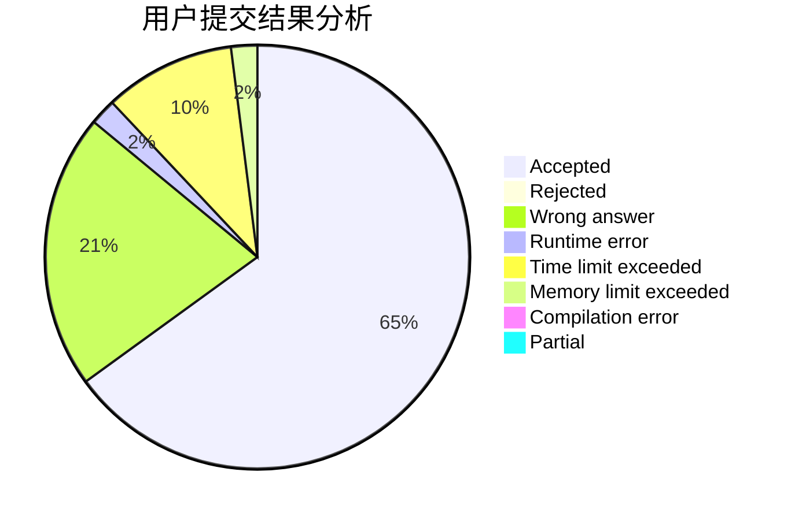
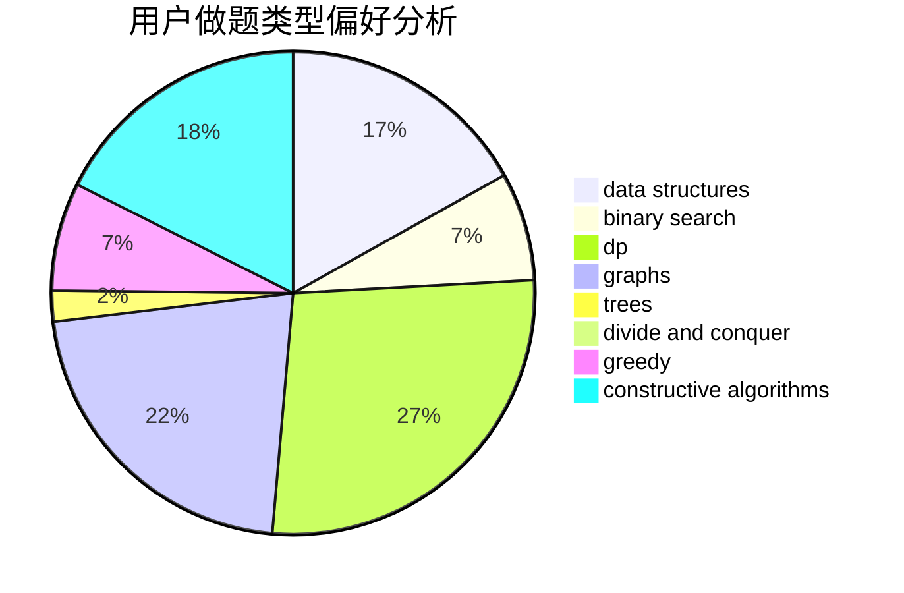
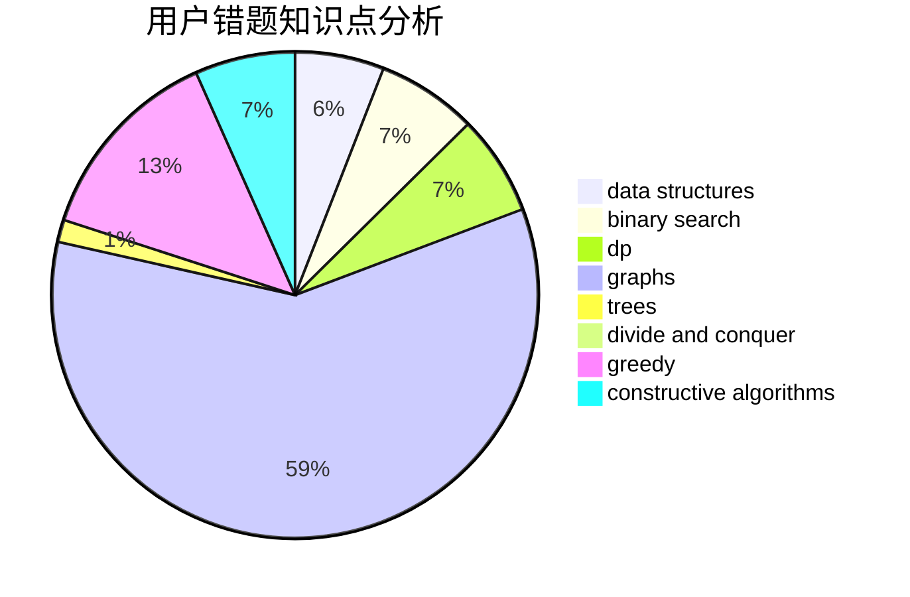

# Calabash_yang

<!-- tabs:start -->

#### **用户提交结果分析**

#### **用户做题类型偏好分析**

#### **用户错题知识点分析**

<!-- tabs:end -->
# 推荐题目
[1214G](https://codeforces.com/contest/1214/problem/G)		bitmasks,
                        data structures		  
[425E](https://codeforces.com/contest/425/problem/E)		dp		  
[628F](https://codeforces.com/contest/628/problem/F)		flows		  
[628B](https://codeforces.com/contest/628/problem/B)		dp		  
[1349F1](https://codeforces.com/contest/1349F/problem/1)		dp,
                        fft,
                        math		  
[628C](https://codeforces.com/contest/628/problem/C)		greedy,
                        strings		  
[389A](https://codeforces.com/contest/389/problem/A)		greedy,
                        math		  
[1271F](https://codeforces.com/contest/1271/problem/F)		brute force		  
[195C](https://codeforces.com/contest/195/problem/C)		expression parsing,
                        implementation		  
[20A](https://codeforces.com/contest/20/problem/A)		implementation		  
