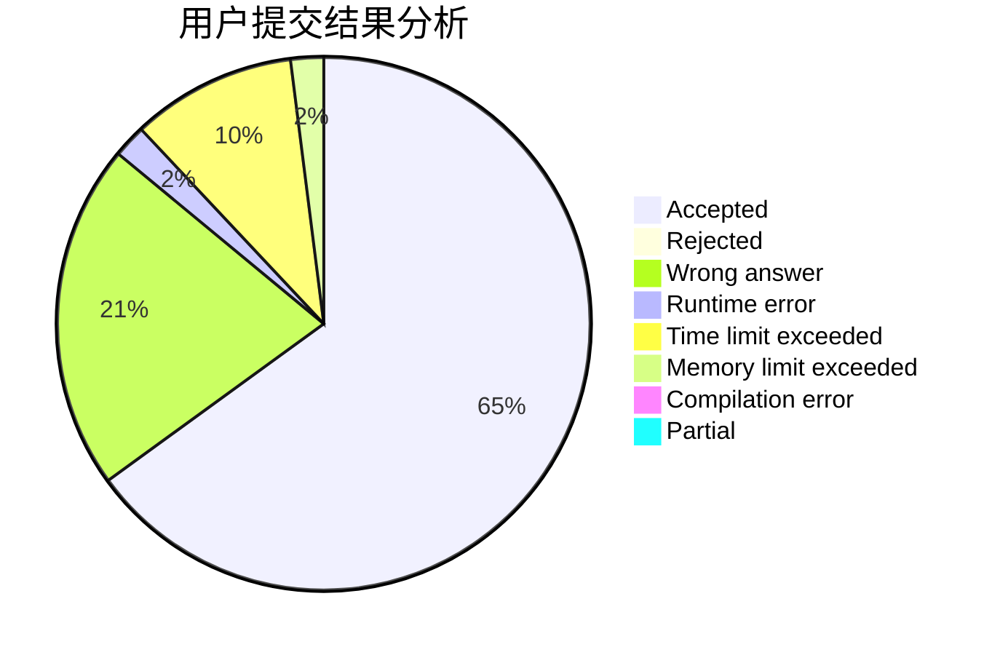
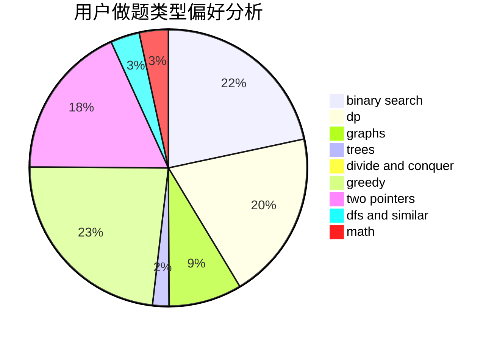

# Calabash_yang

<!-- tabs:start -->

#### **用户提交结果分析**

#### **用户做题类型偏好分析**

<!-- tabs:end -->
# 推荐题目
[1220C](https://codeforces.com/contest/1220/problem/C)
[449C](https://codeforces.com/contest/449/problem/C)
[656F](https://codeforces.com/contest/656/problem/F)
[656A](https://codeforces.com/contest/656/problem/A)
[13571](https://codeforces.com/contest/1357/problem/1)
[656D](https://codeforces.com/contest/656/problem/D)
[418C](https://codeforces.com/contest/418/problem/C)
[1281B](https://codeforces.com/contest/1281/problem/B)
[218C](https://codeforces.com/contest/218/problem/C)
[231C](https://codeforces.com/contest/231/problem/C)
