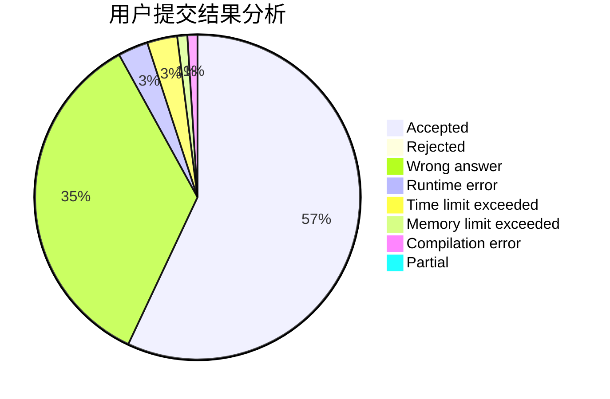
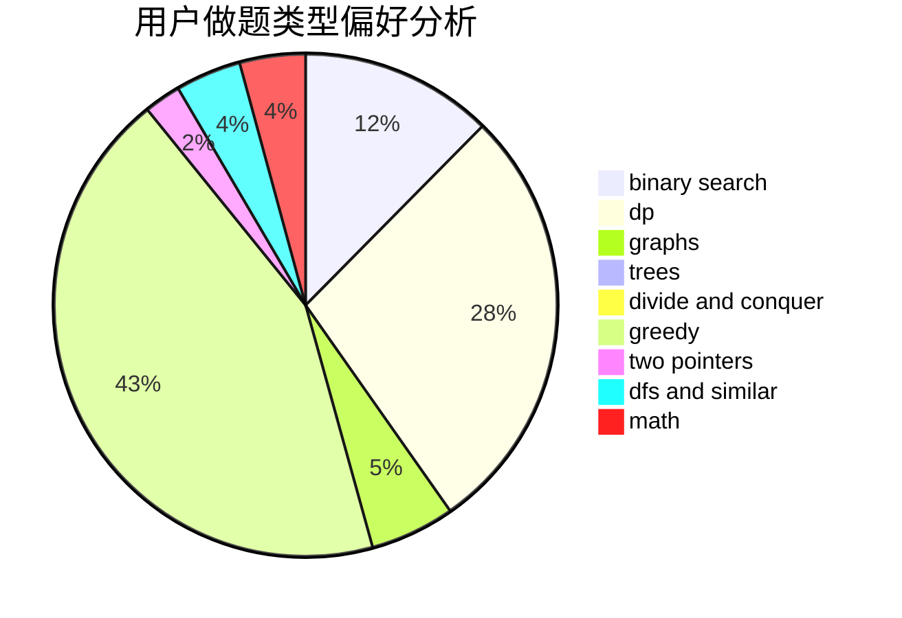

# wenhao801

<!-- tabs:start -->

#### **用户提交结果分析**

#### **用户做题类型偏好分析**

<!-- tabs:end -->
# 推荐题目
[1301C](https://codeforces.com/contest/1301/problem/C)
[936A](https://codeforces.com/contest/936/problem/A)
[886F](https://codeforces.com/contest/886/problem/F)
[639B](https://codeforces.com/contest/639/problem/B)
[682A](https://codeforces.com/contest/682/problem/A)
[300C](https://codeforces.com/contest/300/problem/C)
[1150C](https://codeforces.com/contest/1150/problem/C)
[1250A](https://codeforces.com/contest/1250/problem/A)
[486E](https://codeforces.com/contest/486/problem/E)
[629A](https://codeforces.com/contest/629/problem/A)
